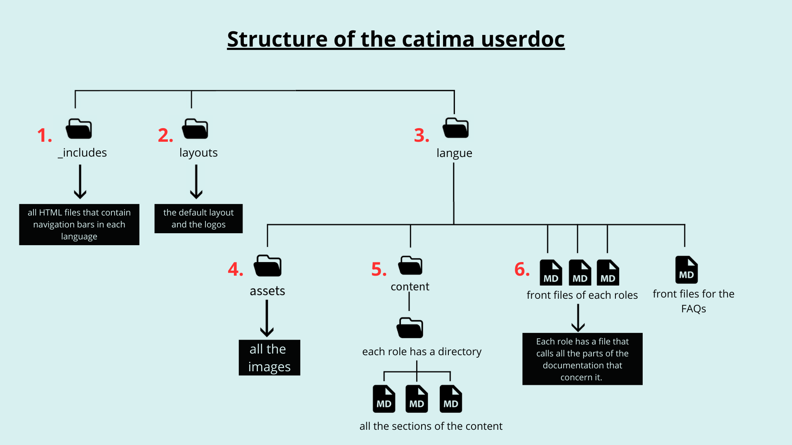

# CATIMA end-user documentation

This repo contains the end-user documentation for CATIMA. Currently, the end-user documentation is available in French and English only, but other translations are planned.

For each language, there is one folder (currently the [fr](docs/fr) and [en](docs/en) folders).

## How it works

On Catima the users have access to buttons that brings them to the online documentation based on their status(es).

The content of the documentation is contained in small files divided by roles and titles that can be found in the *content* directory. The documentation is brought together in "parent" files that acts as front and contains each titles and their content embedded underneath. They are divided by statuses and a FAQ file.

To update the doc: You edit the content of the markdown files inside the *content* directory. The parent files don't need to be edited unless you added a file in the *content* directory.

## What you need to know and how to maintain

The documentation is stored in the *docs* directory and is divided by language; currently, there is a *fr* directory and an *en* directory.

Each language contains different folders and files organized as follows:

- An ***assets*** folder containing images used in the documentation.

    > Images are organized into different folders named after the features they are associated with.
- Markdown files divided by **statuses (admin, user, editor, etc.)** containing the complete documentation for each status, they act as fronts for our website. Each files has a head containing the title of the page and a "navbar" variable where the title of the file's corresponding navbar is referenced. Each file contains a skeleton composed of **titles and subtitles** referenced in the navbar (see the navbar doc below) preceded by an HTML `<a>` tag carrying an id corresponding to each link in the navbar (making the menu clickable in all circumstances). The **content of each part is included using the *[include_relative](https://jekyllrb.com/docs/includes/)* syntax** provided by Jekyll. Files are retrieved as follows:

	``

- A ***content*** directory containing the textual content of the documentation in markdown.
    - _Content_ is organized into folders by **statuses (admin, user, editor, etc.)**. Each folder contains markdown files that contain markdown documentation **divided by titles and undertitles**.
        
        > Individual markdown files are named after the part of the index they are attached to; the nomenclature is as follows: the title of the part in lowercase, without accents or special characters, all attached + .md.
        
        > Images appearing in the various content file must be called with the relative path **from the parent file that includes the individual parts and not from the content/*role* folder**. This is imperative for the images to display in the documentation via the *include_relative* tag.
- A *faqcatima.md* file.
    - It contains titles formulated as questions that refer to different parts of the documentation integrated into the document with the same syntax as in the parent files 

> ⚠️ **Any new file that calls parts of the documentation with the *include_relative* syntax must be located in the same directory as the assets folder so that the images are displayed correctly. ⚠️**



## Maintaining the Github.io Website

The documentation is hosted on GitHub Pages, which allows hosting a mini-site for free directly from a GitHub repository; this functionality is powered by [Jekyll](https://jekyllrb.com).

GitHub Pages allows hosting documentation pages for free. It uses Jekyll to transform markdown files into HTML files that are publicly accessible.

The site requires two additional directories:

- The *_includes* directory contains the content of the navbar in the form of html unordered lists. Anytime a title is added in a parent file the navbar needs to be updated manually.
- The *_layouts* folder contains the default layout for the documentation pages. The details of it are commented inside the file. 

### How to add a navbar to your page

1. Create an HTML file in the ***_includes*** folder named **fr/en**-sidenav-**status**.html.

2. Add an unordered list to the html file containing the page's titles and undertitle.

3. In the markdown document, add a head:

	```
	---
	title: Title of your page
	navbar: Name of the file created in include
	---

The default layout automatically adds a navigation bar if the markdown file contains the link to the HTML file with the navigation bar content. Otherwise, it displays the content normally.

### How to test your changes locally

Because the documentation doesn't have a staging, any changes in the doc must be tested locally before being pushed to the Github repository.

Ruby, Jekyll, and bundler must previously be installed as indicated in the following procedure [https://jekyllrb.com/docs/installation/](https://jekyllrb.com/docs/installation/).

The userdoc repository must be cloned locally.

In the file located at the root of the site (in this case the *docs* folder), create a file named "Gemfile" containing the following:

```ruby
source "https://rubygems.org"

gem "github-pages", group: :jekyll_plugins

gem "webrick", "~> 1.8" # replace 1.8 with the latest version
```

Open the terminal and navigate to the root of the site (in this case the *docs* directory) and execute the "bundle install" command.

Wait for the operations to finish, then use the command to run the site locally:

```yaml
bundle exec jekyll serve
```

The site should normally run at the address "localhost:4000".

Simply run the jekyll serve command from the root of the site whenever you want to test locally.
