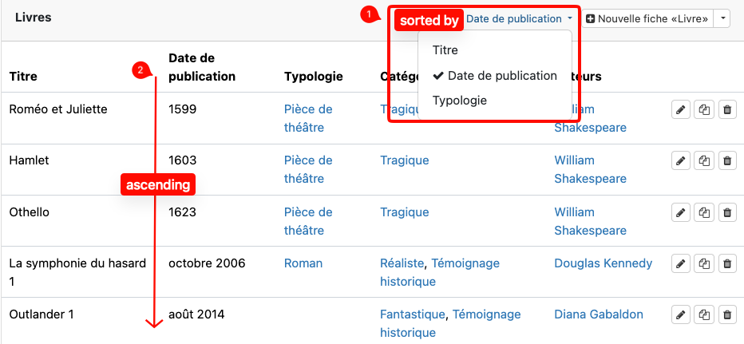

<!-- This is a FAQ front file. FAQs don't have side navigation bars. They start with a list of questions organized by themes and pointing to elements lower in the page. In the second part of the file, every content part is called under a title using the include_relative syntax of Jekyll -->

# CATIMA FAQ

Simplified documentation of [CATIMA](https://catima.github.io/userdoc/) organized in a question format.

## Adding and Editing Data

### How to create a new item type? [Read more →](#new-item-type)

### How to create conditional content? [Read more →](#conditional-content)

### How to edit the information of an existing item? [Read more →](#edit-an-item)

### How to embed media in an **item**? [Read more →](#embed-media)

### How to embed media in a **page**? [Read more →](#embed-media-in-a-page)

### How to create a custom page? [Read more →](#custom-content)

## Data Display

### How to define or change the display of an item type? [Read more →](#item-list-container)

### What sort options are available listing items? [Read more →](#data-sort)

### How to display items on a geographical map? [Read more →](#map-container)

### How to customize the catalog's navigation bar? [Read more →](#custom-navigation-bar)

## Collaboration and Access

### How to invite people and groups on a catalog? [Read more →](#invite-collaborators)

### How to restrict catalog visibility to certain members? [Read more →](#restrict-a-catalog)

### What are the different possible roles? [Read more →](#different-statuses)

## Workflow and Features

### How does the record validation system by reviewers work? [Read more →](#item-status)

<!-- ### How to create and manage a multilingual catalog?

Not in the documentation **-> to be created?** -->

### How to allow visitors of the catalog to submit comments? [Read more →](#suggestions)

----

### New item type



----

### Conditional content



----

### Edit an item



----

### Embed media in an item



----

### Embed media in a page



----

### Custom content



### Add a page



### Edit a page



----

### Item list Container



----

### Sort options for Items

Sort in Catima is based on *sortable fields* of items; to be used, these fields must meet the following conditions:
- the field is readable and can be ordered logically by a human (for instance from A to Z)
- the field allows maximum one value (or can remain empty as well)

**Note**: thus, *file* or *image* fields, *geographical fields* or fields which accept multiple values cannot be sorted.

In DATA mode, these fields are rapidly identified in the list view of items. As shown below, 1) the relevant field can be selected then 2) the list shows items in *alphanumerical ascending* order (i.e. from 1 to big numbers, then from A to Z).

 

**Note however that**, in case you unticked the box 'Include this field in edition list view (Data)' of a field in SETUP mode, that particular field **will not show as a sort option in DATA view**, even though it meets the above conditions. It remains available elsewhere in Catima when a sort criteria can be defined.

<!--  -->

The same principles thus apply for instance when you add an 'ItemList' container in an HTML page.

Only *sortable fields* can be selected to define the display order: 
- By default, the sort criteria will be the primary field, provided it has been set, or the first *sortable* field of the item type. 
- For the 'line' display style, another *sortable field* can be chosen as the sort criteria

----

### Map container



----

### Custom navigation bar



----

### Invite collaborators

There is a specific FAQ dedicated to the informations related to the invitation of collaborators and groups on catalog [available here](https://catima.github.io/userdoc/en/faqinvitation.html).











----

### Restrict a catalog



----

### Different statuses



----

### Item status



----

### Suggestions



----
