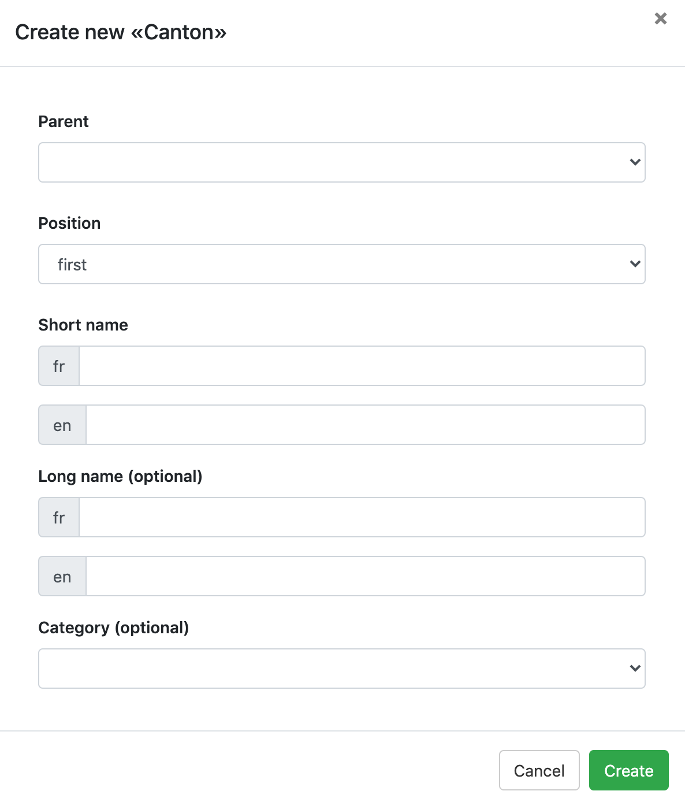

A super-editor can add and edit any item as well as add choices to existing choice sets. 

# Table of content

- [Add new choice to choice set](#add-new-choice-to-choice-set)

# Add new choice to choice set 
It is possible to add a new choice in a choice set when editing or creating an item with a "Choice set" field. Simply click on add .

A new window appears: 

Fill in the blank and click on "Create" to add a new choice to the choice set. 
> The field "Category (optional)" allows to link conditional content to a choice. The conditional content must be created before adding the choice. 

It is not possible for super-editors to delete existing choices or choice set. 