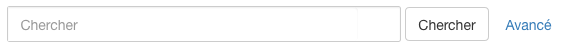

Les catalogues de CATIMA disposent d'une fonctionnalité de recherche permettant d'accéder au contenu du catalogue par le biais de mots-clés. Il est possible d'effectuer une recherche simple (recherche d'un mot, expression) ou une recherche avancée permettant de chercher du contenu au moyen de un plusieurs critères ("expression exacte", "contient les mots", "ne contient pas les mots").

Les recherches simple et avancées sont accessibles depuis la page d'accueil du catalogue, en cliquant sur le nom du catalogue tout à gauche de la barre de menus :

