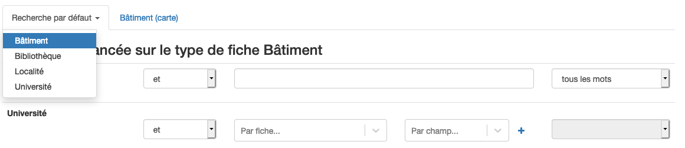

La recherche avancée permet de d'accéder à une liste de contenus en utilisant un ou plusieurs critères de recherche **au sein d'un type de fiche**. 

La recherche avancée est accessible depuis la page d'accueil du catalogue (via un clic sur le nom du catalogue). Pour accéder à la recherche avancée, cliquer sur "*Avancé*" ("Advanced") qui se trouve à droite du bouton "Chercher". Une page s'ouvre, présentant l'interface de recherche avancée. Le premier type de fiche s'ouvre par défaut mais en cliquant sur "Recherche par défaut" les autres types de fiches peuvent être choisis pour faire l'objet d'une recherche.

Il est possible de chercher des mots ou expressions exactes dans les champs de textes ou de sélectionner des options proposées. 

Pour sélectionner plus d'une option parmi les choix proposés (par exemple "Université de Lausanne", ainsi que "Université de Genève"), cliquer sur le bouton "+". Cette action ajoute une ligne, qui permet d'entrer une nouvelle option.

Une fois les différents champs souhaités remplis, cliquer sur "*Chercher*" ("Search"). Une liste des résultats trouvés apparaît permettant d'accéder au contenu souhaité. Pour modifier la recherche, revenir en arrière à l'aide du bouton précédent (<-) de votre navigateur.