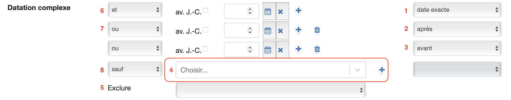

> Le champ datation est un champ très complexe pour lequel a été réalisé [un manuel complet](../../assets/datation/exempledatation.pdf) ainsi qu'un [catalogue d'exemple](https://catima.unil.ch/datation-exple/fr) de l'utilisation du champ ainsi que de son comportement lors des recherches.

**Différences entre les champs "Datation" et "Date"**
Le champ **Date** permet l'entrée d'une date précise sur une fiche. Cette date doit être unique. Cela peut être par exemple la date de naissance d'une personne, l'année de construction d'un bâtiment ou l'heure et la date d'une représentation.

Le champ de **Datation** accepte une date de début et une date de fin, permettant la création de périodes et la recherche sur toutes les dates contenues dans cette période.

### Recherche simple

Rechercher une date dans la barre de recherche retournera uniquement les fiches dans lesquelles les caractères recherchés figurent tels quels dans un des champs. Une recherche simple ne permet pas de calculer des périodes.
Ainsi, entrer deux dates dans la barre de recherche ne calculera pas une période mais retournera les fiches dans lesquelles figurent textuellement les deux dates.

### Recherche avancée

Une recherche avancée sur le champ datation permet de préciser des périodes de plusieurs façons différentes.

Les champs dates permettent de rechercher des dates manuellement. Les listes déroulantes à droite permettent de préciser si la recherche se fait sur une date exacte (1), après une date (2) ou avant une date (3).

La liste déroulante (4) permet d'effectuer des recherches par ensemble de choix.

Le critère ***Exclure*** (5) permet d'exclure l'un ou l'autre des types de datation. Exclure les fiches avec **datation manuelle** ne retournera que les fiches avec une **datation par ensemble de choix** et inversement.

Les critères peuvent être cumulés à l'aide des opérateurs de recherche "et", "ou" et "sauf" qui se trouvent sur la gauche.

L'opérateur qui se trouve avant la première ligne (6) se réfère aux autres champs de recherche. Tous les autres permettent de faire entrer en interaction plusieurs critères à l'intérieur du champ datation.
>  **Rappel:**
> 
> **ET** (6): tous les critères doivent être remplis
> 
> **OU** (7): l'un ou l'autre des critères doit être rempli
> 
> **SAUF** (8): le critère doit être exclu