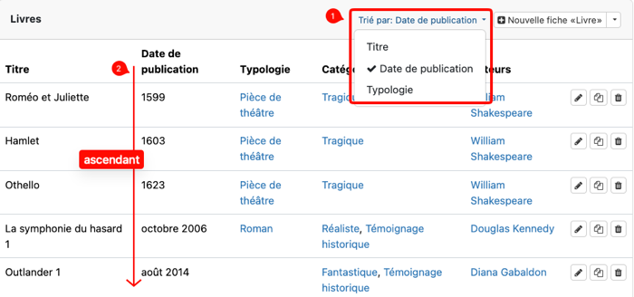

<!-- This is a FAQ front file. FAQs don't have side navigation bars. They start with a list of questions organized by themes and pointing to elements lower in the page. In the second part of the file, every content part is called under a title using the include_relative syntax of Jekyll -->

# FAQ CATIMA

Documentation simplifiée de [CATIMA](https://catima.github.io/userdoc/) organisée sous forme de questions.

## Ajout et modification de données

### Comment créer un nouveau type de fiche ? [Lire la suite →](#nouveau-type-de-fiche)

### Comment créer du contenu conditionnel ? [Lire la suite →](#contenu-conditionnel)

### Comment modifier les informations d'une fiche existante ? [Lire la suite →](#modifier-une-fiche)

### Comment ajouter une vidéo ou du contenu multimédia dans une **fiche** ? [Lire la suite →](#int&eacute;gration-de-m&eacute;dia)

### Comment ajouter une vidéo ou du contenu multimédia dans une **page** ? [Lire la suite →](#int&eacute;gration-de-m&eacute;dia-dans-une-page)

### Comment créer une page personnalisée ? [Lire la suite →](#contenu-personnalis&eacute;)

## Affichage des données

### Comment définir ou changer l'affichage d'un type de fiche ? [Lire la suite →](#affichage-des-fiches)

### Quelles sont les options de tri possibles ? [Lire la suite →](#tri-des-fiches)

### Comment afficher des fiches sur une carte géographique ? [Lire la suite →](#affichage-sur-une-carte)

### Comment modifier la barre de navigation du catalogue ? [Lire la suite →](#modifier-la-barre-de-navigation)

## Collaboration et accès

### Comment inviter des personnes ou des groupes sur un catalogue ? [Lire la suite →](#attribution)

### Comment restreindre la visibilité du catalogue à certains membres ? [Lire la suite →](#restreindre-un-catalogue)

### Quels sont les différents rôles possibles ? [Lire la suite →](#les-diff&eacute;rents-statuts)

## Workflow et fonctionnalités

### Comment fonctionne le système de validation de fiches par les reviewers ? [Lire la suite →](#validation-des-fiches)

<!-- ### Comment créer et gérer un catalogue multilingue ? pas dans la doc **-> à créer ?** -->

### Comment autoriser l'envoi de commentaire par les visiteurs du catalogue ? [Lire la suite →](#suggestions)

----

### Nouveau type de fiche



----

### Contenu conditionnel



----

### Modifier une fiche



----

### Intégration de média



----

### Intégration de média dans une page



----

### Contenu personnalisé



### Ajout d'une page



### Édition d'une page



----

### Affichage des fiches



----

### Options de tri dans Catima

Le tri dans Catima se base sur les *champs triables* d'une fiche, qui doivent remplir ces conditions:
- le champ doit être lisible et pouvoir être classé selon un ordre logique par des humains (par exemple de A à Z)
- le champ accepte au maximum une seule valeur (ou il est vide)

**Note**: ainsi, les champs de type *fichier* ou *image*, les *champs géographiques* ou les champs qui autorisent la sélection de plusieurs valeurs ne peuvent pas être utilisés pour le tri.

En mode DATA, ces champs sont identifiables dans l'affichage liste (cf. 1 dans la copie d'écran ci-dessous) et les données seront triées par ordre ascendant alphanumérique (donc de A à Z, et de 1 aux grand nombres, cf. 2 ci-dessous).

 

**A noter toutefois** que si, dans un champ en mode SETUP, vous avez décoché la case 'Inclure le champ dans la liste des fiches en mode édition (Data)', ce champ ne fera pas partie des champs de tri disponibles en mode DATA, même si ce champ correspond aux conditions définies plus haut. Il reste cependant disponible ailleurs dans Catima quand un ordre d'affichage peut être défini.

<!--  -->

Les mêmes principes s'appliquent par exemple lors de l'ajout d'un conteneur de type 'ItemList' dans une page HTML.

Seuls les *champs triables* peuvent être sélectionnés:
- Par défaut, le *champ primaire*, s'il existe, est la champ de tri sinon c'est le prochain *champ triable* de la fiche.
- Pour le style d'affichage 'line', un autre *champ triable* d'une fiche peut être librement choisi comme champ de tri.

----

### Affichage sur une carte



----

### Modifier la barre de navigation



----

### Attribution de statuts

Il existe une FAQ consacrée à toutes les questions concernant l'imvitation d'utilisateur-ice-s sur un catalogue [consultable ici](https://catima.github.io/userdoc/fr/faqinvitation.html).





### Créer et gérer des groupes



### Ajouter des utilisateur-ice-s manuellement



### Inviter des utilisateur-ice-s avec un identifiant



----

### Restreindre un catalogue



----

### Les différents statuts



----

### Validation des fiches



----

### Suggestions



----
