An administrator has full access to the catalog; they can add and modify any content as well as modify pages and the catalog's structure. 

# Table of contents

- [Catalog configuration](#catalog-configuration)
	- [Conceptualization](#conceptualization)
	- [Exploration](#exploration)
	- [Ranking and structure](#ranking-and-structure)
	- [Links and references](#links-and-references)
	- [Add new item type](#add-new-item-type)
		- [New field](#new-field)
		- [Field types](#field-types)
			- [Boolean field](#boolean-field)
			- [Choice set field](#choice-set-field)
			- [Date time field](#date-time-field)
			- [Decimal field](#decimal-field)
			- [Editor field](#editor-field)
			- [Email field](#email-field)
			- [Embed field (media integration)](#embed-field)
			- [File field](#file-field)
			- [Geographic field](#geographic-field)
			- [Image field](#image-field)
			- [Integer field](#integer-field)
			- [Reference field](#reference-field)
			- [Text field](#text-field)
			- [URL field](#url-field)
		- [Display options](#display-options)
	- [Categories and conditional content](#categories-and-conditional-content)
	- [Create and edit custom pages](#create-and-edit-custom-pages)
		- [Contact container](#contact-container)
		- [HTML container](#html-container)
		- [Item List container](#item-list-container)
		- [Map container](#map-container)
		- [Markdown container](#markdown-container)
		- [Search container](#search-container)
	- [Embed media in a page](#embed-media-in-a-container)
	- [Customize navigation bar](#navigation-bar)
	- [Statistics](#statistics)
	- [API and data only mode](#api)
	- [Catalog access](#catalog-access-and-visibility)
		- [Manage access to data](#access-to-data-and-data-edition)
		- [Change a user's status](#change-status)

# Catalog configuration

Building a new catalog is a two-step process: first, define the catalog's structure, then start to add data. This section will go over the first step; the data entry process is described in the editors section above.

## Conceptualization

It is important to consider the type of data that will be added to the catalog and how it will be structured before starting to add it. This reflective stage will help define catalog's conceptual and logical structure and facilitate the realization in CATIMA.  
At this stage, we are grouping different **data** together under a same **concept**.   
> For example "Titanic", "The Godfather" and "2001: A Space Odyssey" can be grouped together as "***movies***".

When there are multiple objects (or data) of one type each can have different features. To stay with the movies example, each movie has a ***Title***, ***Director***, ***Genre*** and ***Release date***. This information can be displayed in a table: 

| Title      | Genre | Director | Release date |
| ----------- | ----------- | ----------- | ----------- |
| Titanic      | Drama       | James Cameron | 1998 |
| The Godfather   | Crime        | Francis Ford Coppola | 1972 |
| 2001: A Space Odyssey   | Science-fiction      | Stanley Kubrick | 1968 |

The next steps show one way to conceptualize a dataset. 

## Exploration

Freely list all elements that will be added to the databse without worrying about any kind of order. In our example, we want to list about 20 movies.

## Ranking and structure

We will now add some order to the list of elements. We want to find what are the important concepts and what features do they have. 
> Note: an element can be a feature of a concept and a concept as the same time: see "*Links and references*".  

In the movie example, the core concept is ***Movie*** since the catalog's goal is to list movies. But ***Director*** can also be a concept if it is considered useful to know additional features about them such as "*Date of birth*", "*Nationality*" or "*Biography*".  

## Links and references

Next, we will consider the relationship that each concept can have with other concepts. It is common for a concept to have a connection to one or more concepts. 
> ***Movie*** and ***Director*** have a connection as a ***Movie*** can have one or many ***Directors*** and a ***Director*** can make one or more ***Movie***. 

In CATIMA, those relationships are *References*. By adding a *Reference* field to the ***Movie*** concept about ***Director***, the ***Movie*** will appear in the ***Director*** concept.  

In CATIMA, concepts are called ***Items*** and their features ***Fields***.  

## Add new item type

After deciding which concepts and features will be used in the catalog, it is time to start adding item types. No data is added yet, this is where the item types and its fields are defined.  

First, acess the set up page by clicking on **Admin** > **Catalog set up** in the navigation bar. One must be connected to CATIMA and and be an administrator to perform this action.  

If some items have already been created, they will be displayed on the top-left of the page. Click on the "*New item type*" button to create a new one. 

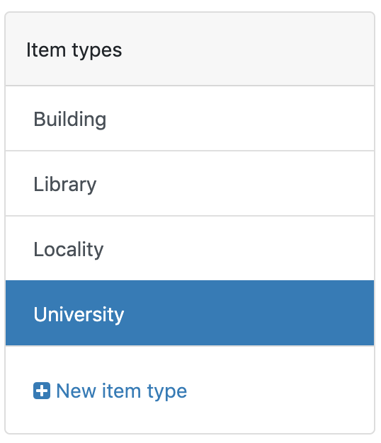

The *New item type* form opens:

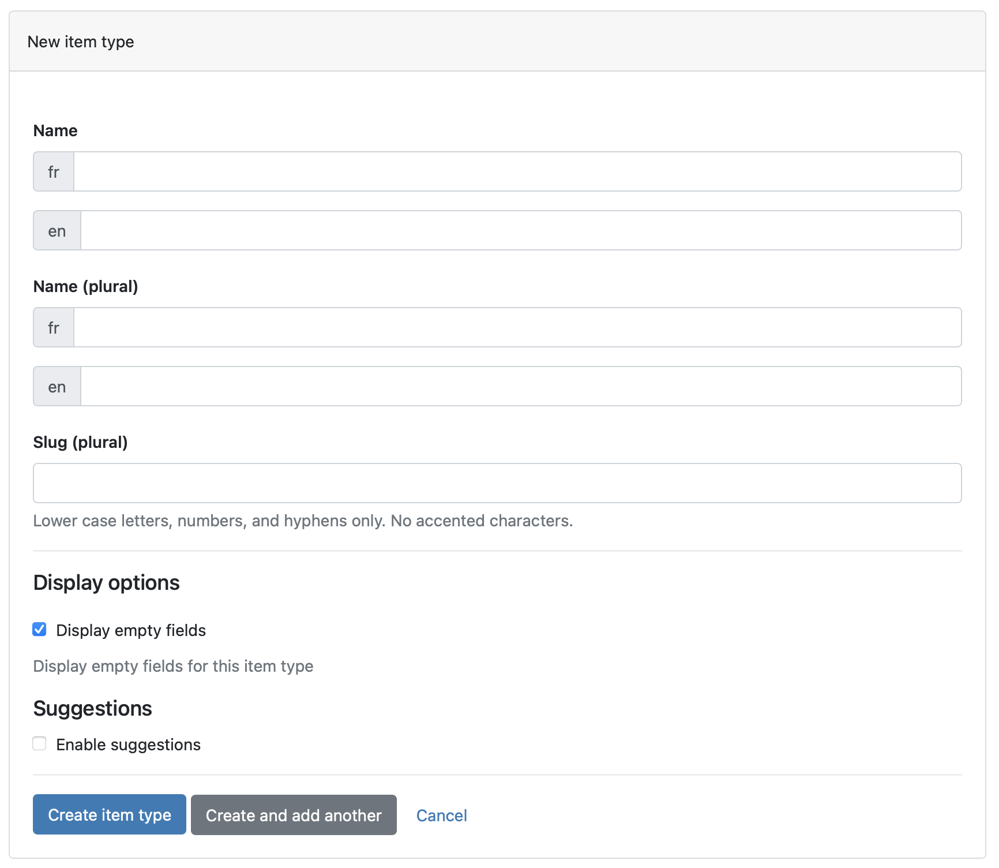

**Name**: add the item name. If different languages are selected, all fields must be completed.  
**Slug**: the slug is a short name that will appear in the website's address (URL). It must contain only letters (without accent), numbers and hyphens and must be short.  
> Example: for the item "University" the slug could be "uni".

In the **Display options**, if ***Display empty fields*** is selected, all fields will appear to the catalog's visitors, even if those are empty. If you do not wish empty fields to be shown, deselect this option. 

## Suggestions

**Suggestions** are a way for catalog's users to send their comments to the editors and administrators. This could be used to notify about an error in a specific item. Those **Suggestions** are private and not publicly displayed on the catalog; they are sent by email to the adress defined by the administrator and are visible in data mode. 

To activate this option, select **Enable suggestions**. Unless the **Enable anonymous suggestions** is checked, only users with a Catima account can send suggestions. 

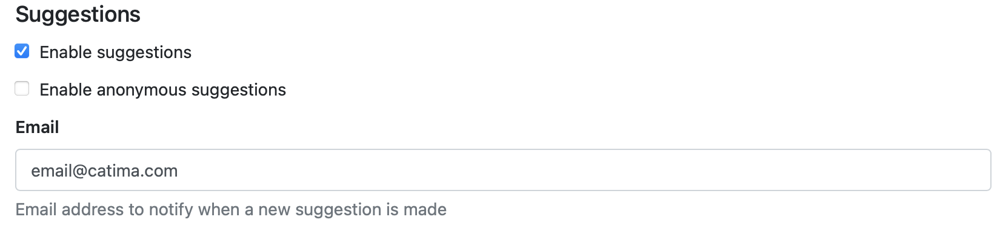

If suggestions are allowed for an item type, a button will appear on the top right of the screen:

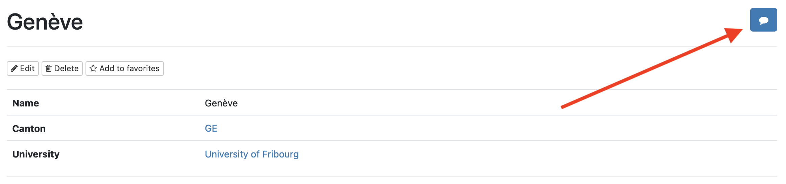

When clicking, an interface will appear to write the comment:

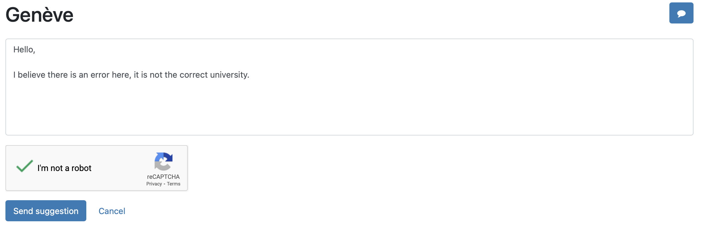

When a suggestion is made, a notification is sent to the specified email adress and the suggestion is visible in data mode. A grey number  next to the item indicates the number of suggestions that haven't been validated or deleted.  
They can be accessed by editing  the item.

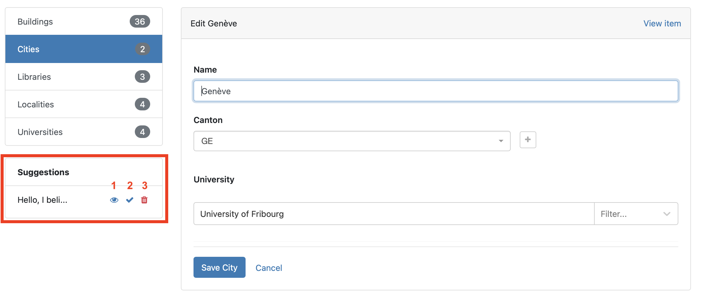

There are 3 options: 

- **1**: read suggestion:

 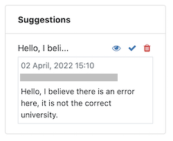
- **2**: validate suggestion: the icon will turn green and the suggestion stays visible
- **3**: delete suggestion

## New field

Once the new item created, it is time to add fields that will hold the data. Fields are the item's *features*. 

> A "*Movie*" item's fields could be a text field for the title, a date field for the release date and a choiceset field for its genre.

The number of fields an item can have isn't limited.

To add a new field to an item: 

1. On the *set up* page, select the item in the item list
2. Click on the **Add** button on the top right of the page

## Field types

In order for the catalog to be filled in by the editors with data in the right format (e.g. number, date, image), it is necessary to create appropriate fields. Here are the types of fields available in CATIMA :

#### Boolean field

Only for "Yes" and "No" values. 

#### Choice set field

This field is for a hierarchical choice list with multiple values. It can accept a only a single selection or multiple ones. Here is an example of what the choice set field looks like when adding data:

> Note: the add  button is only available to super-editors, not simple editors.

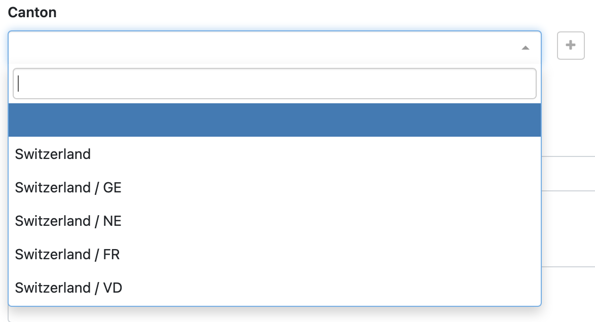

The list of available **choice sets** is on the *Choices* page that is accessible from the left sidebar. Each choice can have children which can also have their own children. This allows the user to structure the choice sets. Each choice can be selected, event those that have children.

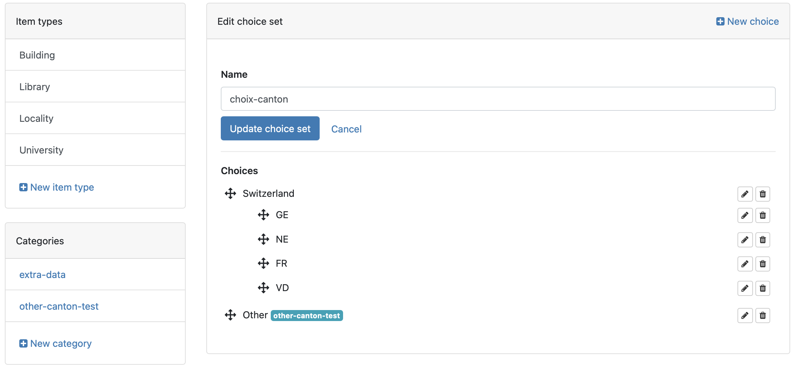

When a choice set is not in use anymore, there are two options: 

- **deactivate** it: this option leaves the choice set available in "Set up" but can't be used in "Data". It can be reactivated if needed.
- **delete** it: completely deletes the choice set.

#### Date time field

The date-time format goes from **year** only to **year, month, day, hour, minute and second**. 

#### Decimal field  

For decimal numbers

#### Editor field  

Automatically displays the item's editor or the last person to modify it. 

#### Email field  

Creates a text field that only accept an email.

### Embed field

**For media integration in a page's container, see [Embed media in a page](#embed-media-in-a-container)*

This field allows media integration such as interactive capsules, 3D models or videos to an item from websites that are independent from Catima. For the integration to be possible, the site where the media is located must be explicitly authorized explicitly by Catima. It has to be part of the **authorized domains**' list.

> e.g. to add a youtube video to an item, the domain **youtube.com** has to be authorized by Catima - which it is.

##### Non-exhaustive list of authorized domains:

- Youtube (*.youtube.com)
- Viméo (*.vimeo.com)

To know the exhaustive list of authorized domains contact the persons in charge of the project.

##### Using the embed field

In addition to the usual information such as title, slug and display options, it is also necessary to add *Additional domains* and *Format*.

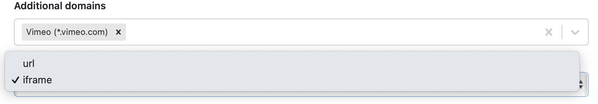

1. **Additionnal domains**: choose form the list the authorized domains for this field. *E.g. if this field will only be for youtube video, select Youtube. But if it should be able to display videos from Youtube and Vimeo, choose both.*
 
2. **Format**: there are two ways to add a media.
	- *with iframe*: this option is to share the media only. It means that any other element on the page will not be displayed in the field. If we are embedding **Youtube** video this way, the youtube search bar, titles and comments will not be shared. Visually, this is a clean way to display a media in Catima. 
		- How to add a media in data edition mode: get the *iframe tag* from the internet page where the media currently is by clicking on **Share > Embed**. The *iframe tag* is some text that starts with `<iframe` and ends with `</iframe>`. Copy and paste it in the item's embed field.
		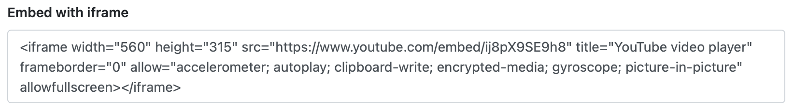
		This is what it looks like when consulting the catalog:
		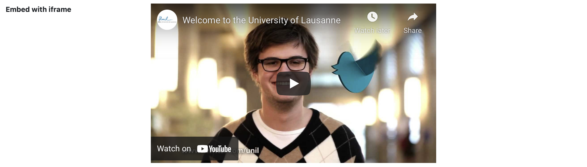
		Is it possible to add multiple medias by simply adding different *iframe tags*: 
		
		
		> Note: due to security reasons, any other HTML tag with be deleted, the field only accepts *iframe tags*. 
		 
	- *with URL*: this options allows to share a complete web page with media, titles and other elements. It is convenient to use when a media can not be shared with *iframe*. Height and width can be changed, by default 400px and 900px respectively. 
	> Note: it isn't always possible to use this method as the website needs to accept to be embeded this way - which sometimes is not the case. This decision is independent of Catima. E.g. Youtube and Vimeo don't allow it.
	
It is highly recommended to be specific when creating an **embed field** and add a meaninful title and/or to use *data editing help text* to let the editors know what kind of content is expected.  

#### File field  

To add external file to the item with the possibility to restrict the accepted files' type (*e.g. only .pdf and .png*). 

#### Geographic field  

The geographic field is used to set an item's location. It is set by drag and drop'ing a point on the map or with coordinates. A single items can have multiple locations: add a location by clicking on the pin below the zoom controls on the map.

#### Image field  

Accepts images with optional caption.

#### Integer field  

For integer numbers. Can also be userd to create an automatic incrementation - for exemple for id number. 

#### Reference field  

Creates a relationship to another item. 

**E.g.** Create a reference field named *"University"* in the building item to link it to a university. This makes it so when creating a new building, it is possible to link it to a university. 

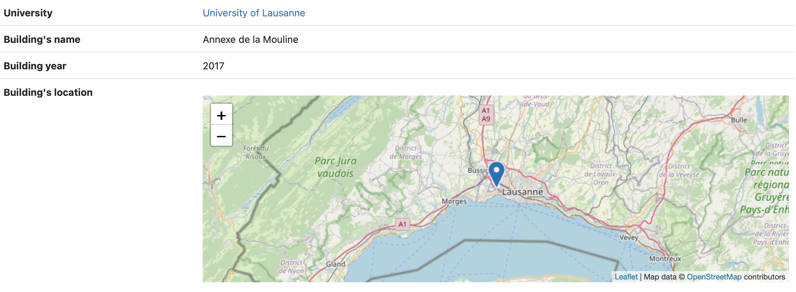

This field also appears on the university item, at the bottom with a list of all buildings that are linked to it. If different items have a reference field to it, it is sorted by item type. 

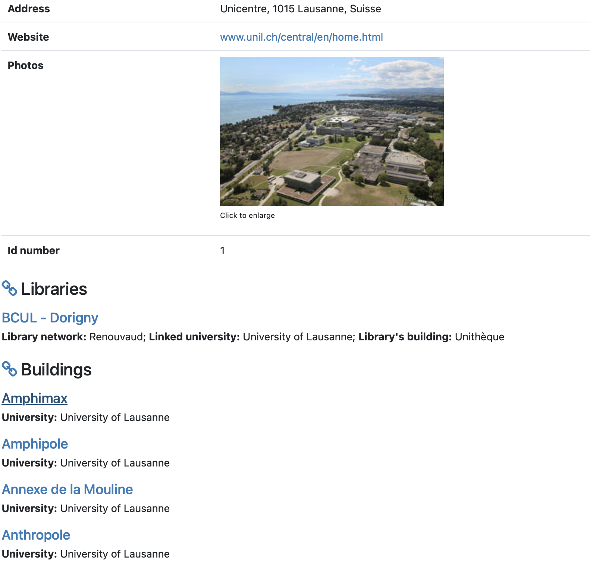

#### Text field

Can be used to add short (*e.g. name or title*) or long (*e.g. description*) text. It is possible to choose between a formatted text editor or a simple text editor. 

> If this field is used as a primary field, formatted text is not possible and will be deactivated. 

#### URL field  

This field accepts URL adress and will create a link. 

### Create a new field

A field name and slug must be chosen when creating a new field for an item:

| | Definition | Example | Note |
| ---------- | ---------- |---------- | ---------- |
| **Name** | The new field's name | *Actor's birthday* | - |
| **Name (plural)** | The new field's name - plural form | *Actors' birthdays* | - |
| **Slug** | Short and unique name | *birthday_actors* | Only accepts letters without accents and hypens. |

#### Display options 

When creating a new field, the following options can be selected:

| | Definition | Note |
| ---------- | ---------- |---------- |
| **Use this as a primary field** | This field with uniquely identify each item. It is usually a text field (Title) or integer field (ID number) | This option can only be activated for one field at a time. |
| **Include this field in edition list view (Data)** | Choose to display/not display a field in the data section. | This is useful to not display a field with a lot of informations and lighten section.|
| **Include this field in site list view** | Choose to display/not display a field to the final user when browsing all items. The field will still appear when the item is displayed, only not when all item types are listed. | Particularely useful if the item's list default is *List*. If *Grid* is selected, this option won't change anything. |
| **Restrict field to catalog staff** | Only members with invite or access to the secred code will have access to this field. | Useful to share extra information within the team that should not be displayed to the site's visitors.

## Categories and conditional content

An item type can have content that is common to all items (e.g. all movies have a director) but can also have conditional content (e. g. the "Period" field is relevant for *historical documentary* but not for *action movies*). It is possible to create a **category** that is displayed only if a certain **choice** is selected. In our example, the option *Period* can be show to the editor creating a new item only if the choice *Historical documentary* is displayed and otherwise hidden.  
This allows the *New item* page to remain uncluttered.  

Follow the next steps to create conditional content:  

### 1. Add a category

On the *Set up* page click on **Category > New category** in the left sidebar. It is possible to create multiple categories that are linked to different choices.  
The process of creating a new category is the same as creating a new item: chose a name and slug then add new fields.

### 2. Link it to a choice

In the left sidebar, select **Choices** and edit  the choice set containing the choice that you want linked to the conditional content. In this example we will add conditional content to the canton *Other* in the first choice set.

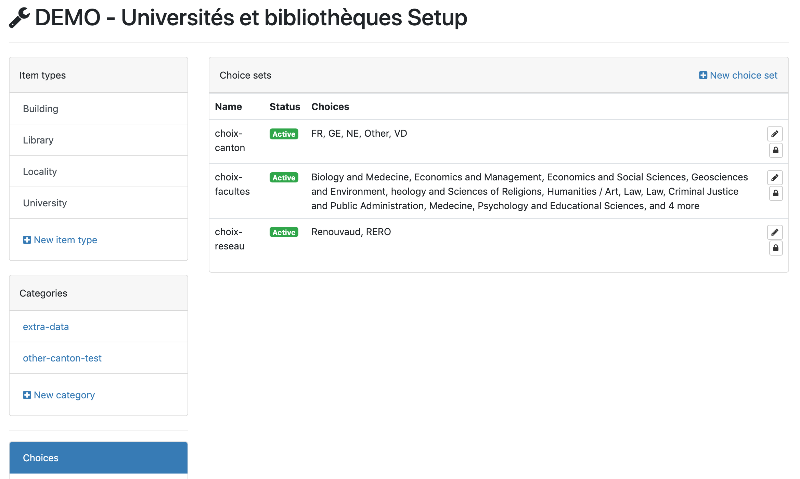

Edit the choice and the last option is to add conditional content; select the category that should be displayed when that choice is selected:

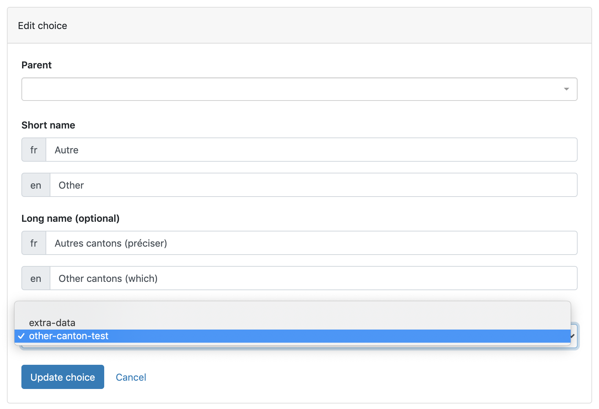

After updating the choice, the conditional content is displayed on the right side of the choice when editing the choice set:

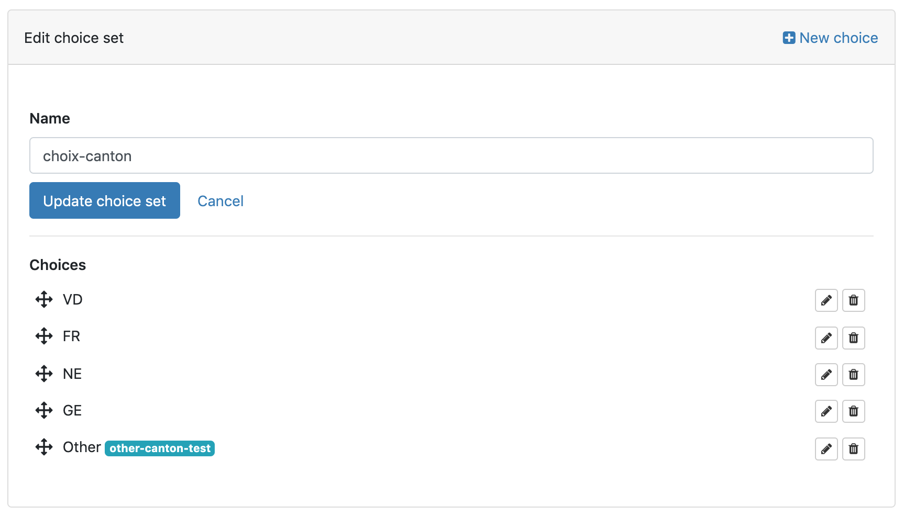

## Create and edit custom pages

CATIMA has a default mode to display the item to the final user. This mode can not be modified, but we can create **pages** where the layout can be modified as needed.

To add a new page, click on **Pages** in the left sidebar while in *Set up* mode and click on *New page* then add a slug and title and confirm by clicking on **Create page** - or **Create and add another** if you need to add more.

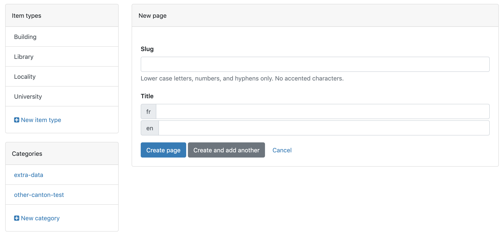

Then to modify the page, click on edit  and the *Edit page* page will open. The slug and title can be modified and content can be added in the *Containers* section. 

> If the catalog is multilingual, there will be one container per language on the *Edit page* page. Adding an elemenet to one container doesn't automatically add it to the other ones. 

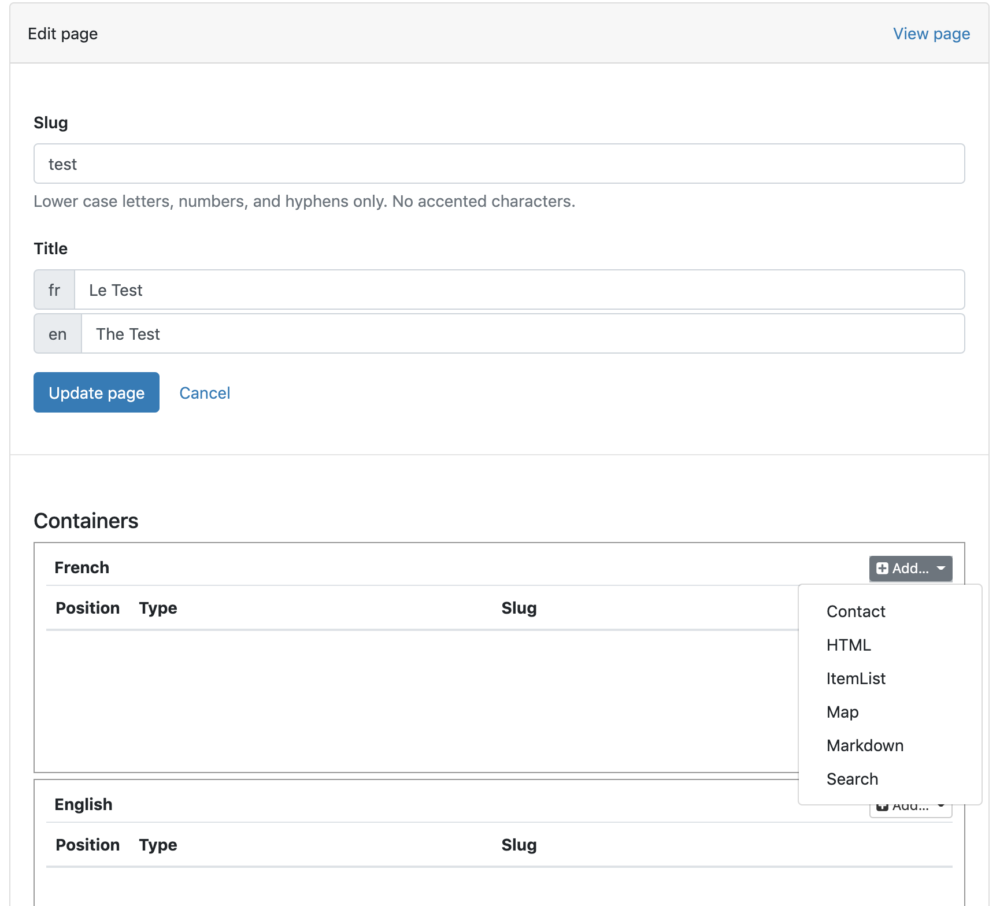

Different kind of content containers can be added to a page:

- **Contact**: adds a form that allows users to send an email to specified email adress. 
- **HTML**: displays a visual editor to write formatted text, links (URLs) and add images or videos. A code editor also allows advanced users to enter HTML code directly. It is this container that is used to embed media. 
- **Item List**: this container display a list of a selected item. Different styles are availables (list, grid, thumb). *Maximum one per page*
- **Map**: displays a map with a specified item type's localisation. The item must have a *Geographic field*. 
- **Markdown**: to add text, tables and images with Markdown syntax.
- **Search**: displays the results of a previously saved search. *Maximum one per page*

### Contact container

Simply add a slug (must be unique and only letter, numbers and hypens) and an email adress. The messages will be sent directly to that specified adress.

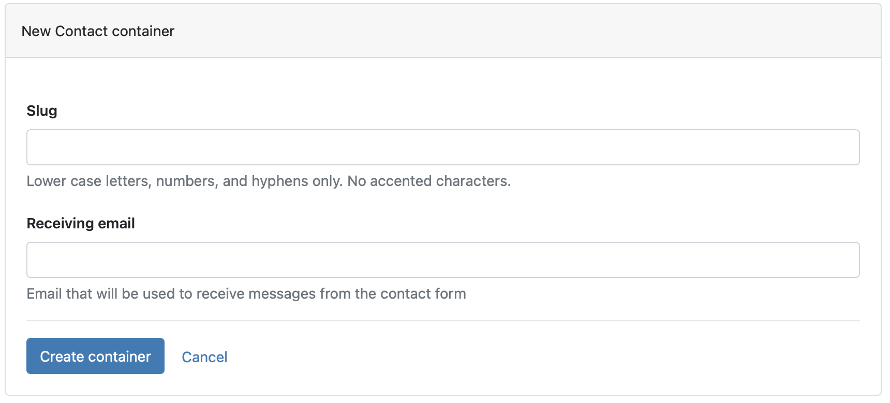

### HTML container 

This will allow to add text, images, URL, video through a text editor. This container also allows advanced users to add pure HTML content by clicking on "Code View".
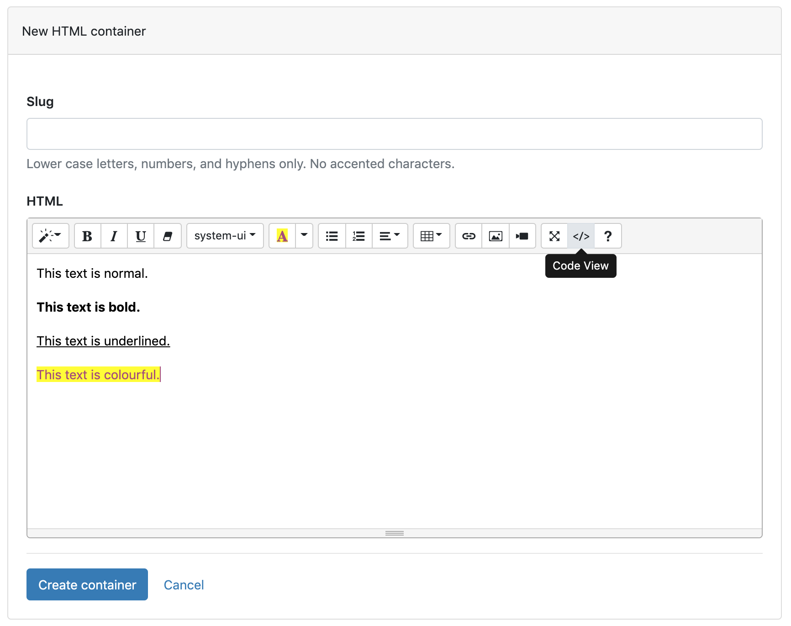 

> When using "Code View* it is critical to switch back to normal (by clicking the the "Code View" button again) before saving the container. If this step is skipped, the work won't be saved !

### Item List container

Displays all items of an item type in a list, grid, thumb or line style (e.g. to show a list of all *Universities*). Different styles are availables:

> **Note**: it is not possible to have more than one Item List container on the same page. 

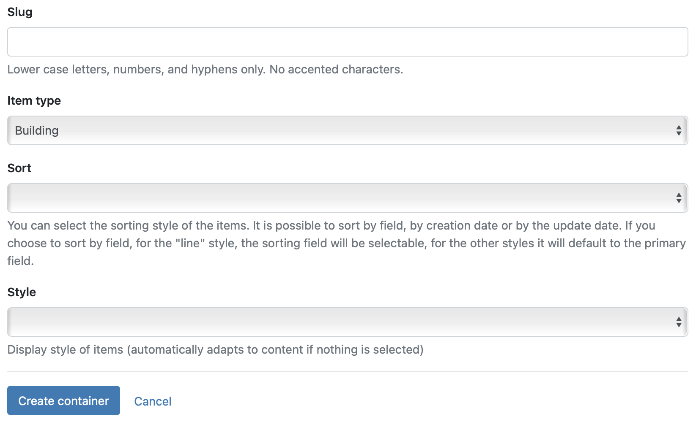

After selecting a unique slug and the item type to be displayed, choose to sort the items in *ascending* or *descending* order (alphabetically), creation date or modification date. With grid, list and thumb styles the order (ascending or descending) is created based on the primary field. Whith line style, a new option appears and it is possible to choose the field to sort the items. 

> **Example**: let's say we have an item type **Book** with the following fields: *Title* (primary field), *Author*, *Publishing date* and *Illustration*. When chosing grid, list or thumb style sorting is done on *Title*. With line style it can be on *Title*, *Author* or *Publishing date*. *Illustration* will not be a possible choice as it can't be alphabetically sorted. 

#### Grid style
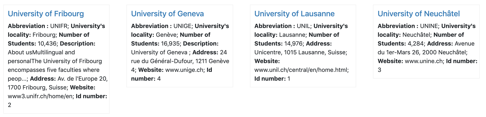

#### List style
- With images 
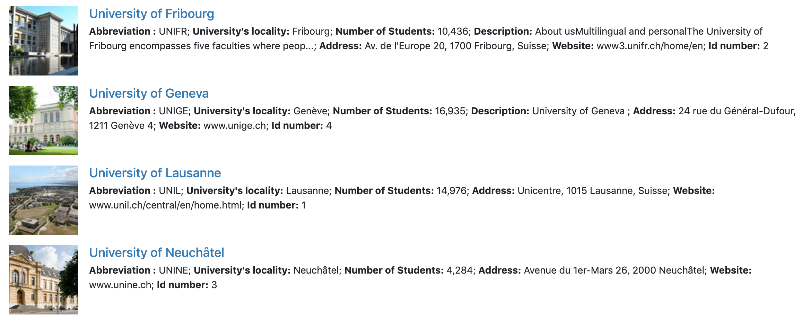
- Without image
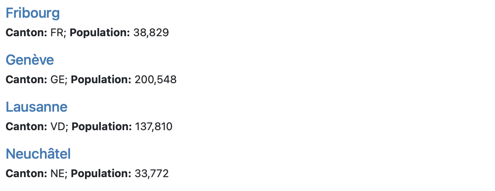

#### Thumb style
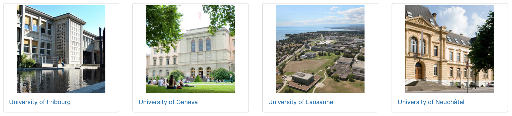

#### Line style
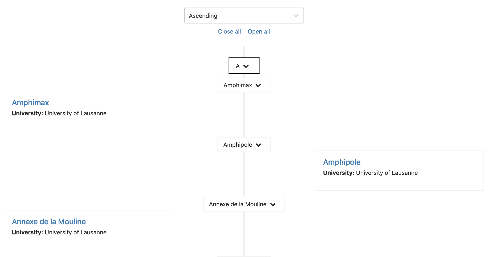

This style displays the items vertically along a line. The user can choose to see the items in a ascending or descending order and to see all the items or none with *Close all* and *Open all*. It is then possible to only see some of the items using the small arrows.

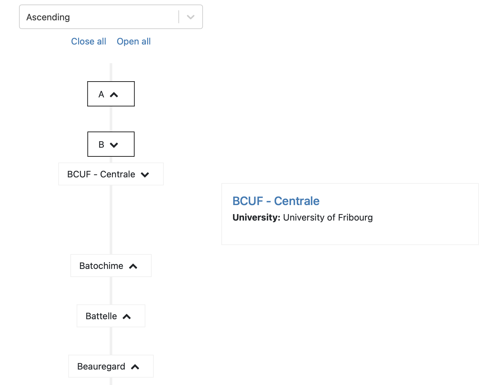

### Map container 

The map container is used to display a geographic map of a item type that has a geographic location attribute (e.g. location of all swiss universities with geographic field). It has different options: 
	-  The item to be displayed on the map can be selected vie the **Item type** field. It will be possible to choose items that have a location attribute - items that don't have location attribute will not appear in the list:
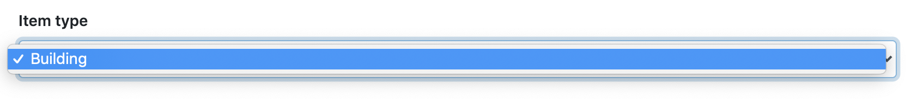
	- The map background can be chosen with the additional layers field. If more than one is selected, the user will be able to switch between them.

	- The map height can be changed by changing the default height (400px) in the **Map height** attribute.
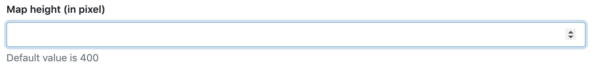

Example of a map container:
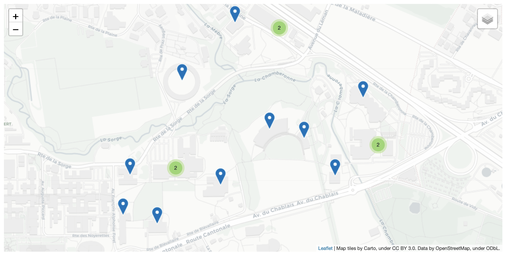

### Markdown container 

This container can be used to add text, images and tables with the markdown syntax. 

### Search container

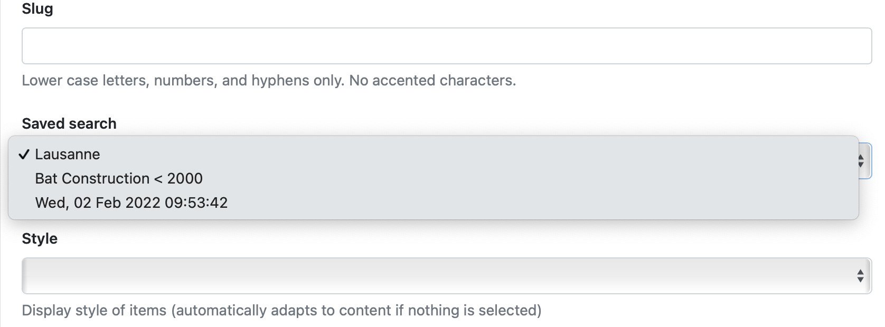

> **Note**: it is not possible to have more than one Search container on the same page. 
> 
Displays the result of a previously saved simple or advanced search. The "Style" settings changes the way the items are displayed. It is the same styles as listed in the [ItemList Container section](#item-list-container): Grid Style, List Style and Thumb Style. 

#### Simple search 

The simple seach bar is available on the home page. Click on the catalog's title on the top left corner to access the home page. 

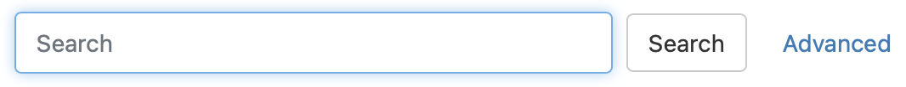

#### Advanced search 

With advances search, it is possible to search a specific item type and to search on one or more specific fields. The image below shows an advanced search on the item "Building", on the "Building year" field for all buildings built before the year 2000:

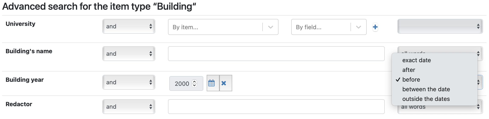

To save a search, click on *"Save search"*. It is now in the user's profile. To see all saved searches, click on the user's email on the top right of the page (it is necessary to have a Catima account and to be connected), then *"My searches"*. From there, rename the searches is needed. That will be very useful to select the correct search for the Search container as otherwise, the title is the date and time of the search.

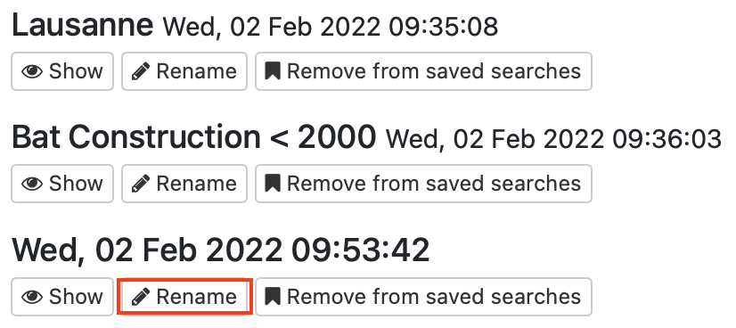

### Embed media in a container

The HTML container allows users to integrate medias such as videos, infographics and more to pages. Unlike the [embed field](#embed-field), this method allows the content to be displayed full width on the page. 

For the integration to be possible, the site where the media is located must be explicitly authorized explicitly by Catima. It has to be part of the authorized domains‘ list.

e.g. to add a youtube video to an item, the domain youtube.com has to be authorized by Catima - which it is.
Non-exhaustive list of authorized domains:

Youtube (*.youtube.com)
Viméo (*.vimeo.com)
To know the exhaustive list of authorized domains contact the persons in charge of the project.

1. Create a new or edit a HTML container and enter "Code View" mode. 

2. Get the iframe tag from the internet page where the media currently is by clicking on Share > Embed. The iframe tag is some text that starts with `<iframe` and ends with `</iframe>`. Copy and paste it intot the HTML editor.
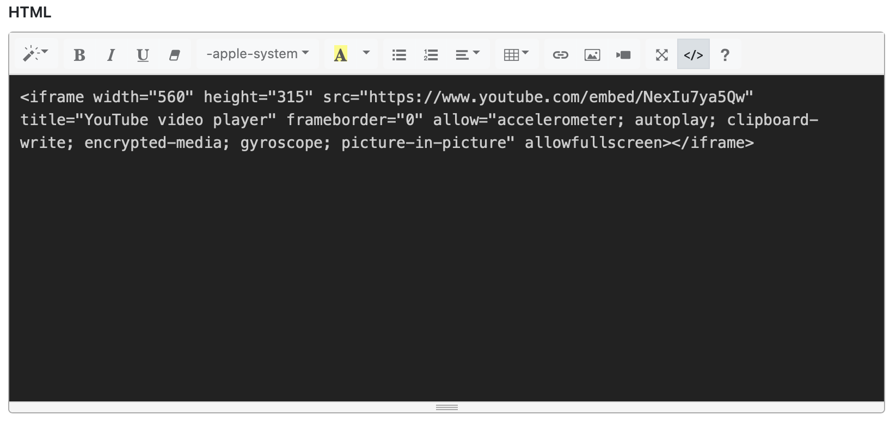

3. Click on the "Code View" button again to go back to standard editing more. 
4. Save your work by clicking on the save or create container button. 

> It is critical to switch back to normal editing more before saving or creating the container with the button at the bottom of the page, otherwise the changes will be lost !

### Tip

To modify the elements' order on the page, move the blocks up or down with the arrows on the left:

## Navigation bar

The navigation bar is customizable: it is possible to add or remove items as well as change the order. To do this acces the **Menu items** settings in the left sidebar while in *Set up* mode. The current items displayed in the navigation bar are listed with their rank. An *Item type*, *Custom page* or *External URL* can be in the navigation bar. 

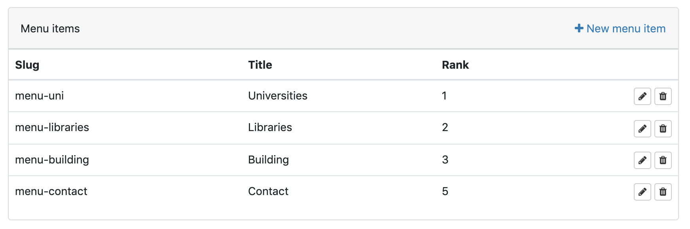

Settings can be adjusted by editing an existing item or creating a new one. Apart from the usual slug (short name that must only have small cap letters without accents, numbers or hypens) and title, the options are:

- **Rank**: change the item's order by changing its rank. The items are displayed from left to right in ascending order. 
- **Parent**: To create a drop-down menu:
	- Create a *Parent* menu item; this is the name that will appear in the navigation bar. Only fill in the slug, title and rank fields. 
	- To add *Child* menu items - options that will appear when the parent is clicked, create a new item or edit an existing one and add the *Parent* item in the parent field.   

> It is not possible for a child item to have other children.

## Statistics

The **Stats** tab in the Set up page tracks catalog's visitors. 

- The blue line is external users 
- The red one is editors and administrators on the Data and Setup page. 

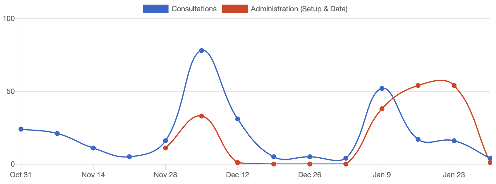

## API 

Catima offers the possibility to get a catalog's informations through an API. *This option has to be activated by a system administrator. To activate your catalog's API, contact the persons in charge of the project.*

### Who can access the data ? 

One must either have a Catima account, be logged in and have access to the catalog to be able to use it's API (password method) or have the catalog's API key (API key method). The available data with the password method is the same than the data that the user has access to and can be restricted while the API key method grants access to the full catalog. For this reason, **never publicly share an API key.**

Create and delete API keys in from the **API** tab in "Set Up" mode. It is possible to have several API keys at the same time. 

More informations for API requests can be foud [in the documentation](https://catimalb.unil.ch/api-docs/index.html).

### Data only mode

A data only mode can be activated is Catima is only used to store data and a frontend catalog is not needed to access and visualize the items.

**In data only mode:**

- items can not be accessed via a catalog site by visitors
- there are no visualization options (menu, pages, visitors' statistics)
- access to data and set up mode can still be separated by role (editor, reviewer, administrator)

*This option has to be activated by a system administrator. Contact the persons in charge of the project if interested.*

# Catalog access and visibility

The CATIMA website can be accessible to all visitors or restricted to members/staff only. To configure who can see it, access the **General** setting on the left sidebar: 

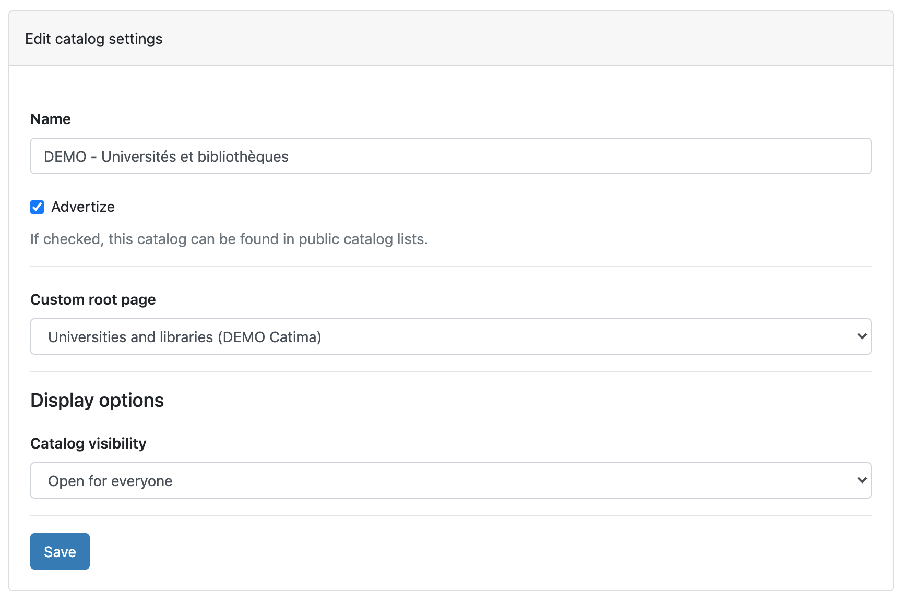

Choose who can see your website by changing the **Catalog visibility** option:

- **Open to everyone**: the website is visible to anybody with the URL.
- **Open to members**: can be accessed by the website's members only. *To learn how to attribute member status, see Member status further down this page.*
- **Open to catalog staff**: the catalog is only accessible my *editors*, *super-editors*, *reviewers* and *administrators*. 

Other options are accessible from this page:

- **Name**: change the name of the website
- **Advertize**: by checking it, your catalogue will be accessible from public CATIMA lists.
- **Custom root page**: change the landing page 

## Access to data and data edition 

CATIMA has different staus that can be attributed to users; those status define what a user can or can't do within a given catalog. Guests are users that don't have a CATIMA account and must create one to have access to other status.

> Status are catalog specific and a user can have different status in different catalogs. 

**Users** can view the public areas of the non-restricted catalogs.  
**Members** are users that can view the public areas of a restricted catalog.  
**Editors** are members that can create and edit their own items in the catalog.  
**Super-editors** are editors that can create and edit all the items in the catalog and add new choice in choice sets.
**Reviewers** validate itesm created by **editors** and **super-editors**.
**Administrator** have access to all the catalog's options. 

## Change status

It is possible to invite people to see a private catalog or colaborate by changing their status. They will get an email with the invite. To edit a user's status, got to **Users & groups** in the left sidebar on the "Set up" page.

Status can be changed in two ways: 

1. One person at a time: search for the user and click on edit . After selcting a prefered language, their status can be updated. 
2. Use the *Group* setting: add a new group, give it a name and description.

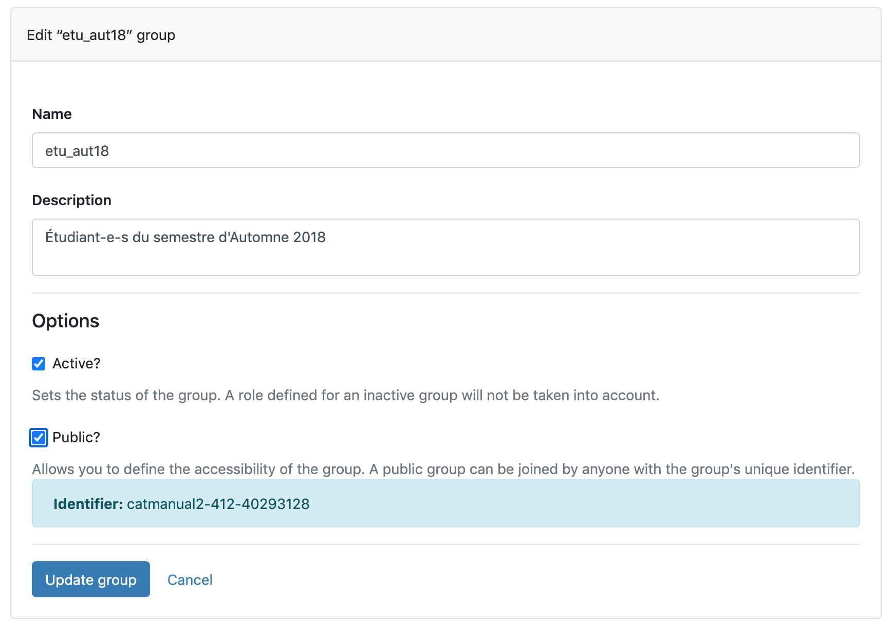 

If the "Public" checkbox is not checked, only members with an email invitation are part of the group. To add members to the group with email adresses, click on the  icon. 

If the "Public" checkbox is checked, CATIMA will create a password that can be shared with anybody. This pasword is the key to be part of the group. 
> To generate the password, check the "Public" checkbox, update the group and edit it again.

Users can also be given editor or super-editor status the same way.

> Users won't be able to see the catalog if its visibiliy is set on *Open to members* or *Open to catalog staff.
> Members won't be able to see the catalog if its visibility is set on *Open to catalog staff*.
> To change the catalog's visibility, go to *Set up > General > Catalog visibility*