An administrator has full access to the catalog and can add data as well as modify pages and the catalog's structure. 

# Table of contents

- [Catalog configuration](#catalog-configuration)
	- [Conceptualization](#conceptualization)
		- [Exploration](#exploration)
		- [Ranking and structure](#ranking-and-structure)
		- [Links and references](#links-and-references)
	- [Add new item type](#add-new-item-type)
		- [New field](#new-field)
		- [Field types](#field-type)
			- [Boolean field] (#boolean-field)
			- [Choice set field] (#choice-set-field)
			- [Date time field] (#date-time-field)
			- [Decimal field] (#decimal-field)
			- [Editor field] (#editor-field)
			- [Email field] (#email-field)
			- [File field] (#file-field)
			- [Geographic field] (#geographic-field)
			- [Image field] (#image-field)
			- [Integer field] (#integer-field)
			- [Reference field] (#reference-field)
			- [Text field] (#text-field)
			- [URL field] (#url-field)
			- [Xref field] (#xref-field)
		- [Display options] (#display-options)
	- [Categories and conditional content](#categories-and-conditional-content)
	- [Create and edit custom pages] (#create-and-edit-custom-pages)
- [Manage access to data](#manage-access-to-data)
- [Example](#Example)

# Catalog configuration
Building a new catalog is a two-step process: first, define the catalog's structure, then start to add data. This section will go over the first step; the data entry process is described in the editors section above.

## Conceptualization
It is important to consider the type of data that will be added to the catalog and how it will be structured before starting to add it. This reflective stage will help define catalog's conceptual and logical structure and facilitate the realization in CATIMA.  
At this stage, we are grouping different **data** together under a same **concept**.   
> For example "Titanic", "The Godfather" and "2001: A Space Odyssey" can be grouped together as "***movies***".

When there are multiple objects (or data) of one type each can have different features. To stay with the movies example, each movie has a ***Title***, ***Director***, ***Genre*** and ***Release date***. This information can be displayed in a table: 

| Title      | Genre | Director | Release date |
| ----------- | ----------- | ----------- | ----------- |
| Titanic      | Drama       | James Cameron | 1998 |
| The Godfather   | Crime        | Francis Ford Coppola | 1972 |
| 2001: A Space Odyssey   | Science-fiction      | Stanley Kubrick | 1968 |

The next steps show one way to conceptualize a dataset. 

### Exploration
Freely list all elements that will be added to the databse without worrying about any kind of order. In our example, we want to list about 20 movies.

### Ranking and structure
We will now add some order to the list of elements. We want to find what are the important concepts and what features do they have. 
> Note: an element can be a feature of a concept and a concept as the same time: see "*Links and references*".  

In the movie example, the core concept is ***Movie*** since the catalog's goal is to list movies. But ***Director*** can also be a concept if it is considered useful to know additional features about them such as "*Date of birth*", "*Nationality*" or "*Biography*".  

### Links and references
Next, we will consider the relationship that each concept can have with other concepts. It is common for a concept to have a connection to one or more concepts. 
> ***Movie*** and ***Director*** have a connection as a ***Movie*** can have one or many ***Directors and a ***Director*** can make one or more ***Movie***. 

In CATIMA, those relationships are *References*. By adding a *Reference* field to the ***Movie*** concept about ***Director***, the ***Movie*** will appear in the ***Director*** concept.  

In CATIMA, concepts are called ***Items*** and their features ***Fields***.  

## Add new item type
After deciding which concepts and features will be used in the catalog, it is time to start adding item types. No data is added yet, this is where the item types and its fields are defined.  

First, acess the set up page by clicking on **Admin** > **Catalog set up** in the navigation bar. One must be connected to CATIMA and and be an administrator to perform this action.  

If some items have already been created, they will be displayed on the top-left of the page. Click on the "*New item type*" button to create a new one. 

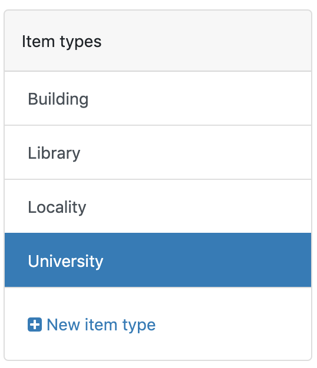

The *New item type* form opens:

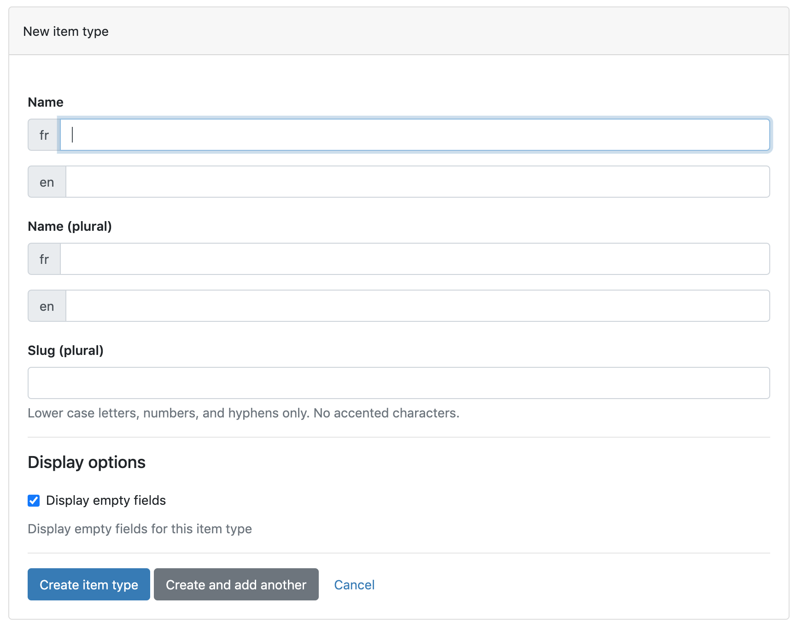

**Name**: add the item name. If different languages are selected, all fields must be completed.  
**Slug**: the slug is a short name that will appear in the website's address (URL). It must contain only letters (without accent), numbers and hyphens and must be short.  
> Example: for the item "University" the slug could be "uni".

In the **Display options**, if ***Display empty fields*** is selected, all fields will appear to the catalog's visitors, even if those are empty. If you do not wish empty fields to be shown, deselect this option. 

### New field
Once the new item created, it is time to add fields that will hold the data. Fields are the item's *features*. 

> A "*Movie*" item's fields could be a text field for the title, a date field for the release date and a choiceset field for its genre.

The number of fields an item can have isn't limited.

To add a new field to an item: 

1. On the *set up* page, select the item in the item list
2. Click on the **Add** button on the top right of the page

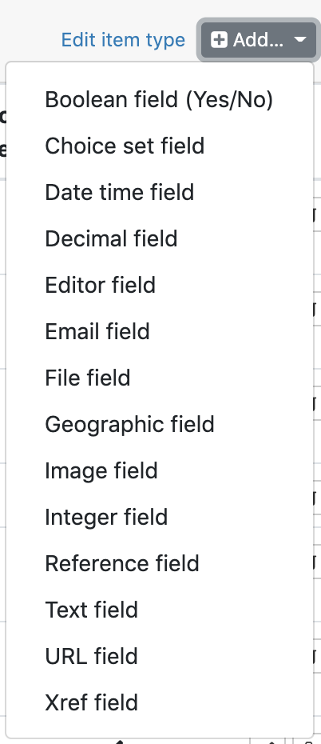

### Field types

Different kind of fields are available: 

#####Boolean field
Only for YES and NO values. 

#####Choice set field
This field accepts a choice list with many values. This fiels can accept a unique choice from a list, or multiple choices from a list. The **choice sets** found on the **Choices* page that is accessible from the left sidebar, are hierarchical. Each choice can have children which can also have their own children. This allows the user to structure the choice sets. Each choice can be selected, event those that have children.

#####Date time field

#####Decimal field  
For decimal numbers

#####Editor field  
Automatically displays the item's editor or the last person to modify it. 

#####Email field  
Creates a text field that only accept an email.

#####File field  
To add external file to the item with the possibility to restrict the accepted files' type (*e.g. only .pdf and .png*). 

#####Geographic field  
The geographic field is used to set an item's location. It is set by drag and drop'ing a point on the map or with coordinates. A single items can have multiple locations: add a location by clicking on the pin below the zoom controls on the map.

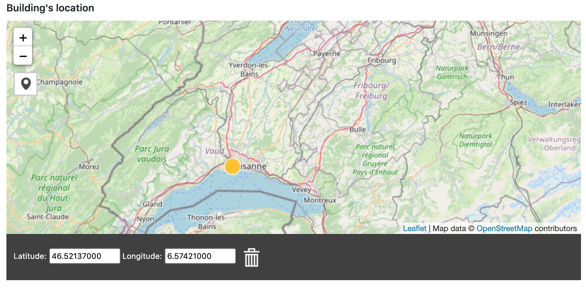

#####Image field  
Accepts images with optional caption.

#####Integer field  
For integer numbers. Can also be userd to create an automatic incrementation - for exemple for id number. 

#####Reference field  
Creates a relationship to another item. 

#####Text field
Can be used to add short (*e.g. name or title*) or long (*e.g. description*) text. It is possible to choose between a formatted text editor or a simple text editor. 

#####URL field  
This field accepts URL adress and will create a link. 

### Create a new field
A field name and slug must be chosen when creating a new field for an item:

| | Definition | Example | Note |
| ---------- | ---------- |---------- | ---------- |
| **Name** | The new field's name | *Actor's birthday* | - |
| **Name (plural)** | The new field's name - plural form | *Actors' birthdays* | - |
| **Slug** | Short and unique name | *birthday_actors* | Only accepts letters without accents and hypens. |

#### Display options 
When creating a new field, the following options can be selected:

| | Definition | Note |
| ---------- | ---------- |---------- |
| **Use this as a primary field** | This field with uniquely identify each item. It is usually a text field (Title) or integer field (ID number) | This option can only be activated for one field at a time. |
| **Include this field in edition list view (Data)** | Choose to display/not display a field in the data section. | This is useful to not display a field with a lot of informations and lighten section.|
| **Include this field in site list view** | Choose to display/not display a field to the final user when browsing all items. The field will still appear when the item is displayed, only not when all item types are listed. | Particularely useful if the item's list default is *List*. If *Grid* is selected, this option won't change anything. |
| **Restrict field to catalog staff** | Only members with invite or access to the secred code will have access to this field. | Useful to share extra information within the team that should not be displayed to the site's visitors.

## Categories and conditional content
An item type can have content that is common to all items (e.g. all movies have a director) but can also have conditional content (e. g. the "Period" field is relevant for *historical documentary* but not for *action movies*). It is possible to create a **category** that is displayed only if a certain **choice** is selected. In our example, the option *Period* can be show to the editor creating a new item only if the choice *Historical documentary* is displayed and otherwise hidden.  
This allows the *New item* page to remain uncluttered.  

Follow the next steps to create conditional content:  

### 1. Add a category
On the *Set up* page click on **Category > New category** in the left sidebar. It is possible to create multiple categories that are linked to different choices.  
The process of creating a new category is the same as creating a new item: chose a name and slug then add new fields.

### 2. Link it to a choice
In the left sidebar, select **Choices** and edit  the choice set containing the choice that you want linked to the conditional content. In this example we will add conditional content to the canton *Other* in the first choice set.

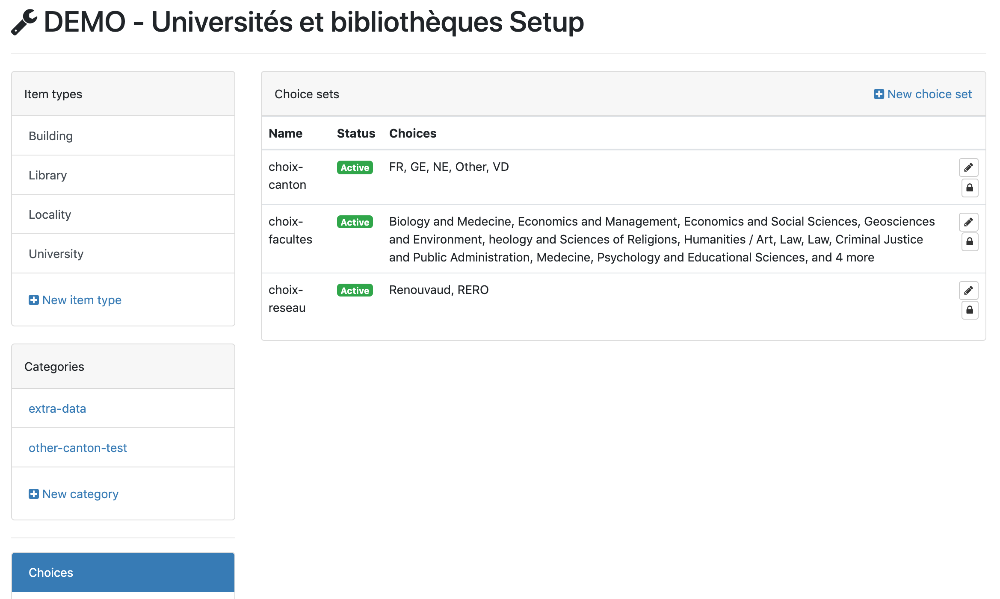

Edit the choice and the last option is to add conditional content; select the category that should be displayed when that choice is selected:

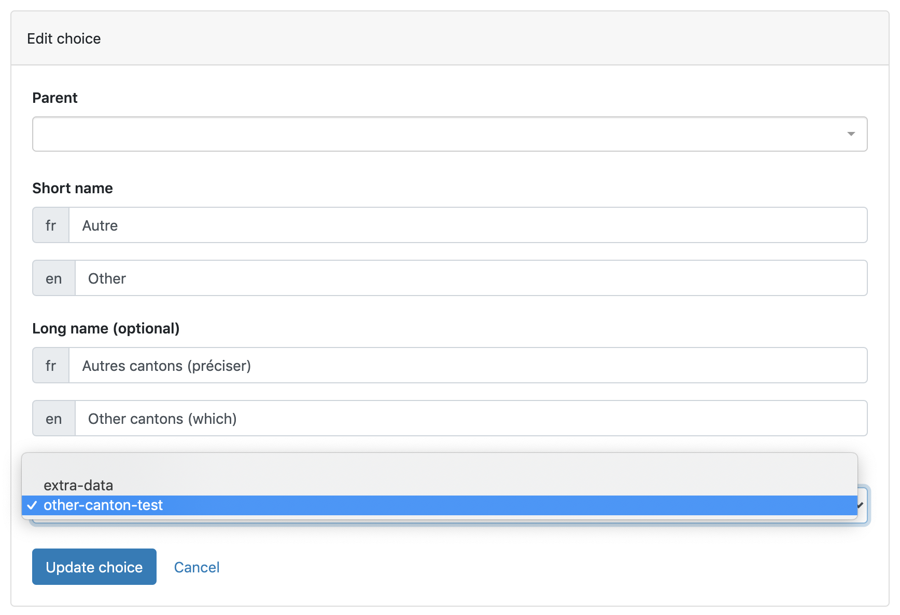

After updating the choice, the conditional content is displayed on the right side of the choice when editing the choice set:

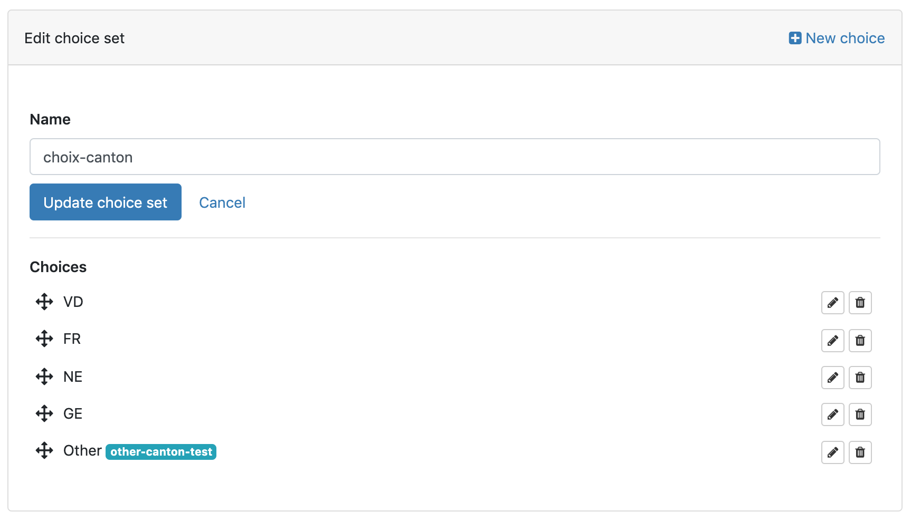

## Create and edit custom pages
CATIMA has a default mode to display the item to the final user. This mode can not be modified, but we can create **pages** where the layout can be modified as needed.

To add a new page, click on **Pages** in the left sidebar while in *Set up* mode and click on *New page* then add a slug and title and confirm by clicking on **Create page** - or **Create and add another** if you need to add more.

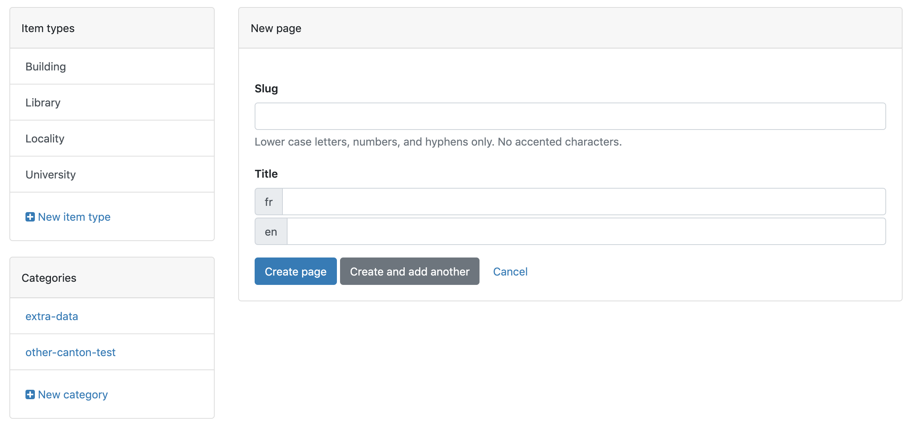

Then to modify the page, click on edit  and the *Edit page* page will open. The slug and title can be modified and content can be added in the *Containers* section. 

> If the catalog is multilingual, there will be one container per language on the *Edit page* page. Adding an elemenet to one container doesn't automatically add it to the other ones. 

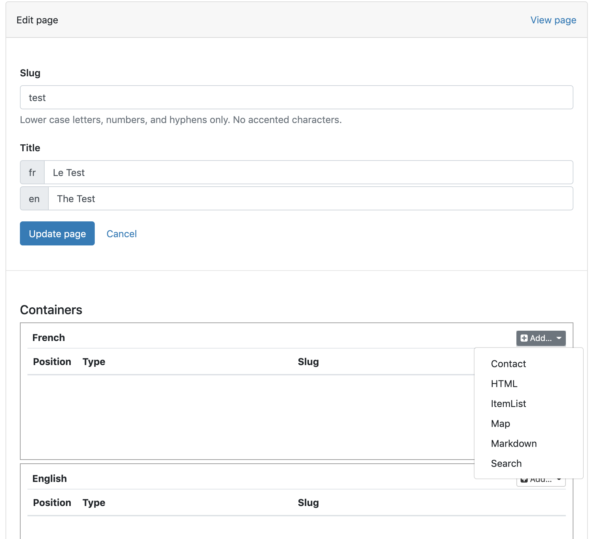

Different kinds of content can be added to a page: 

- **Contact**: the contact container adds a form that allows users to send an email to an adress that can be specified. 
- **HTML**: this will allow to add text, images, URL, video through a text editor. This container also allows advanced users to add pure HTML content by clicking on code view.
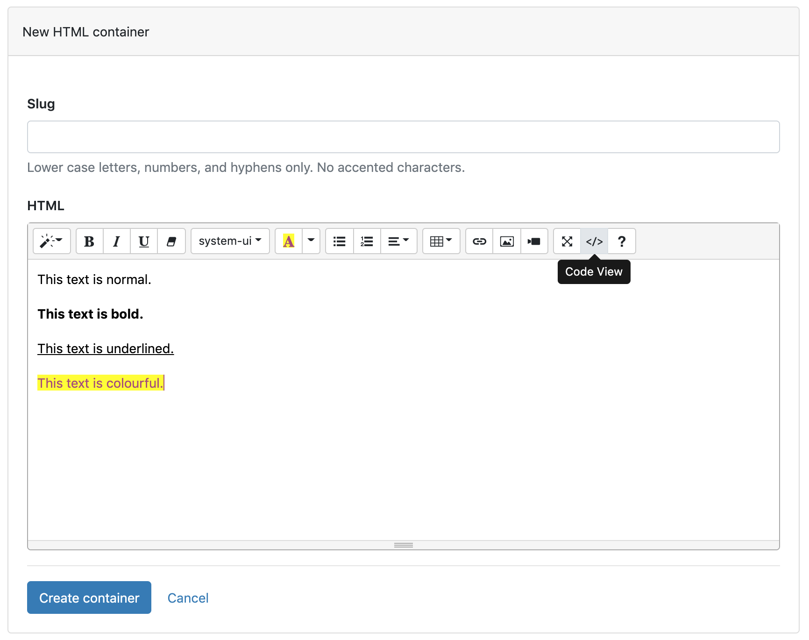 
- **Item List**: will display a list or grid of a selected item type. (e.g. to show a list of *Universities*). Different styles are availables:
	- Grid style
	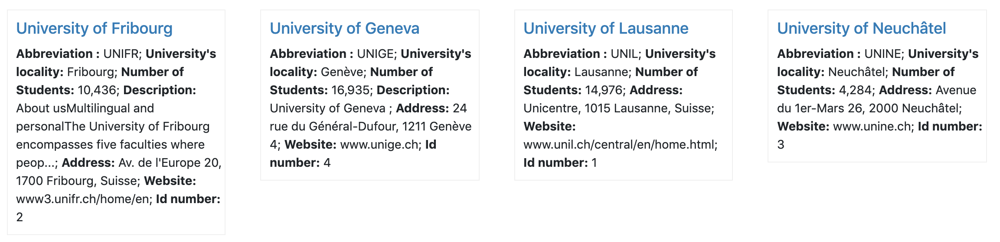
	- List style
	
	- Thumb style
	
- **Map**: the map container is used to display a geographic map of a item type that has a geographic location attribute (e.g. location of all swiss universities with geographic field). It has different options: 
	-  The item to be displayed on the map can be selected vie the **Item type** field. It will be possible to choose items that have a location attribute - items that don't have location attribute will not appear in the list:
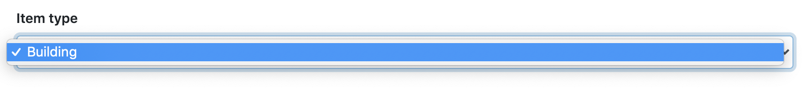
	- The map background can be chosen with the additional layers field. If more than one is selected, the user will be able to switch between them.
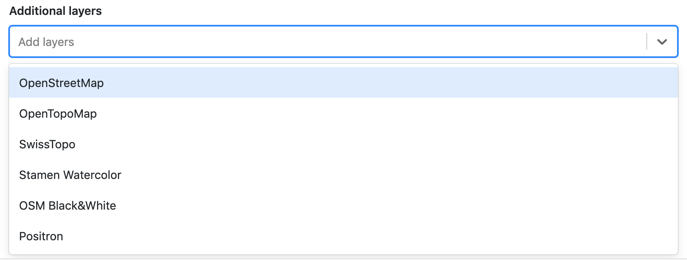
	- The map height can be changed by changing the default height (400px) in the **Map height** attribute.

- **Markdown**: this container can be used to add text, images and tables with the markdown syntax. 
- **Search**: displays the result of a previously saved search. To save the result of a search, search the CATIMA catalog while connected and click on *Save search*. The saved search are available to be displayed on pages. 

To modify the elements' order on the page, move the blocks up or down with the arrows on the left:

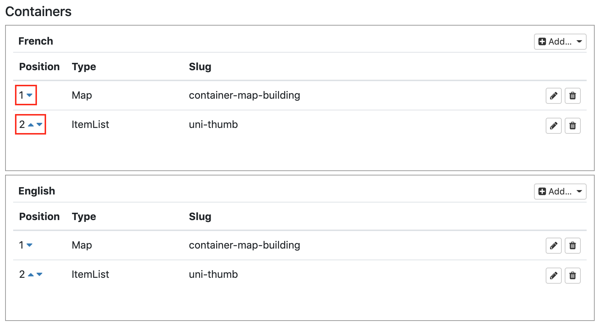

## Navigation bar

The navigation bar is customizable: it is possible to add or remove items as well as change the order. To do this acces the **Menu items** settings in the left sidebar while in *Set up* mode. The current items displayed in the navigation bar are listed with their rank. An *Item type*, *Custom page* or *External URL* can be in the navigation bar. 

Settings can be adjusted by editing an existing item or creating a new one. Apart from the usual slug (short name that must only have small cap letters without accents, numbers or hypens) and title, the options are:

- **Rank**: change the item's order by changing its rank. The items are displayed from left to right in ascending order. 
- **Parent**: To create a drop-down menu:
	- Create a *Parent* menu item; this is the name that will appear in the navigation bar. Only fill in the slug, title and rank fields. 
	- To add *Child* menu items - options that will appear when the parent is clicked, create a new item or edit an existing one and add the *Parent* item in the parent field.   

> It is not possible for a child item to have other children.

# Manage access to data and data edition 

CATIMA defines different levels of users: 

**Users** can view the public areas of the non-restricted catalogs.  
**Members** are users that can view the public areas of a restricted catalog.  
**Editors** are members that can create and edit their own items in the catalog.  
**Super-editors** are editors that can create and edit all the items in the catalog.  

## Catalog access and visibility

The CATIMA website can be accessible to all visitors or restricted to members only. To configure who can see it, access the **General** setting on the left sidebar: 

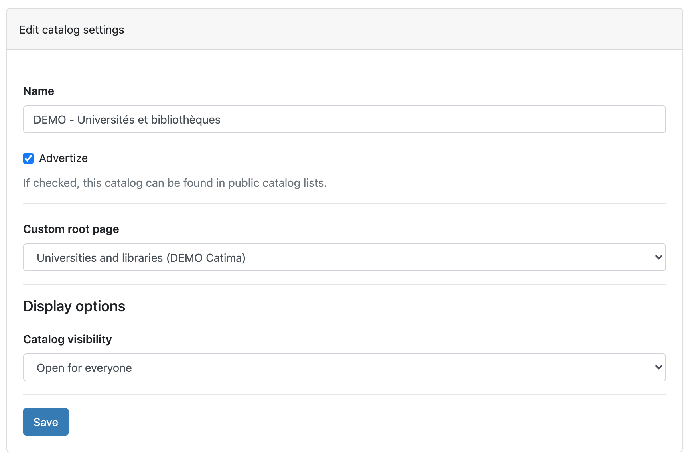

Choose who can see your website by changing the **Catalog visibility** option:

- **Open to everyone**: the website is visible to anybody with the URL.
- **Open to members**: can be accessed by the website's members only. *To learn how to attribute member status, see Member status further down this page.*
- **Open to catalog staff**: the catalog is only accessible my *editors* and *administrators*. 

Other options are accessible from this page:

- **Name**: change the name of the website
- **Advertize**: by checking it, your catalogue will be accessible from public CATIMA lists.
- **Custom root page**: change the landing page 

## Change status

Members are catalog visitors that have a CATIMA account. By restricting the catalog's access to members only, one must be connected and authorized to see the website. To edit who can access it, got to **Users & groups** in th left sidebar.  

It is possible to add catalog members different ways:

1. One person at a time: search for the user and click on edit . After selcting a prefered language, their status can be updated. 
2. Use the *Group* setting: add a new group, give it a name and description.

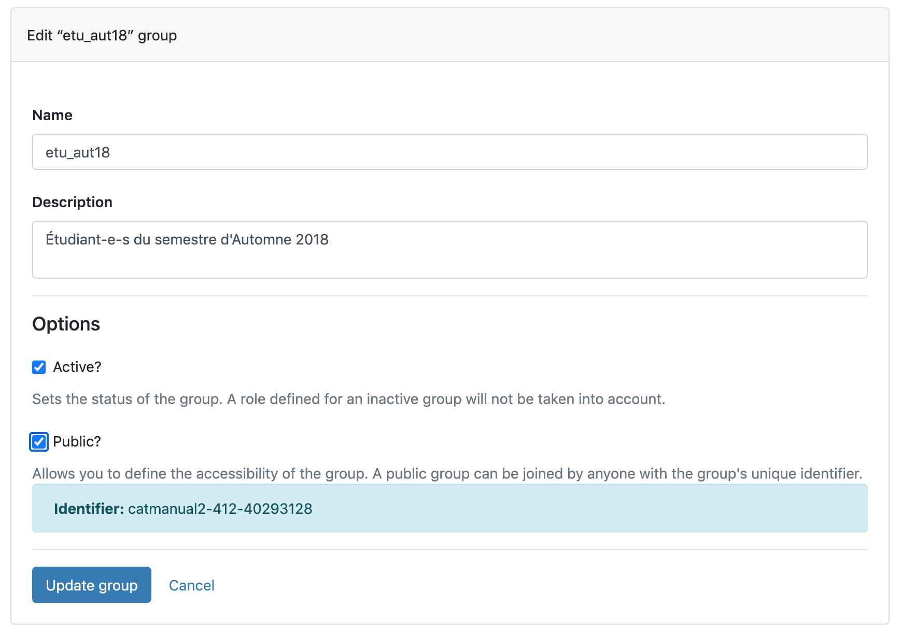 

If the "Public" checkbox is not checked, only members with an email invitation are part of the group. To add members to the group with email adresses, click on the  icon. 

If the "Public" checkbox is checked, CATIMA will create a password that can be shared with anybody. This pasword is the key to be part of the group. 
> To generate the password, check the "Public" checkbox, update the group and edit it again.

Users can also be give editor or super-editor status the same way.
