# Detailed example of use and behaviour of a catalog using a datation field

- [Detailed example of use and behaviour of a catalog using a datation field](#detailed-example-of-use-and-behaviour-of-a-catalog-using-a-datation-field)
  - [Use case of the datation field](#use-case-of-the-datation-field)
  - [Configuration of the datation field](#configuration-of-the-datation-field)
  - [Catalog Data](#catalog-data)
  - [Examples of Searches](#examples-of-searches)
    - [Simple Search](#simple-search)
    - [Advanced Search](#advanced-search)
    - [Booleans: AND, OR, EXCLUDE](#booleans-and-or-exclude)
    - [Search by Choice Sets](#search-by-choice-sets)
    - [*Exclude* Option](#exclude-option)
  - ["Parent" and "Child" Periods](#parent-and-child-periods)
    - [Impact on searches](#impact-on-searches)
  - [Cross-Referencing Search Fields](#cross-referencing-search-fields)

## Use case of the datation field

A team of researchers is conducting an inventory of objects found in a castle. Some objects are difficult to date precisely. However, various temporal clues can be associated with the objects to estimate their approximate creation date. A complex Datation field is created with the options for manual entry and using a choice set.

## Configuration of the datation field

The choice set of datation type is created prior to the datation field. It is configured as follows:

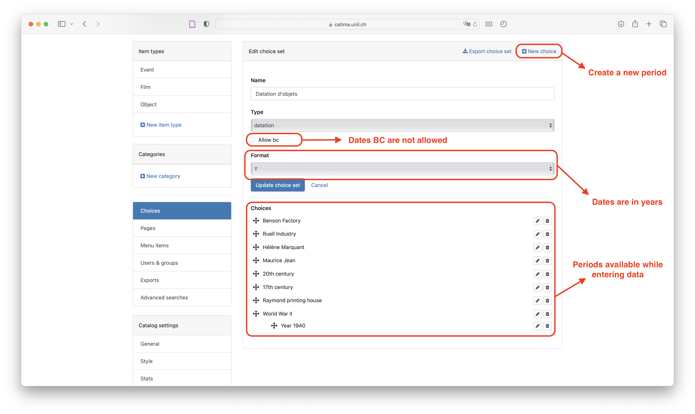

The datation field is created and configured as follows:

When editors enter the data, they have the following possibilities:

- Enter a **manual** datation with a start date and/or an end date.
- Enter a datation **using a choice set**. This is a list of periods configured by the administrators and super-editors of the Catima catalog.
- Not enter any datation.

## Catalog Data

This catalog consists of 13 objects, which are as follows:

| Object Title     | datation Information                                                                                                                                | Chosen datation                                                                                                       | Thumbnail                                           |
|------------------|---------------------------------------------------------------------------------------------------------------------------------------------------|---------------------------------------------------------------------------------------------------------------------|-----------------------------------------------------|
| A Book           | The printing date "1922" is found on the first page.                                                                                               | **Manual** between 1922 and 1922                                                                                    |   |
| A Tablecloth     | It is estimated to be from the early 19th century.                                                                                                | **Manual** between 1815 and 1850                                                                                    | 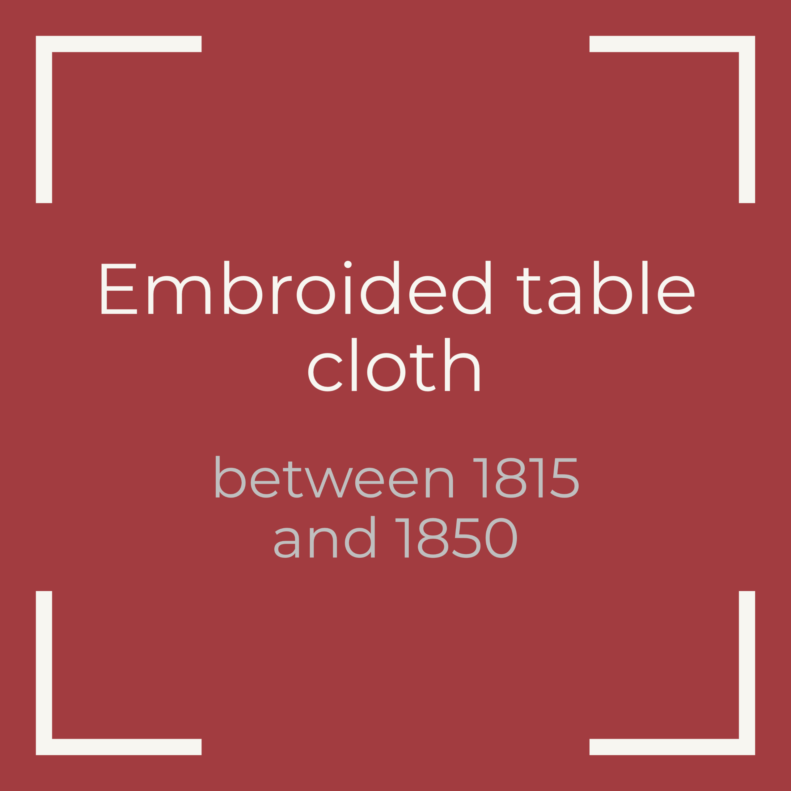  |
| A Tea Set        | The factory name is indicated on the cups. It has been in operation since 1902.                                                                 | **Using choice set** Benson Factory: before 1902                                                          | 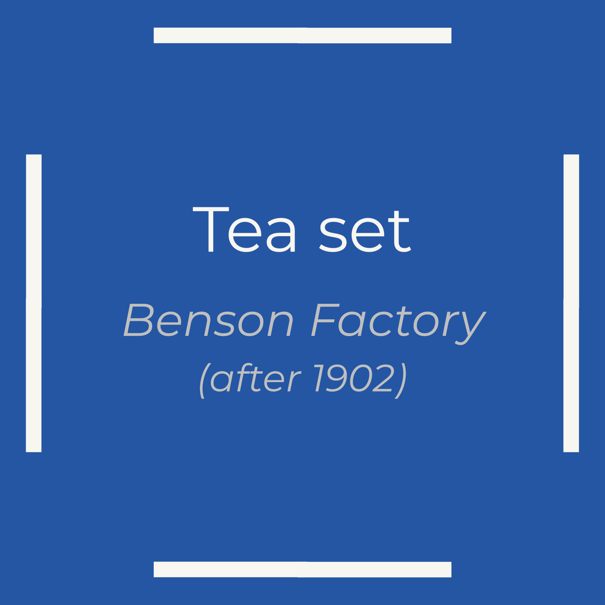 |
| A Painting       | It doesn't have a signature. Two searchers disagree: one claims it's from a painter, the other from one of his students.                    | **Using choice set with two choices** Maurice Jean: between 1897 and 1913 + Hélène Marquant: between 1904 and 1929 |   |
| A Table          | Based on the construction style, it's estimated to date before the Industrial Revolution.                                                        | **Manual** Before 1750                                                                                             | 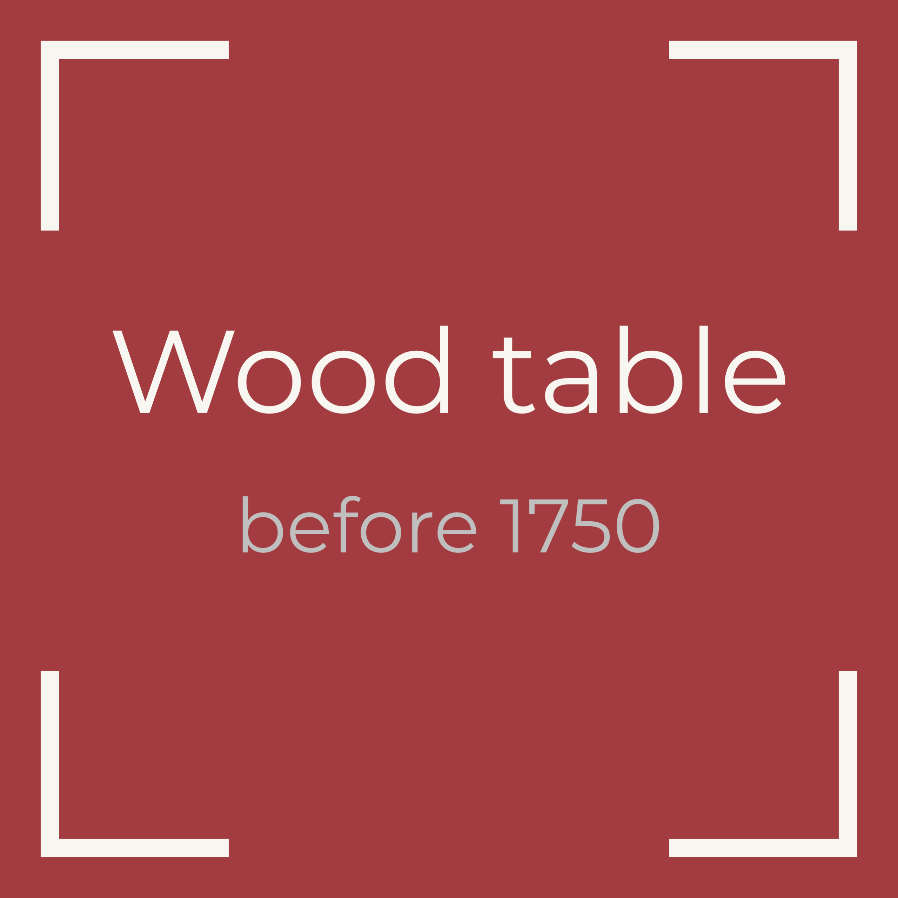  |
| A Carpet            | The name of a manufacturer that ceased its activity in 1782 is found on it. The start date of its activity is unknown.                           | **Using choice set** Ruell Industry: before 1782                                                              |  |
| A Vase           | It has floral patterns typical of the 17th century, but its state of preservation suggests it could be a 20th-century copy.                   | **Using choice set with two choices** 17th century: between 1601 and 1700 + 20th century: between 1901 and 2000  | 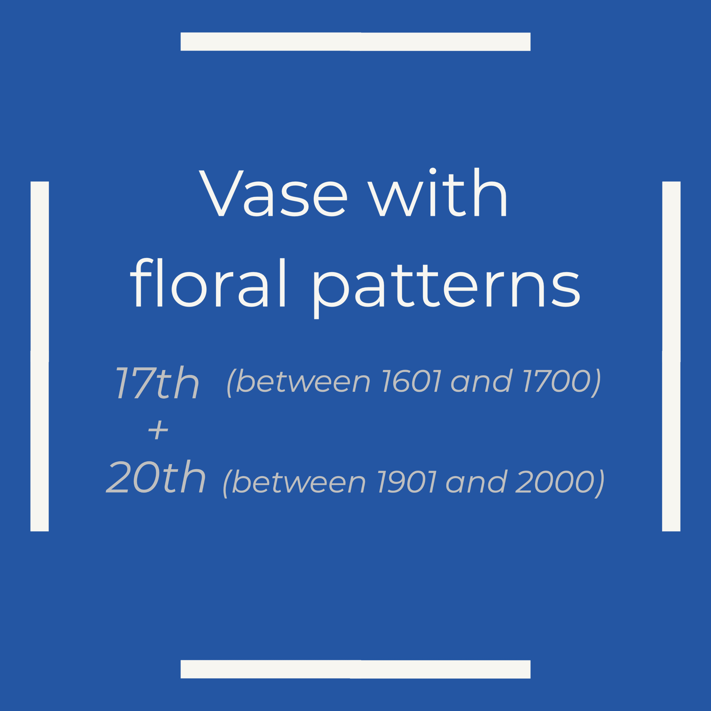  |
| A Plate          | It doesn't have any indications that could help with datation.                                                                                      | **None**                                                                                                           |   |
| An Empty Notebook| The year "1887" is engraved on the back of the notebook, but it's unclear when this was done.                                                  | **None**                                                                                                           |   |
| A Kinetoscope  | It's a Edison brand Kinetoscope, it was created after 1895.                                                                                             | **Manual** after 1895                                                                                             |   |
| A card game  | It's known to have been manufactured by Raymond Printing house, which operated from 1864 to 1913.                                              | **Using choice set** Raymond Printing house between 1864 and 1913                                                 |   |
| A Lamp           | It's estimated to date from World War II.                                                                                                        | **Using choice set** World War II: between 1939 and 1945                                                        |  |
| A Letter         | It's undated, but based on its content, it's believed to be from the year 1940.                                                                | **Using choice set** Child of *World War II*: Year 1940: between 1940 and 1940                                 |  |

## Examples of Searches

To facilitate this example, photos of the objects have been replaced with colored and coded thumbnails according to the assigned datation type:

- Yellow with no border: **no datation**
- Red with corner borders: **manual datation**
- Blue with borders without corners: **choice set datation**

### Simple Search

A simple search in the search bar does not allow searching for periods as it only searches within the text.

**We search for all objects dated between 1939 and 1945**

> A simple search does not calculate periods.

**We search for objects dated in 1887**
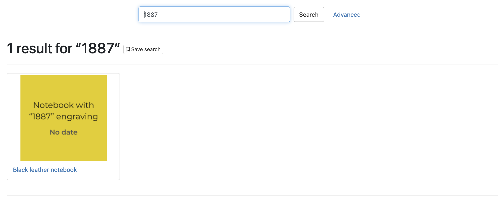

> The notebook comes up despite its lack of datation because the date 1887 appears in one of its text fields.

**We search for objects dated in 1815**
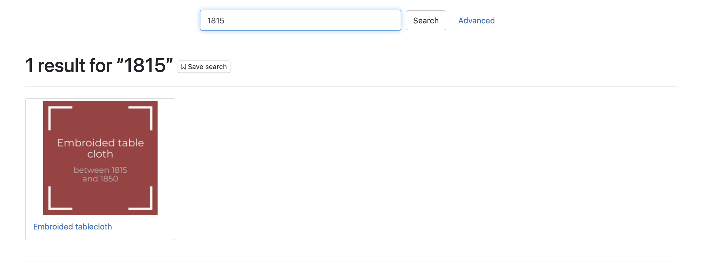

> Simple search takes the datation field into account but only allows pure text searches without any processing.

### Advanced Search

Advanced search on the datation field allows several possibilities. Here is a non-exhaustive list of examples.

**We search for objects exactly dated in 1922**

**Result**

> The book is the only object that is exactly dated in 1922.

**We search for all objects dated after 1922**

**Results**
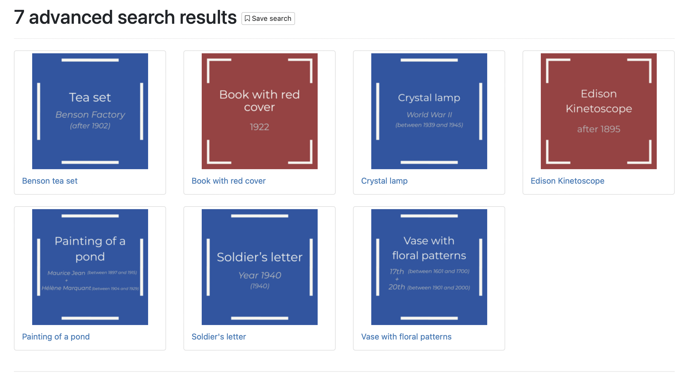

> All objects have at least one date that is between 1922 and the present day. The book appears because the year 1922 is included.

**We search for all objects dated before 1800**

**Results**

> The vase appears because it has two choices, 17th century and 20th century. The 17th century choice includes dates before 1800.

### Booleans: AND, OR, EXCLUDE

Booleans allow searches to be broadened or refined in more or less complex ways. In the datation field, multiple search criteria can be combined. This set of criteria can then be combined with criteria from other fields using the first operator in the field.

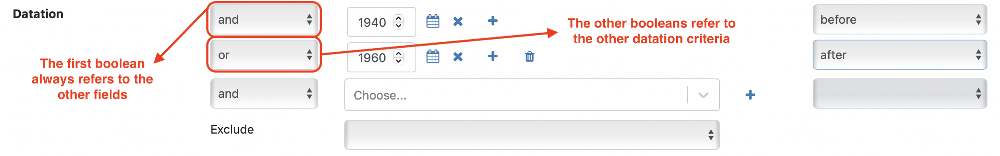

**We search for objects dated after 1930 AND before 1970**
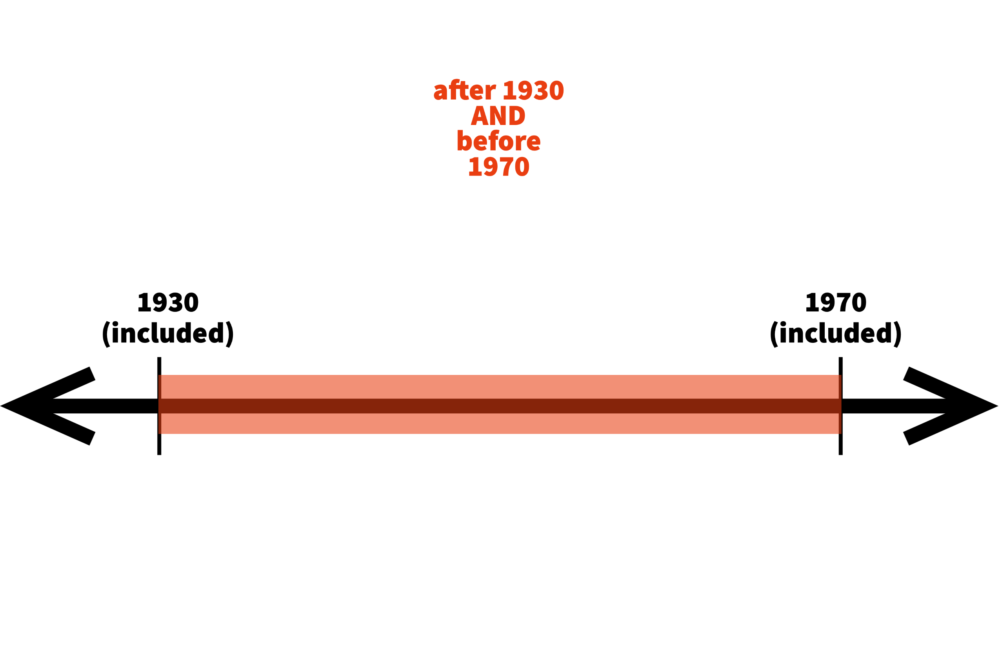

**Results**
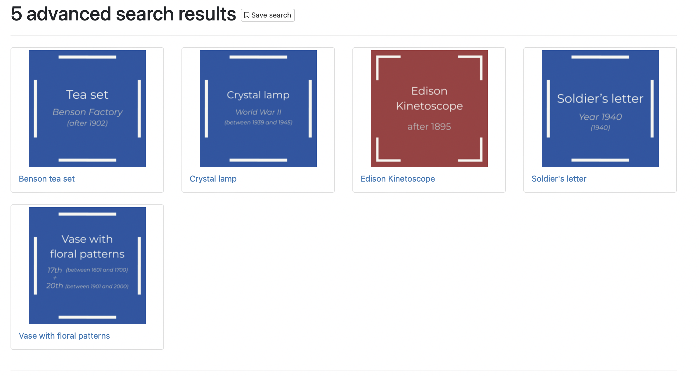

> - The Kinetoscope includes all dates after 1895.
> - The lamp contains dates before 1930 and after 1970.
> - The letter is dated 1940, which falls between 1930 and 1970.
> - The tea set includes all dates after 1902.
> - The vase is dated with the 20th century choice, which includes dates between 1901 and 2000.

**We search for objects dated before 1940 OR after 1960**
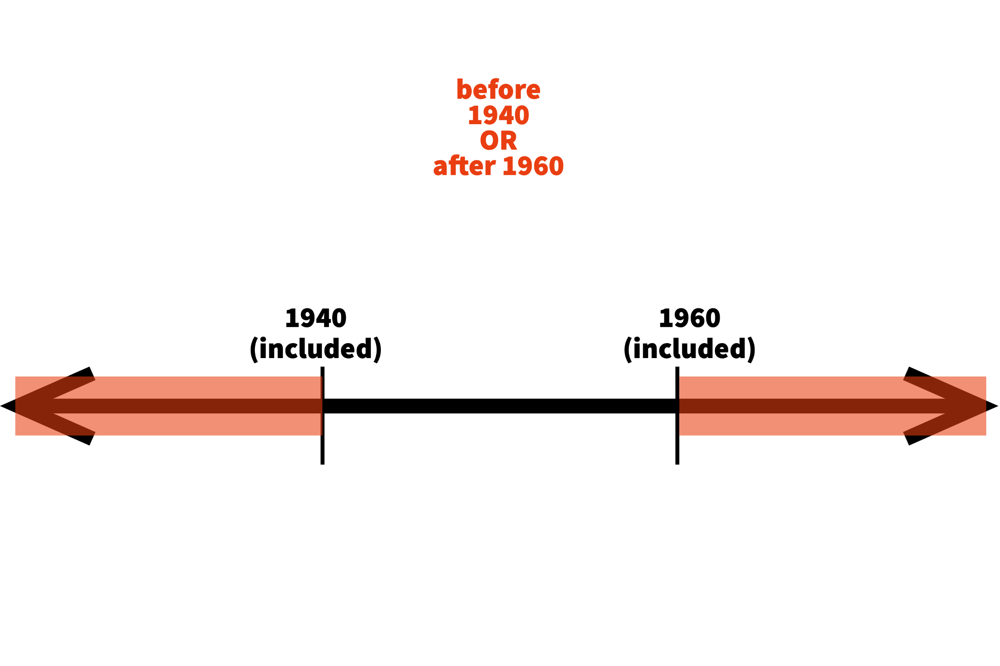

**Results**
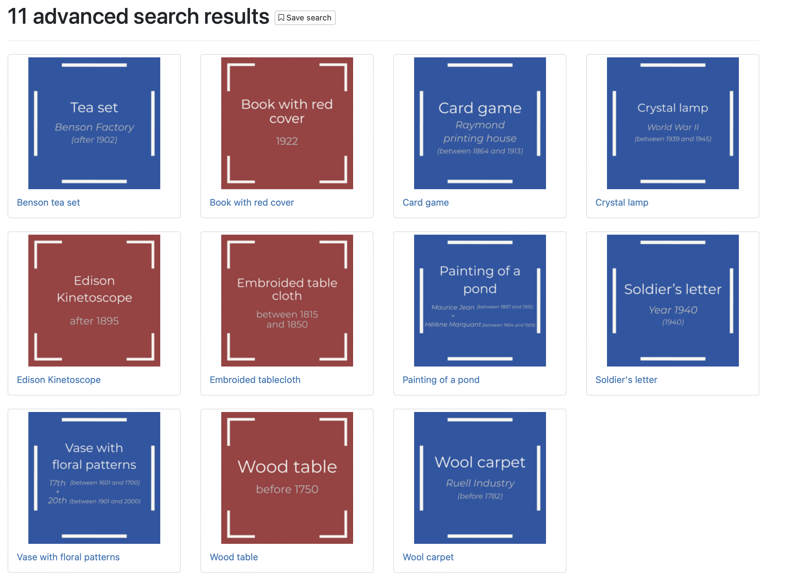

> - The card game, the lamp, the book, the tablecloth, the tea set, the painting, the table, and the rug all include dates before 1940.
> - The letter dated 1940 appears because the years 1940 and 1960 are included in the search.
> - The kinetoscope and the vase include dates after 1960 and before 1940.

**We search for objects dated before 1940 EXCLUDING those dated in the year 1922**
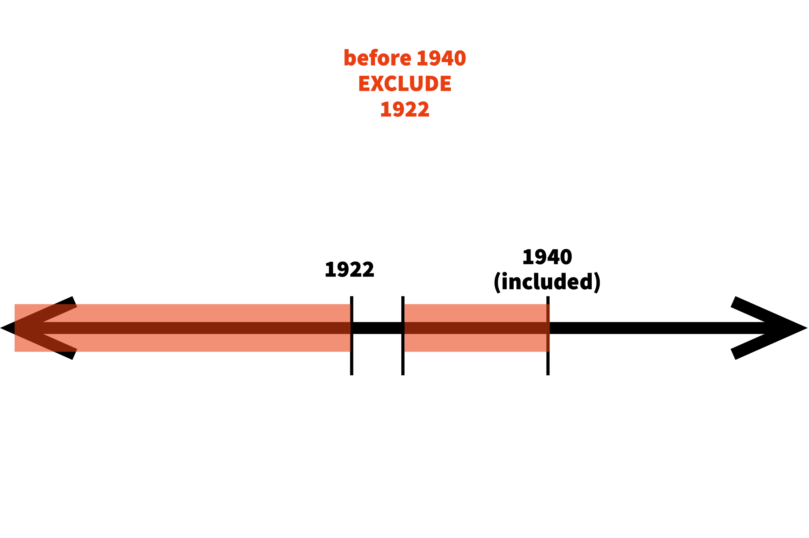

**Results**

> - The letter dated 1940 appears because the year 1940 is included in the search.
> - All cards have at least one date before 1940.
> - The book does not appear because entries exactly dated 1922 are excluded from the search.

### Search by Choice Sets

**We search for all objects dated before 1782 using the choice set** ***Ruell Industry***

**Results**

**Difference with Manual Search**
We want to do the same search manually: We search for all objects dated before 1782.

**Results**

**Why does the manual search show one more entry than the choice set search?**
A choice set search returns entries that carry the selected choice and manually dated entries that have at least one date falling within the period. It does not include other choice-dated entries that fall within the period. Manual searches apply to all entries.

**Precision on choices with specific dates**
When conducting a search with a choice bearing a specific date (e.g., "Year 1940"), the search will only return entries that carry that choice and manually dated entries with the exact same date. The search will not include manually dated entries with multiple dates even if they include the searched-for date.

### *Exclude* Option

**We only search for entries that are dated using a specific choice**  
The exclude option allows the exclusion of one or the other of the input formats in the search.

**Example**  
We search for entries dated between 1900 and 1939.

**Results**
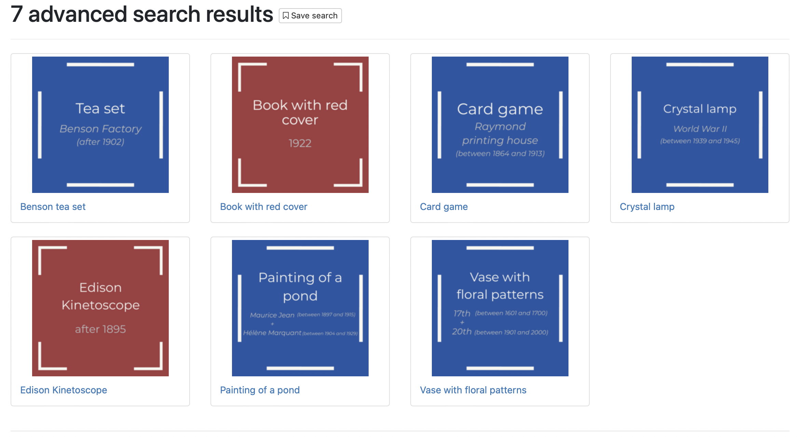

Next, we want to exclude entries that are dated using choices (the blue thumbnails) using the "Exclude" option at the bottom of the search options.

**Result**

> All entries that were dated using choices have been excluded from the search.

## "Parent" and "Child" Periods

When creating a datation choice, it is possible to assign a parent to it from the list of existing choices.

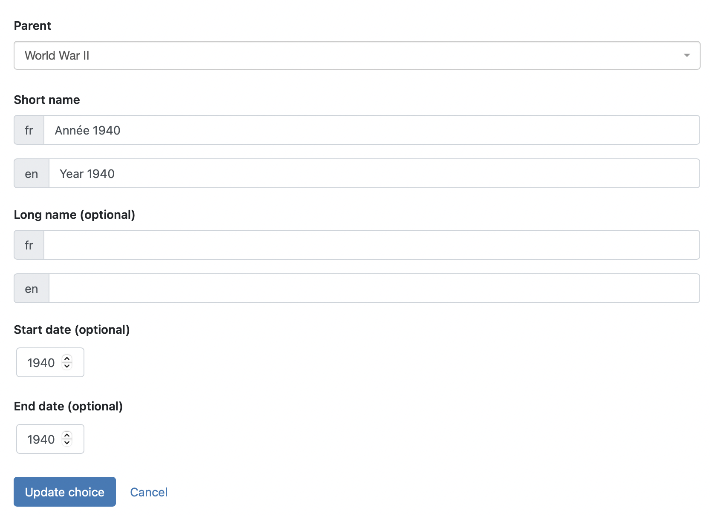

In our inventory, the object **Crystal Lamp** is dated using the choice *World War II*, and the object **Soldier's Letter** is dated using the choice *Year 1940*, which is the child of *World War II*.

### Impact on searches

**We search for objects dated during World War II without including the children**

> The "Include children?" box appears. Not selecting anything is equal to choosing no.

**Results**

> - The *Kinetoscope* appears because it's a manual date that fits the search criteria.
> - The *Crystal Lamp* appears because it's a choice set date that fits the searched choice set.
> - The *Soldier's Letter*  does not appear because children of parent choices are by default excluded from searches.
> - Objects dated using a choice set other than the one being searched are not included in the search.

**We search for objects dated during World War II, including child choices of this period**

**Results include the soldier's letter**

**We manually search for all objects dated between 1939 and 1945**

**Results**
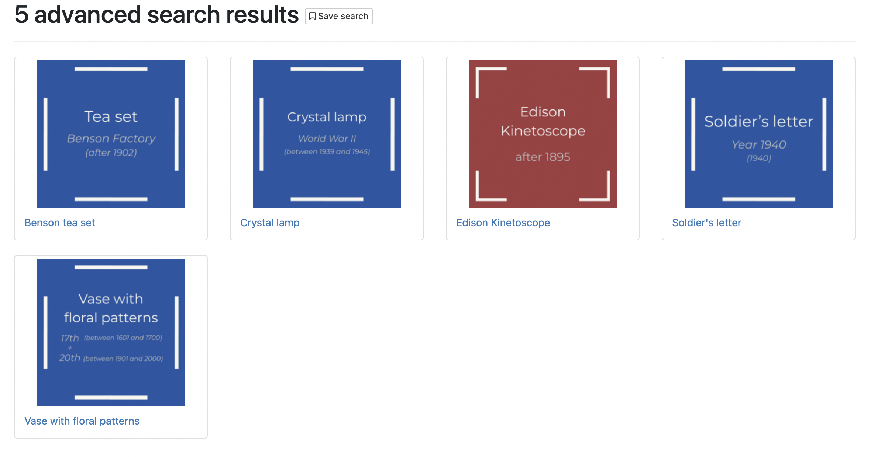

The manual search is always more inclusive than a choice-based search because it considers all objects, whether dated using a choice set or manually. Here, all objects dated within a period that includes at least one date within the searched period appear.

## Cross-Referencing Search Fields

Advanced search allows to cross-reference search fields.

**We search for objects dated after 1930 AND belonging to the category** ***Decoration items***

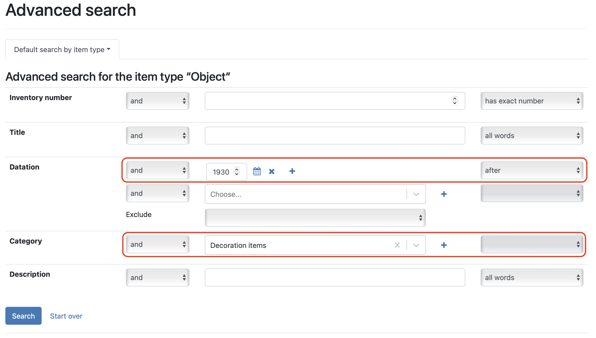

**Results**

***