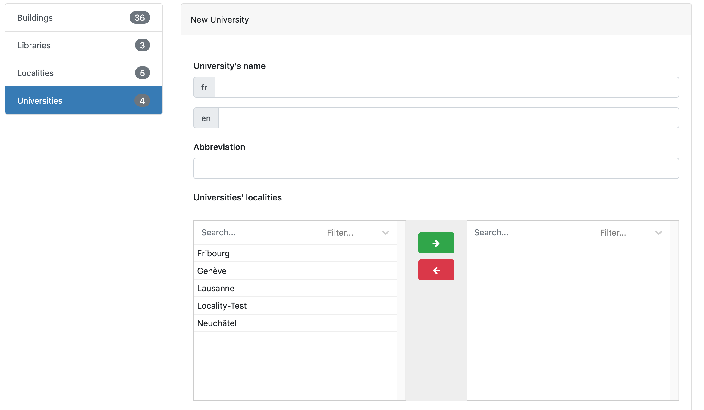
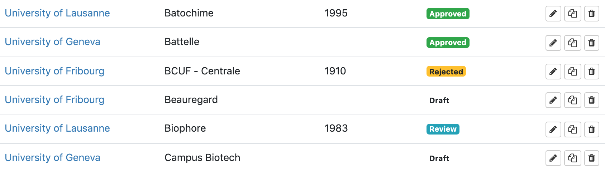

A catalog's editor can view the website and add new items/content to it, but not modify pages and structure.

# Table of contents

- [Display items](#display-items)
- [Add item](#add-item)
- [Item status](#item-status)
- [Edit, duplicate and delete item](#editduplicatedelete)

# Display items

The *data* section is where items can be added and modified and is accessible by clickin on **admin** in the navigation bar.  All items are listed in the left side. By clicking on one, the list of data related to this item is displayed. It is possible to search for a specific term using the search bar located at the top of the page.

# Add item

To add an item to the database:

1. Select the item type in the top-left list
2. Click on the **New item** button

The page that will open the manual data entry page where informations can be added. Each section only accept a specific type of predefined data (text, email, numbers...).
Once saved, the new item will appear in the data list with other similar items.

# Item status

*This feature is only available if activated by the administrator.*

An item can have one of the following status: draf, review, approved or rejected. This status is displayed in the list view of each item in the "Data" section: 

By default, an item has the ***Draft*** status. This means it is not ready to be published yet and more modifications will be made. It is possible to change this status once it is ready by clicking on the "Edit"  and checking the "Ready for review" checkbox at the bottom of the page before saving. This will change the item's status from ***Draft*** to ***Review***.

The item will be published in the catalog after a reviewer's approval and will have the ***Approved*** status. If some changes are necessary before publishing it, the item will have the ***Rejected*** status. It is possible to edit the data and check the "Ready for review" checkbox again when ready.

> Items with the ***Approved*** status are the only ones published in the catalog. 

# Edit, duplicate, and delete item

An item can be edited, duplicated or deleted at any time from theh data list view.  
To edit and item, click on the **Edit item** button:   
To duplicate an item, clik on the **Duplicate** button:   
To delete an item, click on the **Delete** button: 

