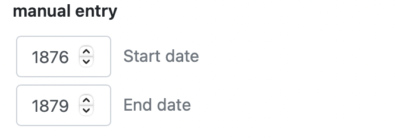
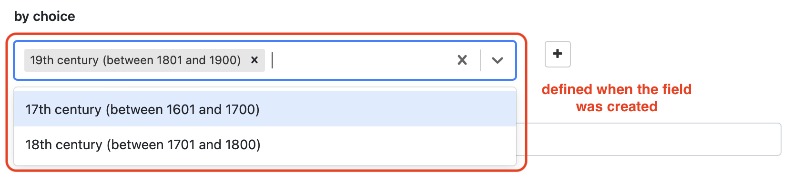

A catalog's editor can view the website and add new items/content to it, but not modify pages and structure.

# Table of contents

- [Display items](#display-items)
- [Add a new item](#add-item)
	- [datation data](#datationdata)
- [Item status](#item-status)
- [Suggestions managment](#suggestions)
- [Edit, duplicate and delete item](#editduplicatedelete)

# Display items

The *data* section is where items can be added and modified and is accessible by clickin on **admin** in the navigation bar.  All items are listed in the left side. By clicking on one, the list of data related to this item is displayed. It is possible to search for a specific term using the search bar located at the top of the page.

# Add item

To add an item to the database:

1. Select the item type in the top-left list
2. Click on the **New "item name"** button

The page that will open the manual data entry page where informations can be added. Each section only accept a specific type of predefined data (text, email, numbers...).
Once saved, the new item will appear in the data list with other similar items.

### Datation Data
> The datation field is a very complex field for which [a complete manual](assets/datation/exampledatation.pdf) has been produced, as well as an [example catalog](https://catima.unil.ch/datation-exple/en) showing how the field is used and how it behaves when searched.

The datation field is a field that allows for **flexible datation** of an item. It differentiates itself from the date/time field by offering the ability to consider periods in addition to specific dates.

Subsequently searches by date can be performed based on predefined periods, user-defined periods, or based on a specific date.

This field accepts two types of formats for entering dates when creating new items:

- Manual entry by date/time: for each added item, manually enter the start and/or the end of a period.
- Entry through a choice set: Select a choice from a predefined choice set when creating the item.

> Both options can be offered for the same item type. It is then possible to choose between a predefined period or to create one manually when entering a new record. **However, it's not possible to enter both formats in the same item.**

#### Manual Entry

With manual datation, there are several input possibilities:

- The *Start Date* and *End Date* fields are filled with two different dates. They define a period from one date to another, including all dates between them.
- The *Start Date* and *End Date* fields are filled with the same information. They define a fixed date. For example, *Start Date*: 1990 and *End Date*: 1990.
- Only the *Start Date* field is filled. It defines a period after the indicated start date (included).
- Only the *End Date* field is filled. It defines a period before the indicated end date (included).

> Start and end dates are **inclusive**. A period defined with a start date of **1990** and an end date of **1999** includes the years 1990, 1991, 1992, 1993, 1994, 1995, 1996, 1997, 1998, and 1999. Searching for any of these years will return records from this period.

#### Through a Choice Set

Select one or more choices from the dropdown list. datation through a choice set allows assigning one or more different periods to the same record.

# Item status

*This feature is only available if activated by the administrator.*

An item can have one of the following status: draf, review, approved or rejected. This status is displayed in the list view of each item in the "Data" section: 

By default, an item has the ***Draft*** status. This means it is not ready to be published yet and more modifications will be made. It is possible to change this status once it is ready by clicking on the "Edit"  and checking the "Ready for review" checkbox at the bottom of the page before saving. This will change the item's status from ***Draft*** to ***Review***.

The item will be published in the catalog after a reviewer's approval and will have the ***Approved*** status. If some changes are necessary before publishing it, the item will have the ***Rejected*** status. It is possible to edit the data and check the "Ready for review" checkbox again when ready.

> Items with the ***Approved*** status are the only ones published in the catalog. 

# Suggestions 

*This feature is only available if activated by the administrator.*

Suggestions are made by the catalog's users and visitors and work like private comment so users can notify editors and administrators about a specific item. They are is visible in data mode. A grey number  next to the item indicates the number of suggestions that haven't been validated or deleted.  
They can be accessed by editing  the item.

There are 3 options:  

**1**: read suggestion:  
**2**: validate suggestion: the icon will turn green and the suggestion stays visible  
**3**: delete suggestion  

# Edit, duplicate, and delete item

An item can be edited, duplicated or deleted at any time from theh data list view.  
To edit and item, click on the **Edit item** button:   
To duplicate an item, clik on the **Duplicate** button:   
To delete an item, click on the **Delete** button: 

