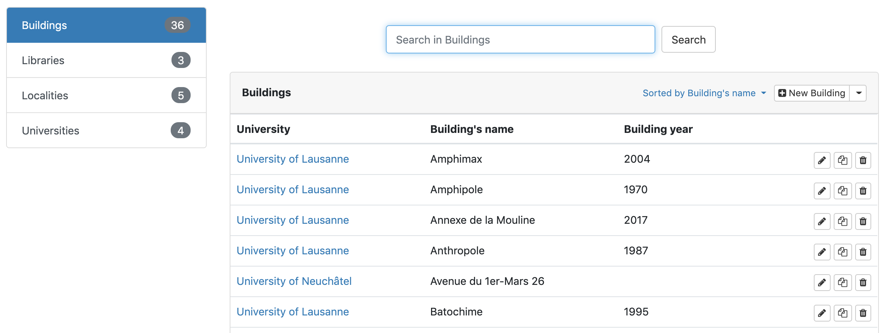
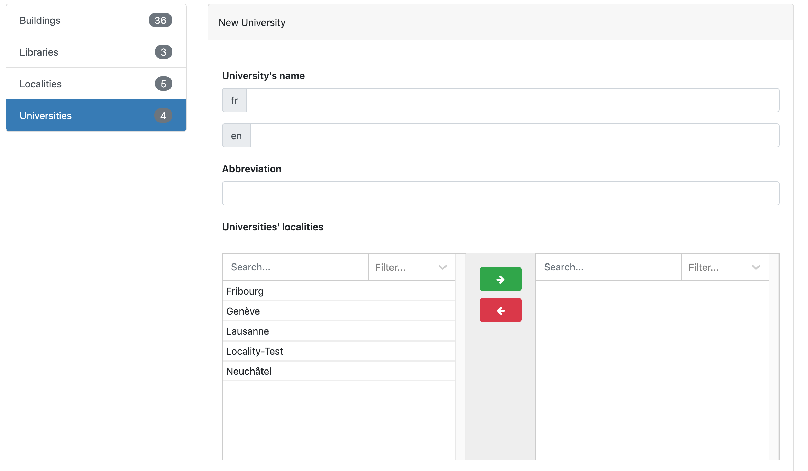
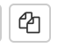

A catalog's editor can view the website and add new items/content to it, but not modify pages and structure.

# Table of contents

- [Display items](#display-items)
- [Add item](#add-item)
- [Edit, duplicate and delete item](#editduplicatedelete)

# Display items

The *data* section is where items can be added and modified and is accessible by clickin on **admin** in the navigation bar.  All items are listed in the left side. By clicking on one, the list of data related to this item is displayed. It is possible to search for a specific term using the search bar located at the top of the page.

## Add item

To add an item to the database:

1. Select the item type in the top-left list
2. Click on the **New item** button

The page that will open the manual data entry page where informations can be added. Each section only accept a specific type of predefined data (text, email, numbers...).
Once saved, the new item will appear in the data list with other similar items.

## Edit, duplicate and delete item

An item can be edited, duplicated or deleted at any time from theh data list view.  
To edit and item, click on the **Edit item** button:   
To duplicate an item, clik on the **Duplicate** button:   
To delete an item, click on the **Delete** button: 

