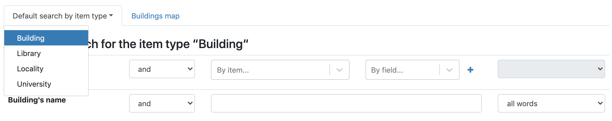
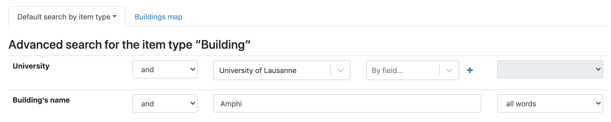
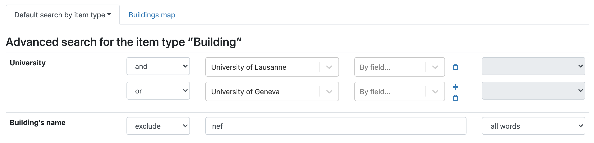
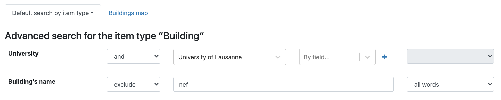
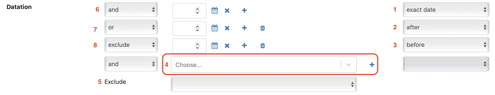

A guest is a user that doesn't have a CATIMA account. The accessibility (e.g. editing items) is limited, but it is still possible to search in the catalog and view its content.

# Table of content

- [Search](#search)
	- [Simple search](#simple-search)
	- [Advanced search](#advanced-search)
- [Search on dating field](#searchdate)
	- [Simple search](#simplesearchdate)
	- [Advanced search](#advancedsearchdate)

# Search

All CATIMA's databases have a search features that can be used to look for elements through keywords. It can be a simple search with one keyword or a more advanced one that can include multiple keywords and exclude others.   

Both are accessible through the catalog's search bar on the homepage.  
> To access the homepage, click on the catalog's name on the left side of the navigation bar.  

It is possible to search the full database with a simple search. Just enter the enter a word or list of words and click on the search button.

## Advanced search

The advanced search is for searching within **elements of a specific item**. To access the advanced search page, click on the *Advanced* link on the right side of the search button; you will be redirected to a new page. 

By default, the item searched is the first one in alphabetical order. This can be changed by clicking on *Default search by item type* and choosing a different item. Then each field can be searched using a keyword or exact wording. It is also possible to filter elements by name or category. 

### Boolean operators
It is possible to use advanced search with boolean operators: 
 
- Operator "**AND**" (default) is used to combine search words and narrow results. This tells the database that *all* search terms must be present in the results. 
- Operator "**OR**"; two search terms linked with **OR** will return all results that match with either one or the other
- Operator "**EXCLUDE**" is used to excludes results that match a given term.  

#### Examples  
> To display all buldings from the University of Lausanne that have "Amphi" in their name:

> To display the list of all buildings from the University of Lausanne and from the University of Geneva:

> To display the list of the buildings from the University of Lausanne, except the ones that have "*nef*" in their name:

 

## Searching the Date Field

**Differences between "Date" and "Dating" Fields**

The **Date** field allows the entry of a specific date on a record. This date must be unique. For example, it could be a person's birthdate, a building's construction year, or the date and time of a performance.

The **Date Field** accepts a start date and an end date, allowing the creation of periods and searching for all dates within that period.

### Simple Search

Searching for a period in the search bar will only return items in which the searched characters appear in any fields. A simple search doesn't calculate periods.

Thus, entering two dates in the search bar won't calculate a period but will return items in which both dates are textually present.

### Advanced Search

An advanced search on the dating field allows specifying periods in several different ways.

The dating field allows manual date entry. The dropdowns on the right allow specifying whether the search is for an exact date (1), after a date (2), or before a date (3).

The dropdown (4) enables searches through a choice set.

The ***Exclude*** criterion (5) allows excluding one or the other of the dating format. Excluding records with **manual dating** will only return records with **choice set dating** and vice versa.

The criteria can be combined using the search operators "and," "or," and "exclude," which are located on the left.

The operator before the first row (6) refers to other search fields. All others allow multiple criteria within the date field to interact.

>  **Reminder:**
> 
> **AND** (6): all criteria must be fulfilled
> 
> **OR** (7): either of the criteria must be fulfilled
> 
> **EXCLUDE** (8): the criterion must be excluded