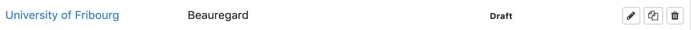
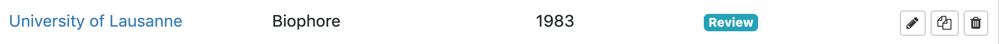
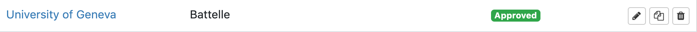
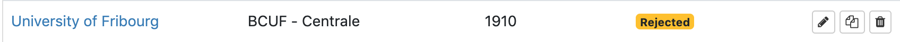
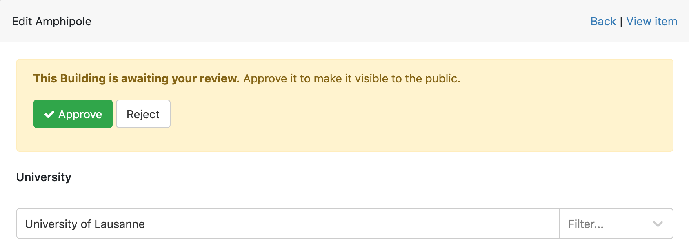

A reviewer can approve or reject an item created by (super-)editors. 

# Table of content

- [Status](#status)
- [Workfow](#workflow)
- [Approve or reject an item](#approve-or-reject-an-item)

# Status

An item can have one of the following status: draf, review, approved or rejected. This status is displayed in the list view of each item in the "Data" section: 

# Workflow

By default, an item has the ***Draft*** status. This means that this item isn't ready yet and more modifications will be made. 

When an item is ready but not published yet, it has the ***Review*** status:

Reviewers can now approve or reject the item. If approved, it will be published in the catalog and have the ***Appoved*** status:$

If some modifications are needed before publishing the item, the reviewer and set the ***Reject*** status. It is not published and the item will be modified before being submitted for review again. 
 

# Approve or reject and item

To approve or reject and item, click on the edit button  of an item that has the ***Review*** status. This will open the edit page and show a yellow box where the thow options are available.

Changes to the status are saved by clicking on the "Save building" button at the bottom of the page. 

Please note it is not possible to revert back to another status once an item is approved. It is still possible to modify it but its status will still be ***Approved***.

> Items with the ***Approved*** status are the only ones published in the catalog. 

