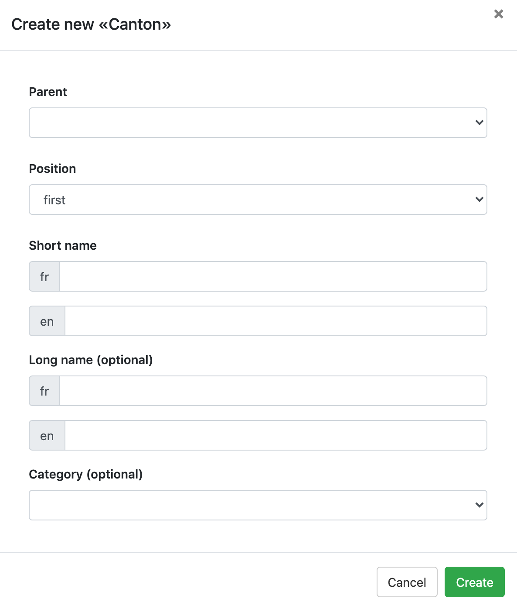

A super-editor can add and edit any item as well as add choices to existing choice sets. 

# Table of content

- [Add new choice to choice set](#add-new-choice-to-choice-set)
- [Add new choice to dating choice set](#addperiodchoice)
- [Choice hierarchy](#choicehierachy)

## Add new choice to choice set 
It is possible to add a new choice in a choice set when editing or creating an item with a "Choice set" field. Simply click on add .

A new window appears: 

Fill in the blank and click on "Create" to add a new choice to the choice set. 
> The field "Category (optional)" allows to link conditional content to a choice. The conditional content must be created before adding the choice. 

It is not possible for super-editors to delete existing choices or choice set. 

## Add new period to a dating choice set

Add a new choice by clicking *+ New Choice* to add a new period or specific date. There are several possibilities:

- The *Start Date* and *End Date* fields are filled with two different dates. They define a period from one date to another, including all dates between them.
- Only the *Start Date* field is filled. It defines a period after the indicated start date (included).
- Only the *End Date* field is filled. It defines a period before the indicated end date (included).
- Filling both fields with the same information sets a fixed date. For example, *Start Date*: 1990 and *End Date*: 1990.

> Start and end dates are **inclusive**. A period defined with a start date of **1990** and an end date of **1999** includes the years 1990, 1991, 1992, 1993, 1994, 1995, 1996, 1997, 1998, and 1999. Searching for any of these years will return records from this period.

## Choice hierarchy

When creating a choice, it is possible to associate a **parent** with it.

The hierarchy of choices is visible in the **Set up** mode of the choice set. To modify the order, select the item and use the cross icon to move it to the desired location in the hierarchy. 

**CAUTION:** It is not recommended to create multiple levels of choice hierarchy as it can lead to confusion when searching by parent choice. During a search by choice set, children of children are not included.

**Example**

- The choice 20th century
  - The choice World War II is a child of 20th century
    	- The choice year 1940 is a child of World War II

### Impact on search

Searching for objects dated in the 20th century without including children

> No children are included in the search results

Searching for objects dated in the 20th century including children

> The first level of children is included

Searching for objects dated in World War II without including children

> The parent choice is no longer included

Searching for objects dated in World War II including children

> The child of the child choice is included but not the parent choice

Searching for objects dated in the 20th century including children **OR** objects dated in World War II including children

> All 3 levels are included

#### In summary
The hierarchy of choices in standard or date type choice sets has a significant impact on search results. The lower in the hierarchy the choices are, the harder it becomes to find them during a search by choice set.