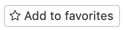
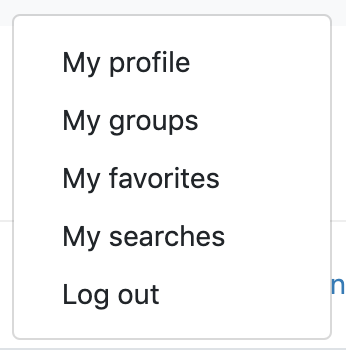
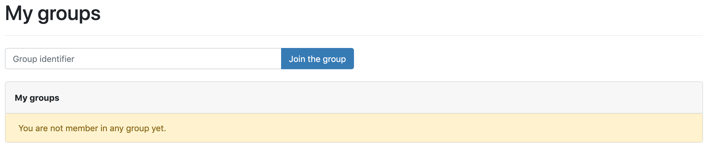

CATIMA's catalog users and people that have a CATIMA account and are connected. While connected, it is possible to add content to the favorites. 

# Table of contents

- [Favorites](#favorites)
- [Access restricted catalogs](#access-restricted-catalogs)

# Favorites

After creating an account, CATIMA users can save content to their *Favorites*. The *Favorites* can have content from different CATIMA catalogs and are linked to a unique user. 

To add an item to the *Favorites* list, simply click on the **Add to favorites** button. 

> Note: this operation is only possible when user is connected. 

The *Favorites* list is accessible to all connected users by clicking on

1. **Username** (top left in navigation bar)
2. **My favorites**

# Access restricted catalogs

Some CATIMA databases may be restricted to some users or group of users. To access a restrcited database, one must first have a CATIMA account and be connected.  
There are 2 ways to have access to a restrcited database: getting an **email** invitation by the catalog's administrator or having the secret code. This identifier is needed to join a group of users that is allowed to access the database.

**To join a group with a secret identifier**:
 
1. click on "**My groups**" in the menu that appears after clicking on your email
2. enter the identifier in the bar a click on **Join the group**.  

