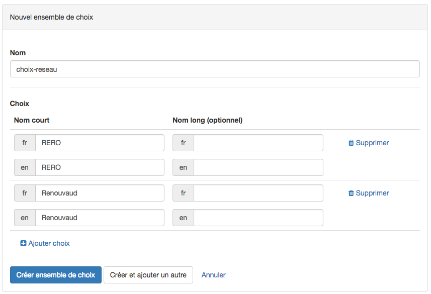
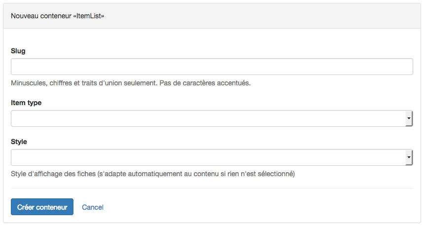

# Configuration d'un catalogue 

Pour pouvoir réaliser un catalogue contenant des données, deux étapes sont à effectuer : la première est la réalisation de la structure du catalogue (configuration). La deuxième consiste en l'entrée des données. 

Cette section décrit la première étape. Pour l'ajout des données consulter la section "Données" destinée aux éditeurs de catalogue.

## Conceptualisation

La démarche de conceptualisation d'un catalogue est une partie importante de la réalisation d'un catalogue : en effet ces réflexions préliminaires ont pour but d'élaborer la structure conceptuelle et logique du catalogue. Effectuer cette étape réflexive en amont facilite ensuite la réalisation concrète du catalogue au sein de Catima.

Pour une conceptualisation efficace il est promordial de comprendre la différence entre les **données** et leur **conceptualisation**. La conceptualisation consiste ainsi en une étape de regroupement des objets que l'on souhaite décrire sous un même concept.

> Par exemple, les objets "*2001, l'Odyssée de l'espace*", "*Le Parrain*", et "*Titanic*" sont regroupés sous le même concept **"film"**.

Ces concepts ont des **caractéristiques** qui les décrivent.

> Par exemple, le concept **"film"** peut regrouper des films de genres différents, réalisés par des personnes différentes et sortis au cinéma à des périodes différentes.

Les éléments du concept "film" peuvent ainsi être représentés dans un tableau tel que celui-ci où les objets sont décrits par leurs caractéristiques "Titre", Réalisateur", "Sortie au cinéma

| Titre                       | Genres          | Réalisateur          | Sortie au cinéma |
|-----------------------------|-----------------|----------------------|------------------|
| 2001, l'Odyssée de l'espace | Science-fiction | Stanley Kubrick      | 1968             |
| Le Parrain                  | Gangsters       | Francis Ford Coppola | 1972             |
| Titanic                     | Drame, romance  | James Cameron        | 1998             |

Les étapes suivantes permettent d'effectuer une conceptualisation efficace : exploration, hiérarchisation et liens

## Exploration

L'étape de listage consiste à lister librement tout élément pertinent à figurer dans le catalogue et à ce stade sans souci d'organisation. Dans cet exemple, il s'agit de lister par exemple une vingtaine de films qui auraient leur place dans ce catalogue.

## Hiérarchisation et Structure

L'étape de structure permet de mettre de l'ordre dans les concepts précédemment listés librement. Il s'agit à présent de se demander quels sont les concepts parmi les éléments parmi ceux listés précédemment et lesquels sont des caractéristiques de chaque concept.

> NB : Un élément peut être à la fois une caractéristique d'un concept *et* un concept en lui-même. Dans ce cas il sera fait une référence à ce concept (voir plus loin "Liens et Références")

Est considéré comme un **concept** un élément pour lequel des descriptions supplémentaires sont pertinentes pour le but du catalogue. Un élément descriptif ne devient donc pas un concept *dans l'absolu*, mais il l'est *selon le but du catalogue*.

> Dans notre exemple, l'élément **Film** est un concept car le but du catalogue est d'effectuer un inventaire de films. Si il est également d'intérêt pour le catalogue de décrire les **Réalisateurs** de films (naissance, nationalité, biographie...), alors cet élément devient également un concept auquel le film fera référence. Si en revanche, évoquer le nom du/des réalisateurs du film suffit, alors l'élément "réalisateur" reste une caractéristique de "film" mais n'est pas un concept.

## Liens et Références

Dans cette étape il s'agit d'évaluer les liens que peuvent avoir les concepts entre eux. Il est en effet fréquent que des concepts soient liés à d'autres. 

> Par exemple : Les concepts "Film" et "Réalisateur" sont liés entre eux par le fait qu'un Film a un (ou plusieurs) Réalisateur(s).

Ces liens seront concrétisés dans Catima par des **"Références"**, au sein du concept le plus précis vers le concept le plus large et englobant (selon le catalogue). 

> Dans notre exemple de catalogue de film, dans le concept "Réalisateur" il sera fait une référence aux Films réalisés par ce Réalisateur.

## Création d'un type de fiche 

Un catalogue permet de stocker des données (texte, images, dates, etc...) structurées sous la forme de types de fiches. Les types de fiches représentent des entités conceptuelles (p.ex le concept "livre") possédant des caractéristiques définies (p.ex "auteur", "année de publication").

Dans Catima les concepts sont appelés "**Types de fiches**" et leurs caractéristiques des **Champs**.

Pour accéder à la section de configuration ("Setup"), cliquer sur "Admin" dans la barre horizontale supérieure, puis choisir "Catalog Setup" dans le menu déroulant. Une interface résumant les éventuels objets existants s'affiche.

Pour ajouter un objet, cliquer sur "+ Nouveau type de fiche" en bas de la rubrique "Types de fiche", dans la barre latérale gauche. 

Le formulaire suivant s’affiche :

Remplir le nom du type de fiche et sa forme plurielle. Si le support de plusieurs langues a été demandé pour le catalogue, il s'agira de remplir également ces éléments traduits dans les autres langues. Pour terminer, choisir une forme simplifiée du nom appelée "slug" qui apparaitra dans l'adresse web (URL) du site généré par CATIMA. Celui-ci doit être unique et n'être composé que de lettres (non accentuées), nombres et de traits d'unions. Les slugs sont souvent en anglais.

> Exemple : Pour un type de fiche "Acteurs de films", le slug peut être "movies-actors"

Une fois les champs remplis avec les données, il est possible d'enregistrer et retourner au menu *Data* avec "*Créer fiche de type*" ou d'enregistrer et ajouter un nouveau type de fiche avec "*Create and add another*".

> NB : Il est possible d'annuler à tout moment en cliquant sur "Annuler" (Cancel).

Une fois le type de fiche créé, ses éléments (nom, pluriel, slug) sont résumés sur la ligne grise. Il est possible de les modifier en cliquant sur le lien "Éditer le type de fiche".

### Configuration d'un "type de fiche" 

Une fois le type de fiche créé, il s'agit d'y ajouter les champs souhaités. 

> NB : Les **champs** à créer dans Catima correspondent aux caractéristiques des concepts issus de l'étape de "Conceptualisation"

Pour ajouter un champ, cliquer sur la liste déroulant "*+ Ajouter…*" (*Add*) qui révèle les différents choix de champs possibles.

> Rappel : Les champs du type de fiche sont issus de l'étape de conceptualisation. Voir (conceptualisation) pour en savoir plus.

### Types de champs 

Afin que le catalogue soit rempli par les éditeurs avec des données au bon format (p.ex nombre, date, image), il s'agit de créer des champs adaptés. Voici les types de champs disponibles dans Catima : 

#### Champ booléen (oui/non)

Ce champ permet le choix entre deux valeurs "oui" ou "non" uniquement.

#### Champ ensemble de choix

Ce champ permet de proposer une liste de choix entre plusieurs valeurs.

#### Champ décimal

Ce champ permet d'entrer des nombres au format décimal.

#### Champ e-mail

Ce champ permet d'entrer une adresse e-mail.

#### Champ fichier

Ce champ permet d'ajouter des fichiers, avec d'éventuelles restrictions d'extension (par exemple uniquement .pdf ou .doc)

#### Champ géographique

Ce champ permet d'entrer une localisation géographique soit en entrant manuellement les valeurs de latitude et longitude soit en pointant la localisation sur une carte.

#### Champ image

Ce champ permet d'ajouter des fichiers images, avec d'éventuelles restrictions d'extension (par exemple uniquement .jpg ou .png)

#### Champ nombre entier

Ce champ permet d'entrer des nombres entiers.

#### Champ référence

Ce champ permet de créer une référence à un autre type de fiche.

#### Champ de texte

Ce champ permet d'entrer du texte avec possibilités de mise en forme (gras, italique, listes, notes de bas de page).

#### Champ URL

Ce champ permet d'entrer des adresses URL.

### Création d'un champ 

Bien que chaque champ impose son format de données spécifiques (nombres, dates, images, etc...), une partie des informations à remplir est commune : 

|              | Définition                 | Exemple                           | Remarques                                                                                                                  |
|--------------|----------------------------|-----------------------------------|----------------------------------------------------------------------------------------------------------------------------|
| Nom          | Nom donné au nouveau champ | *Année de naissance de l'acteur*  | En cas de support de plusieurs langues, indiquer également les traductions du nom                                          |
| Nom(pluriel) | La forme plurielle du nom  | *Années de naissance des acteurs* | En cas de support de plusieurs langues, indiquer également les traductions des formes plurielles                           |
| Slug         | Forme simplifiée du nom    | *birthdates_actors*               | Doit être unique, n'être composé que de lettres (non accentuées), nombres et traits d'unions. Ils sont souvent en anglais. |

#### Options d'affichage des champs dans la liste des fiches

|                                               | Définition                                                                                                                           | Exemple | Remarques                                                                                                                                                                                                                              |
|-----------------------------------------------|--------------------------------------------------------------------------------------------------------------------------------------|---------|----------------------------------------------------------------------------------------------------------------------------------------------------------------------------------------------------------------------------------------|
| **Utiliser comme champ primaire**             | (Facultatif/Utilisateurs Avancés) Le champ designé comme primaire est celui qui permet d'identifier de manière unique les données.   | -       | Par défaut le champ primaire est un champ caché et correspond à un nombre (qui augmente à chaque ajout de données). Cette option ne peut être activée que pour un champ à la fois (la dernière activation est celle qui est appliquée) |
| **Inclure le champ dans la liste des fiches** | Cette option permet d'activer/désactiver l'affichage de ce champ dans le tableau des données (section "Data") pour aérer l'affichage | -       | Particulièrement utile pour les champs contenant de grands textes                                                                                          
## Ajout de "Contenu conditionnel" 

Un type de fiche peut avoir des caractéristiques communes à toutes les enregistrements de données (p.ex : tous les films ont un réalisateur) mais peut également avoir des caractéristiques "conditionnelles" (p.ex : la 'Période traitée' n'est pertinente que pour les documentaires historiques et pas pour les films d'action). Cela permet lors de l'entrée de données de ne pas avoir de champs superflus à remplir.

Les caractéristiques conditionnelles sont rassemblées dans des **sous-fiches**, et apparaissent selon le **choix fait par l'éditeur du catalogue** (p.ex : choisir le genre du film fera apparaître les champs pertinents uniquement pour ce genre). 

Pour permettre l'enregistrement de données de manière conditionnelle, il est nécessaire de créer : 

1. Une sous-fiche
2. Un ensemble de choix

> La notion de sous-fiche étant liée à celle de type de fiche, se référer si besoin à la section "Type de fiche"].

### Création d'une sous-fiche 

Pour ajouter une **Sous-fiche** , dans la barre de gauche, en bas de la rubrique "*Sous-fiches*", cliquer sur "**+ Nouvelle sous-fiche**". 

Une fois choisi un nom pour la sous-fiche, il est possible d'enregistrer et retourner au menu *Setup* avec "*Créer sous-fiche'*" ou d'enregistrer et ajouter une nouvelle sous-fiche avec "*Create and add another*".

> NB : Il est possible d'annuler à tout moment en cliquant sur "Annuler".
> 
### Édition d'une sous-fiche

Une fois la/les sous-fiches créée-s, il s'agit d'y ajouter les champs souhaités. 

Pour cela, choisir la sous-fiche : dans la barre de gauche, dans la section "Sous-fiches", sélectionner la sous-fiche souhaitée. 

Le reste de la procédure est similaire à celle de l'édition d'une fiche et débute par un clic sur la liste déroulante "*+ Ajouter…*" qui révèle les différents choix de champs possibles :

> La notion de sous-fiche étant liée à celle de type de fiche, pour la suite de la procédure se référer si besoin à la section "Type de fiche".

### Ajout d'un "Ensemble de choix"  

Un ensemble de choix est une liste d'éléments prédéfinis permettant de remplir un champ.

> Exemple : un ensemble de choix peut consister en une liste de pays, de genre cinématographique, de professions ou de mots-clés par exemple.

Effectuer un choix permet ainsi l'affichage d'une sous-fiche dédiée. 

La liste des "Ensembles de choix" est accessible en cliquant sur "Ensembles de choix" dans la barre de gauche. Une liste des ensembles de choix existants est affichée :

Cliquer sur "*+Nouvel ensemble de choix*" qui s’affiche en bleu, à droite dans la ligne grise. 

La page de paramétrages suivante apparait :

Choisir un **nom** pour l'ensemble de choix, puis entrer la liste de choix possibles (nom court et éventuellement nom long) avec "+Ajouter choix". 

Une fois les champs remplis avec les données, il est possible d'enregistrer et retourner au menu *Setup* avec "*Créer ensemble de choix'*" ou d'enregistrer et ajouter un nouvel ensemble de choix avec "*Create and add another*".

> NB : Il est possible d'annuler à tout moment en cliquant sur "Annuler" (Cancel).

## Pages personnalisées : listes de types de fiches et contenus Web

Catima génère automatiquement une page par type de fiche. La rubrique "Page" permet d'ajouter des pages personnalisées comme une page d'accueil, de bibliographie ou une carte affichant des localisations géographiques. Ces pages peuvent contenir du texte, des listes de types de fiches, des blocs de code HTML ou Markdown.

### Ajout d'une page

Pour ajouter une page, sélectionner "Pages" dans la barre de gauche. La liste des pages existantes apparaît :

Cliquer sur "Nouvelle page". La page de configuration suivante apparait :

  

Choisir le(s) titre(s) de la page dans les différentes langues du catalogue ainsi qu'une forme simplifiée du nom appelée "slug" qui apparaitra dans l'adresse web (URL) du site généré par CATIMA. Celui-ci doit être unique et n'être composé que de lettres (non accentuées), nombres et de traits d'unions. Les slugs sont souvent en anglais.

> Exemple de slug : "accueil", "home", "biblio"

Une fois les champs remplis , il est possible d'enregistrer et retourner au menu *Setup* avec "Créer une page" ou d'enregistrer et ajouter de nouvelles données avec "*Créer et ajouter une autre*".

> NB : Il est possible d'annuler à tout moment en cliquant sur "Annuler" (Cancel).

### Édition d'une page 

Une fois la page créée, il s'agit d'y ajouter du contenu. Sélectionner "*Pages*" dans la barre de gauche. La liste récapitulative de toutes les pages s’affiche. Cliquer ensuite sur le bouton "Actions" puis "*Éditer*" correspondant à la page à paramétrer. La page d'édition suivante apparaît :

Les champs remplis lors de l'ajout de la page (slug et titres) sont facilement modifiables en leur attribuant les nouvelles valeurs souhaitées puis en cliquant sur "Update page". 

L'édition du contenu de la page se fait dans la section "**Containers**". 

Quatre types de contenus sont possibles :

-	**Map** : Permet de générer une carte géographique affichant les données de localisation pour un type de fiche spécifique.
-	**HTML** : Permet d'afficher un éditeur visuel afin d'écrire du texte mis en forme, des liens (URL) et d'ajouter des images ou des vidéos sans connaissance préalable. Un éditeur de code permet également aux utlisateurs avancés d'entrer directement du code HTML.
-	**ItemList** : Ce type de contenu permet d’afficher une liste des contenus d’un type de fiches.
-	**Markdown** : Ce langage permet l'affichage de textes, tableaux, et images avec une syntaxe simplifiée. 

Pour ajouter du contenu, cliquer sur "+Add" puis choisir le type de contenu souhaité. 
 
### Édition d'un conteneur de cartes géographique (Map Container)

Ce type de conteneur permet de générer automatiquement une carte géographique affichant les données géographiques pour un type de fiches donné, comme ceci : 

Pour créer ce conteneur, choisir "

### Édition d'un conteneur HTML

Ce type de conteneur permet d'ajouter du code utilisé habituellement dans les **pages web**. 

Choisir un "slug" (nom court à donner au conteneur). Celui-ci apparaitra dans l'adresse web (URL) du site généré par CATIMA. Il doit être unique et n'être composé que de lettres (non accentuées), nombres et de traits d'unions. Les slugs sont souvent en anglais.

> Exemple de slug : "accueil-html", "home-html", "biblio-html"

L'édition de l'HTML se déroule dans la zone "HTML" et peut se faire de deux manières :

**1. Édition manuelle via la barre d'outils  :**

* Baguette magique : choix des **titres** et **sous-titres**, blocs de citation ou en-têtes
* B et U : appliquer les styles **gras** ou **souligné** ;
* Gomme : **suppression des styles** appliqués
* Choix des **polices** ; 
* Choix de la **couleur du texte** ou celle du **fond** ;
* Insertions de listes à **puces** ou **numérotatées**, 
* Choix des styles d’**alignement** ;
* Insertion de  **tableau** (jusqu'à 10 colonnes x 10 lignes)
* Insertion de **liens**
* Insertion d'**image**
* Insertion de **vidéo**

 

**2. Édition de code en activant l'affichage "Code View"**

* Les utilisateurs avancés ont la possibilité d'insérer, écrire ou modifier du code HTML via le mode "Code View".
 
> Quelque soit le mode choisi, il est possible d'afficher l'éditeur en mode **plein écran** via le bouton 
 
Une fois le contenu HTML ajouté, enregistrer et retourner au menu *Setup* avec "*Créer conteneur*".

> NB : Il est possible d'annuler à tout moment en cliquant sur "Annuler". Le contenu du champ d'édition sera perdu.

### Édition d'un conteneur Item List

Ce type de *conteneur*, permet d'afficher (sur la page personnalisée) toutes les données enregistrées dans un type de fiche donné.

 

Choisir un "slug" (nom court à donner au conteneur). Celui-ci apparaitra dans l'adresse web (URL) du site généré par CATIMA. Il doit être unique et n'être composé que de lettres (non accentuées), nombres et de traits d'unions. Les slugs sont souvent en anglais.

> Exemple de slug : "liste-oeuvres", "work-list", "img-gallery"

Une fois le slug et l'item choisis, enregistrer et retourner au menu *Setup* avec "*Créer conteneur*".

> NB : Il est possible d'annuler à tout moment en cliquant sur "Annuler". Le contenu du champ d'édition sera perdu.

### Édition d’un conteneur Markdown

Ce type de conteneur permet d'ajouter du texte simple ou des tableaux et des images viac une syntaxe simplifiée (Markdown).  

 

Choisir un "slug" (nom court à donner au conteneur). Celui-ci apparaitra dans l'adresse web (URL) du site généré par CATIMA. Il doit être unique et n'être composé que de lettres (non accentuées), nombres et de traits d'unions. Les slugs sont souvent en anglais.

> Exemple de slug : "liste-oeuvres", "work-list", "img-gallery"

Une fois le contenu Markdown ajouté, enregistrer et retourner au menu *Setup* avec "*Créer conteneur*".

> NB : Il est possible d'annuler à tout moment en cliquant sur "Annuler" (Cancel). Le contenu du champ d'édition sera perdu.

### Organisation des conteneurs

L'ordre des conteneurs ajoutés peut être modifié en tout temps en cliquant sur les flèches bleues **haut** ou **bas** à côté du numéro indiquant leur position (indiqués en rouge ci-dessous)

 

Une fois satisfait de l'organisation de vos conteneurs, **enregistrer** en cliquant sur "Update page" ou annuler avec "Cancel".

## Organisation de la barre de menus

Cette rubrique permet d'**organiser la présentation** de la barre de menus, permettant de naviguer dans le site. Par défaut, les onglets permettent d'accéder aux différents types de fiches, classés par ordre alphabétique. Créer un nouveau menu permet de changer le nom des menus dans la barre horizontale supérieure, mais aussi de créer un accès facile à des pages personnalisées (voir la section "Pages personnalisées")

> NB : L'ajout d'un nouveau menu remplace la barre de menu par défaut (portant le nom des types de fiches). Cela implique de devoir également créer manuellement tous les menus souhaités. 

Pour personnaliser l'organisation de cette barre, choisir "Menus" dans la barre latérale gauche. Les éventuels menus existants sont affichés dans une liste. 

 

Pour ajouter un nouveau menu, cliquer sur "+ Nouveau menu". La page suivante affiche différents champs et permet de choisir parmi 4 types de menus différents :

Pour tous les types de menus, remplir les informations suivantes : 
- **Slug** : nom court à donner au menu. Celui-ci apparaitra dans l'adresse web (URL) du site généré par CATIMA. Il doit être unique et n'être composé que de lettres (non accentuées), nombres et de traits d'unions. Les slugs sont souvent en anglais.
> Exemple de slug : "menu-oeuvres", "menu-biblio", "menu-img-gallery"
- **Titre** du menu : nom de l'onglet de la barre de menus.
- **Rang** : nombre entier permettant de définir l'ordre des menus (ou des éléments à l'intérieur un menu) à la place de l'ordre alphabétique. 
- **Parent** : lors de la création d'un sous-menu, choisir un menu parent (créé précédemment, voir ci-dessous)

Les champs suivants dépendent ensuite du type de menu choisi :

* **Menu pour un type de fiche**  : permet d'afficher la liste avec toutes les fiches du type spécifié
    * Choisir un type de fiche dans le menu déroulant "Item type"
 
* **Menu pour une page personnalisée** : permet d'accéder à une page personnalisée dans le site catima
    * Choisir la page personnalisée dans le menu déroulant "Page"

* **Menu pour une URL spécifique** : permet d'accéder à un lien spécifique (interne ou externe au catalogue)
    * Entrer l'URL (pour chaque langue si le catalogue est multilangue)

* **Menu déroulant** : permet d'avoir des sous-menus à l'intérieur de ce menu. 
    * Pour créer un menu "Parent" (un onglet dans la barre de menus permettant d'accéder à des sous menus) : 
        * Ne *rien* remplir dans les options 
    * Par la suite, lors de la création des sous-menus (type de fiche, page personnalisée ou URL) choisir ce menu comme menu parent 

> NB : Il n'est pas possible d'avoir des sous-menus à l'intérieur d'un sous-menu (menus imbriqués)

Une fois les champs remplis avec les données, il est possible d'enregistrer et retourner au menu *Setup* avec "*Créer le menu*" ou d'enregistrer et ajouter de nouvelles données avec "*Create and add another*".

> NB : Il est possible d'annuler à tout moment en cliquant sur "Annuler" (Cancel).

# Exemple de réalisation d'un catalogue

Afin d'illustrer la réalisation d'un catalogue du début à la fin, voici un exemple reprenant toutes les étapes décrites jusqu'à présent. Cet exemple consiste en un catalogue recensant les universités romandes et de leurs bibliothèques afin de les représenter sur une carte géographique.

## Conceptualisation 

Une manière de débuter de la conceptualisation est de représenter des données réelles ou d'exemple sous la forme d'un tableau de données. Cette étape de création fera émerger les éléments marquants du catalogue.

|  | Université de Fribourg | Université de Genève | Université de Lausanne | Université de Neuchâtel |
|--------------------|--------------------------------------------------------------------------------------------------------------|------------------------------------------------------------------------------------------------------------------------------------------------|--------------------------------------------------------------------------------------------------------------------------------------------------------------------------------------------------------------------------------|--------------------------------------------------------------------------------------------------------------------------------------------------------------------------------------------------------------------------------------------------------------------------------------------------------------------------------------------------------------------------------------------------------------------------------------------------------------------------------------------------------------------------------------------------------------------------------------------------------------------------------------------------------------------|
| Abbréviation | UNIFR | UNIGE | UNIL | UNINE |
| Localité | Fribourg | Genève | Lausanne | Neuchâtel |
| Bâtiments | Uni Beauregard, Uni Miséricorde, Uni Pérolles, Uni Régina Mundi |Battelle, Campus Biotech, CMU, Les Philosophes, Sciences, Uni Bastion, Uni Carl Vogt, Uni Dufour, Uni Mail, Uni Pignon |Amphimax, Amphipôle, Anthropole, Batochime, Biophore, Cubotron, Génopode, Internef, Unicentre, Unithèque|Rue de Saint-Nicolas 4, Place Numa-Droz 3, Chaussée de la Boine 20 , Fbg du Lac 5a, Av. DuPeyrou 1, etc.. |
| Facultés |Droit, Lettres et sciences humaines, Sciences et médecine, Sciences économiques et sociales, Théologie |Droit, Économie et management, Lettres, Médecine, Psychologie et sciences de l'éducation, Sciences, Sciences de la société, Théologie |Biologie et médecine, Droit, sciences criminelles et administration publique, Géosciences et environnement, Hautes études commerciales, Lettres, Sciences sociales et politiques, Théologie et sciences des religions  |Droit, Lettres et sciences humaines, Sciences,Sciences économiques |
| Nombre d'étudiants | 10414 |  16935 | 14976 | 4284 |
| Bibliothèque | Bibliothèque cantonale et universitaire (Fribourg) | Bibliothèque de l'Université de Genève | Bibliothèque cantonale et universitaire (Lausanne) | Bibliothèques UniNE |
| Adresse | Avenue de l'Europe 20, 1700 Fribourg | 24 rue du Général-Dufour,   1211 Genève 4 | Unicentre, 1015 Lausanne | Avenue du 1er-Mars 26, 2000 Neuchâtel |
| Site web | www.unifr.ch | www.unige.ch | www.unil.ch | www.unine.ch |

Dans cet exemple, la réalisation d'un tableau permet de relever les concepts importants de ce catalogue. Les concepts d'Université et de Bibliothèque sont centraux dans ce catalogue. Les grandes lignes du catalogue sont ainsi tracées conformément à son but initial ("Créer une base de données des Universités romandes et de leurs bibliothèques afin de les représenter sur une carte géographique"). Mais pour décrire une université, certains autres concepts méritent également d'être décrits comme la localité où se situe l'université ou ses bâtiments.

|Localité
|---
|Nom de la localité
|Canton
|Population
---

|Université
|---
|Nom de l'Université
|Abbréviation
|Localité ==> **concept "Localité"**
|Facultés
|Nombre d'étudiants
|Photographies
|Adresse
|Site web
----

|Bâtiment
|---
|Nom du bâtiment
|Localisation géographique
|Université ==> **concept "Université"**
---

|Bibliothèque
|---
|Nom de la bibliothèque
|Abbréviation
|Réseau
|Bâtiment ==> **concept "Bâtiment"**
|Université  ==> **concept "Université"**
---

### Types de fiches et liens

Les quatre concepts précédements relevés, "Université", "Bibliothèque", "Localité", "Bâtiment",  correspondent aux types de fiches qu'il faudra créer dans Catima.

**Liens conceptuels entre les types de fiches :**

* Une **localité** a une et une seule **université**
* Une **université** a une, ou plusieurs **bibliothèque(s)**
* Une **université** a un, ou plusieurs **bâtiment(s)**

## Ajout des types de fiches et création de champs

> Pour cette étape, se baser sur la section "Ajout d'un type de fiche". 

> NB : Cet exemple propose un catalogue bilingue français/anglais. Pour un catalogue mono- ou plurilingue, remplir les champs correspondants aux langues du-dit catalogue.

Le concept de "Localité" étant le concept le plus large (un bâtiment se situe dans une université, qui est dans une localité), il englobe les concepts plus précis que lui, à savoir "Université", qui lui-même englobe les "Bâtiments" et les "Bibliothèques". C'est pourquoi il est judicieux de créer d'abord le type de fiches de l'entité la plus large, ici "Localité". Ainsi lors de l'ajout d'une nouvelle université (puis de nouveaux bâtiments et bibliothèques) il existera toujours l'entité plus globale à laquelle faire référence.

Il s'agit ici de donner un nom (et d'éventuelles traductions du nom) au type de fiche, des formes au pluriel, ainsi qu'une version courte du nom appelée "slug" (NB : la langue anglaise se prête souvent bien à cet usage) puis de confirmer avec le bouton "créer type de fiche". 

 

 Le type de fiche "Localité" ainsi créé est par défaut vide : 

  

La prochaine étape est donc d'ajouter des champs descriptifs, qui ont été déterminés dans l'étape de conceptualisation. Pour la "Localité", il s'agira ainsi de créer les champs "Nom de la localité", "Canton" et "Population".

Pour cela, cliquer sur le bouton "+Ajouter", qui affichera une liste de champs possibles à ajouter. Le champ "Nom de la localité" par exemple sera un champ "de texte" et "Population" sera un champ "nombre entier". Pour le champ "Canton", ceux-ci étant en nombre limités (4), un champ "ensemble de choix" semble indiqué, mais un champ de texte aurait très bien convenu également.

Pour le champ "Nom de la localité", remplir le nom du champ (et éventuelles traductions), les formes au pluriel et le slug. Il est également possible d'ajouter un texte d'aide à la saisie, et de spécifier des options d'affichage comme définir que le champ en question comme champ primaire (voir "champ primaire"). Noter également les options de saisie de données, qui permettent selon le type de champ, d'entrer une ou plusieurs données (Single vs Multiple values) et de s'assurer que le champ sera rempli par l'utilisateur (Required). Confirmer l'ajout d'un champ avec le bouton "Créer le champ".

  
  

Cette étape, à répéter pour chaque champ du type de fiche, est globalement similaire pour tous les champs, voir "Types de champs" pour les spécifités de chaque champ.

Une fois tous les champs d'un type de fiche créés, créer un nouveau type de fiche par ordre de complexité croissante, jusqu'à avoir créé tous les types de fiches avec tous leurs champs. 

### Références à d'autres champs 

Lors de la conceptualisation, les concepts les plus "précis" comme par exemple "Bâtiment", font référence aux concepts dans lesquels ils sont compris, par exemple ici "Université". On attribue ainsi à chaque bâtiment une caractéristique d'appartenance à une université.

Dans Catima sela se traduit par la création d'un champ "Référence" : 

> Dans notre exemple, il s'agira dans "Bâtiment" de faire une référence aux concepts d' "Université". 

Pour cela, sélectionner "Bâtiment" parmi les types de fiches (accessibles dans la barre latérale gauche) puis créer un nouveau champ "Référence". 

  

Pour l'éditeur de données, cela se concrétisera dans l'ajout d'un nouveau bâtiment par la possiblité/obligation de choisir parmi les universités pré-existantes.
