# Table des matières

- [Configuration d'un catalogue](#catconfiguration)
    - [Conceptualisation](#conceptualisation)
    - [Hiérarchisation et Structure](#hierarchisationetstructure)
    - [Liens et Références](#liensetref)
    - [Création d'un type de fiche](#creationtypefiche)
        - [Configuration d'un type de fiche](#configuration-dun-type-de-fiche)
        - [Types de champs](#types-de-champs)
            - [Champ booléen oui/non](#champbool)
            - [Champ ensemble de choix](#champensemble)
            - [Champ décimal](#champdecimal)
            - [Champ rédacteur](#champredaction)
            - [Champ e-mail](#champemail)
            - [Champ d'intégration (embed)](#champintegration)
            - [Champ fichier](#champ-fichier)
            - [Champ géographique](#champgeo)
            - [Champ image](#champ-image)
            - [Champ nombre entier](#champ-nombre-entier)
            - [Champ référence](#champreference)
            - [Champ de texte](#champ-de-texte)
            - [Champ URL](#champ-url)
        - [Création d'un champ](#creationchamp)
            - [Options d'affichage des champs dans la liste des fiches](#optionsaffichage)
    - [Ajout et édition de contenu conditionnel ou sous-fiche](#ajoutedition)
        - [Création d'une sous-fiche](#creationsousfiche)
        - [Édition d'une sous-fiche](#editionsousfiche)
        - [Ajout d'un ensemble de choix](#ajoutensemblechoix)
    - [Affichage de contenus personnalisés et styles d'affichages](#affichagecontenuperso)
        - [Ajout d'une page](#ajoutpage)
        - [Édition d'une page](#editionpage)
            - [Édition d'un conteneur Item List](#editionconteneurlist)
            - [Édition d'un conteneur de cartes géographique Map Container](#editionconteneurgeo)
            - [Édition d'un conteneur HTML](#editionhtml)
            - [Édition d’un conteneur Markdown](#editionmarkdown)
            - [Édition d'un conteneur Contact](#editioncontact)
            - [Édition d'un conteneur Search](#editionsearch)
        - [Intégration de média](#integrationmediapage)
        - [Organisation des conteneurs](#organisationconteneurs)
    - [Organisation de la barre de menus](#organisation-de-la-barre-de-menus)
    - [Integration de média](#integrationmedia)
    - [Gestion de la consultation et de l'édition des données du catalogue](#gestion)
        - [Les différents statuts](#statuts)
            - [Attribution des statuts](#attribution)
    - [API et mode data only](#api)
    - [Statistiques du catalogue](#statistiques)
- [Exemple de réalisation d'un catalogue](#exemple)
    - [Conceptualisation](#conceptualisation)
    - [Ajout des types de fiches et création de champs](#types-de-fiches-champs)

# Configuration d'un catalogue 

Pour pouvoir réaliser un catalogue contenant des données, deux étapes sont à effectuer : la première est la réalisation de la structure du catalogue (configuration). La deuxième consiste en l'entrée des données. 

Cette section décrit la première étape. Pour l'ajout des données consulter la section "Données" destinée aux éditeurs de catalogue.

## Conceptualisation

La démarche de conceptualisation d'un catalogue est une partie importante de la réalisation d'un catalogue : en effet ces réflexions préliminaires ont pour but d'élaborer la structure conceptuelle et logique du catalogue. Effectuer cette étape réflexive en amont facilite ensuite la réalisation concrète du catalogue au sein de CATIMA. CATIMA permet non seulement de réaliser un catalogue préalablement conceptualisé en détail, mais aussi d'adopter une démarche plus libre en essayant d'ajouter petit à petit des éléments de structures puis, en ajoutant quelques données représentatives, de tester la conceptualisation et vérifier la cohérence de l'ensemble.

Pour une conceptualisation efficace il est promordial de comprendre la différence entre les **données** et leur **conceptualisation**. La conceptualisation consiste ainsi en une étape de regroupement des objets que l'on souhaite décrire. 

> Par exemple, les objets "*2001, l'Odyssée de l'espace*", "*Le Parrain*", et "*Titanic*" sont regroupés sous le même concept **"film"**.

Ainsi, lorsque un même contenu se répète, un besoin peut se faire sentir d'en faire un concept en relevant les **caractéristiques** qui le décrivent. 

> Par exemple, le concept **"film"** peut regrouper des films de genres différents, réalisés par des personnes différentes et sortis au cinéma à des périodes différentes.

Les éléments du concept "film" peuvent ainsi être représentés dans un tableau tel que celui-ci où les objets sont décrits par leurs caractéristiques "Titre", Réalisateur", "Sortie au cinéma

| Titre                       | Genres          | Réalisateur          | Sortie au cinéma |
|-----------------------------|-----------------|----------------------|------------------|
| 2001, l'Odyssée de l'espace | Science-fiction | Stanley Kubrick      | 1968             |
| Le Parrain                  | Gangsters       | Francis Ford Coppola | 1972             |
| Titanic                     | Drame, romance  | James Cameron        | 1998             |

Les étapes suivantes permettent d'effectuer une conceptualisation efficace : exploration, hiérarchisation et liens

## Hiérarchisation et Structure

L'étape de structure permet de mettre de l'ordre dans les concepts précédemment listés librement. Il s'agit à présent de se demander quels sont les concepts parmi les éléments parmi ceux listés précédemment et lesquels sont des caractéristiques de chaque concept.

> NB : Un élément peut être à la fois une caractéristique d'un concept *et* un concept en lui-même. Dans ce cas il sera fait une référence à ce concept (voir plus loin "Liens et Références")

Est considéré comme un **concept** un élément pour lequel des descriptions supplémentaires sont pertinentes pour le but du catalogue. Un élément descriptif ne devient donc pas un concept *dans l'absolu*, mais il l'est *selon le but du catalogue*.

Dans notre exemple, l'élément **Film** est un concept car le but du catalogue est d'effectuer un inventaire de films. Si il est également d'intérêt pour le catalogue de décrire les **Réalisateurs** de films (naissance, nationalité, biographie...), alors cet élément devient également un concept auquel le film fera référence. Si en revanche, évoquer le nom du/des réalisateurs du film suffit, alors l'élément "réalisateur" reste une caractéristique de "film" mais n'est pas un concept.

## Liens et Références

Dans cette étape il s'agit d'évaluer les liens que peuvent avoir les concepts entre eux. Il est en effet fréquent que des concepts soient liés à d'autres. 

> Par exemple : Les concepts "Film" et "Réalisateur" sont liés entre eux par le fait qu'un Film a un (ou plusieurs) Réalisateur(s).

Ces liens seront concrétisés dans CATIMA par des **"Références"**, au sein du concept le plus précis vers le concept le plus large et englobant (selon le catalogue). Cela permet d'afficher une liste des films correspondant à un réalisateur.

Dans notre exemple de catalogue de film, dans le concept "Réalisateur" il sera fait une référence aux Films réalisés par ce Réalisateur.

## Création d'un type de fiche 

Un catalogue permet de stocker des données (texte, images, dates, etc...) structurées sous la forme de types de fiches. Les types de fiches représentent des entités conceptuelles (p.ex le concept "livre") possédant des caractéristiques définies (p.ex "auteur", "année de publication").

Dans CATIMA les concepts sont appelés "**Types de fiches**" et leurs caractéristiques des **Champs**.

Pour accéder à la section de configuration ("Setup"), cliquer sur "Admin" dans la barre horizontale supérieure, puis choisir "Catalog Setup" dans le menu déroulant. Une interface résumant les éventuels objets existants s'affiche.

Pour ajouter un objet, cliquer sur "+ Nouveau type de fiche" en bas de la rubrique "Types de fiche", dans la barre latérale gauche. 

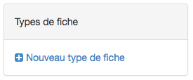

Le formulaire suivant s’affiche :

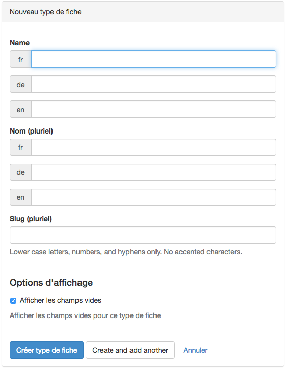

Remplir le nom du type de fiche et sa forme plurielle. Si le support de plusieurs langues a été demandé pour le catalogue, il s'agira de remplir également ces éléments traduits dans les autres langues. Pour terminer, choisir une forme simplifiée du nom appelée "slug" qui apparaitra dans l'adresse web (URL) du site généré par CATIMA. Celui-ci doit être unique et n'être composé que de lettres (non accentuées), nombres et de traits d'unions. Les slugs sont souvent en anglais.

> Exemple : Pour un type de fiche "Acteurs de films", le slug peut être "movies-actors"

Si l'option **Afficher les champs vides** n'est pas sélectionnée, les champs qui ne contiennent aucune données ne seront pas vu par les visiteurs du catalogue.  

#### Suggestions 

L'option **Suggestions** permet aux visiteurs du catalogue d'envoyer leur suggestions aux éditeurs/administrateurs. Celles-ci n'apparaissent pas publiquement (comme le feraient des commentaires) mais sont envoyées par email à l'adresse définie et se retrouvent dans le mode data.

Pour activer cette option, sélectionner **Activer les suggestions**. Les utilisateurs ont besoin d'un compte Catima pour envoyer leurs suggestions. Afin que des visiteurs sans compte Catima puissent aussi envoyer leurs suggestions, activer **Autoriser les suggestions anonymes**.

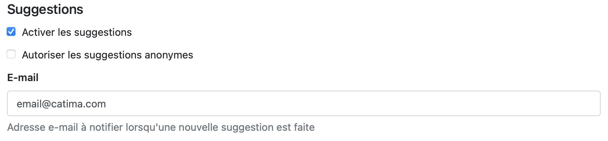

Un petit icône apparaît en haut à droite des fiches pour lesquelles il est possible de faire des suggestions. Celui-ci est visible uniquement pas les utilisateurs connecté à Catima si l'option de suggestions anonymes n'est pas activées, à tout le monde sinon:

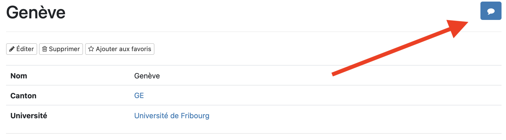

En cliquant dessus, une interface apparaît pour y écrire du texte (avec un dispositif anti-spam) et l'envoyer: 

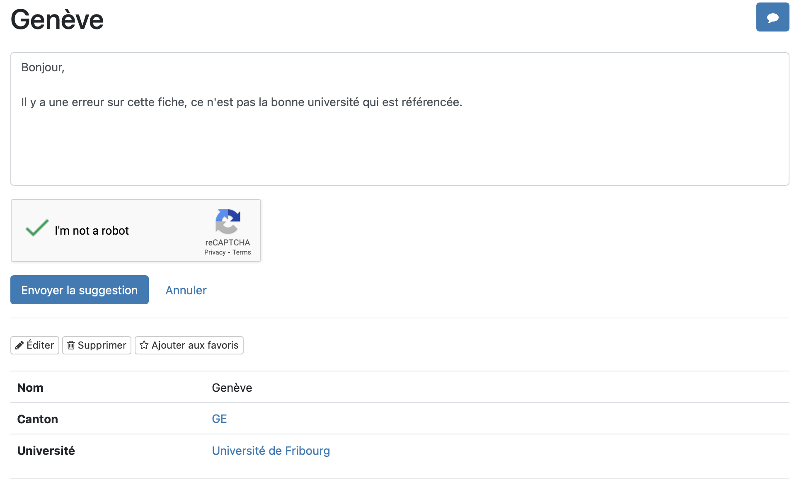

Une fois la suggestion faite, un email est de notification est envoyé à l'adresse spécifiée. Elle apparaît aussi en mode **Data** par une pastille à côté de la fiche en question  indiquant le nombre de suggestions à traiter.

Cliquer sur 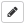 pour édtier la fiche et retrouver toutes les suggestions affichée sur la gauche. 

 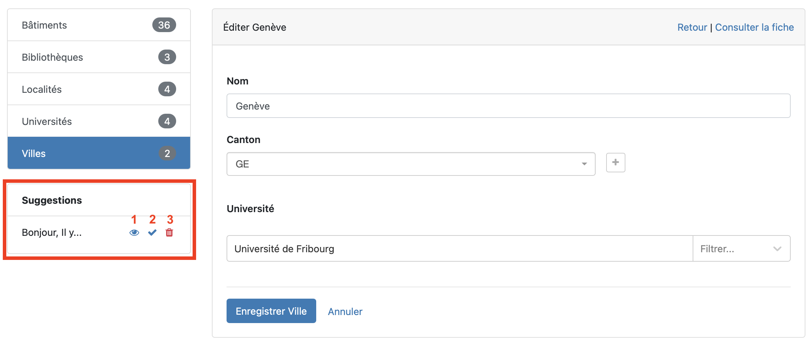

Les options disponibles sont les suivantes: 

**1**: voir la suggestion:  
**2**: valider la suggestion: l'icône deviendra vert et la suggestion reste visible  
**3**: supprimer la suggestion  
 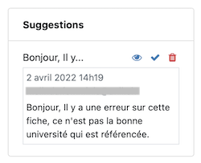

Une fois les champs remplis avec les données, il est possible d'enregistrer et retourner au menu *Data* avec "*Créer fiche de type*" ou d'enregistrer et ajouter un nouveau type de fiche avec "*Create and add another*".

> NB : Il est possible d'annuler à tout moment en cliquant sur "Annuler" (Cancel).

Une fois le type de fiche créé, ses éléments (nom, pluriel, slug) sont résumés sur la ligne grise. Il est possible de les modifier en cliquant sur le lien "Éditer le type de fiche".

### Configuration d'un type de fiche 

Une fois le type de fiche créé, il s'agit d'y ajouter les champs souhaités. 

> NB : Les **champs** à créer dans CATIMA correspondent aux caractéristiques des concepts issus de l'étape de "Conceptualisation"

Pour ajouter un champ, cliquer sur la liste déroulant "*+ Ajouter…*" (*Add*) qui révèle les différents choix de champs possibles.

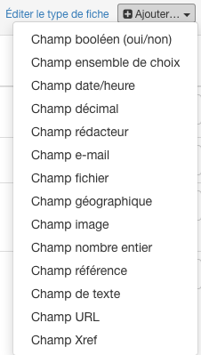

> Rappel : Les champs du type de fiche sont issus de l'étape de conceptualisation. Voir (conceptualisation) pour en savoir plus.

### Types de champs 

Afin que le catalogue soit rempli par les éditeurs avec des données au bon format (p.ex nombre, date, image), il s'agit de créer des champs adaptés. Voici les types de champs disponibles dans CATIMA : 

#### Champ booléen (oui/non)

Ce champ permet le choix entre deux valeurs "oui" ou "non" uniquement.

#### Champ ensemble de choix

Ce champ permet de proposer une liste de choix hiérarchique entre plusieurs valeurs. En cliquant sur *Ensemble de choix > Éditer* depuis la page de *Set up*, on peut visualiser la hiérarchie d'un ensemble de choix. Chaque élément peut être déplacé plus haut ou plus bas dans la hérarchie avec le bouton à 4 flèches à gauche de chaque choix. Si un élément est lié à une sous-fiche, le nom de celle-ci apparaît à droite de l'élément, en bleu.

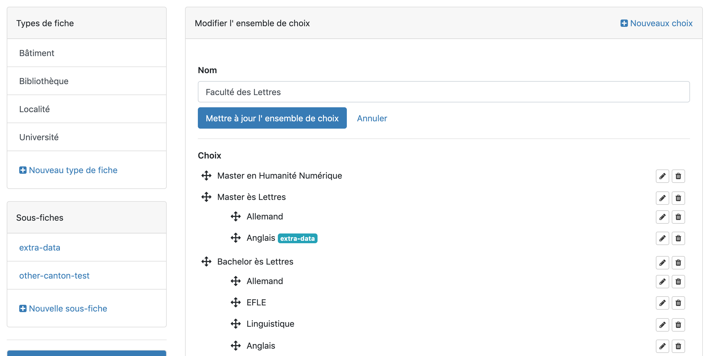

Pour éditer le nom d'un choix ou lui assigner une sous-fiche, cliquer sur le bouton *"Éditer"*  sur sa droite. 

L'organisation hiérarchique permet de lier les éléments entre eux: chaque choix peut avoir des sous-choix. Il n'y a pas de limite quand au nombre de sous-choix: un choix peut avoir un ou plusieurs sous-choix, qui eux mêmes peut avoir un ou plusieurs sous-choix, etc. Un choix ayant un ou plusieurs sous-choix se comporte de la même manière qu'un choix n'en ayant aucun; tous les choix peuvent être sélectionné dans une fiche et être liés à une sous-fiche indépendamment de leur niveau hérarchique.

Si un ensemble de choix créé n'est pas ou plus utilisé, on peut soit:

- le **désactiver**: l'ensemble de choix est toujours présent en mode "Set Up" mais n'est pas utilisable en mode "Data" ni visible dans le catalogue. On peut le réactiver si besoin. 
- le **supprimer**: l'ensemble de choix est supprimé et il n'est plus possible de le récupérer par la suite.

#### Champ décimal

Ce champ permet d'entrer des nombres au format décimal ("nombres à virgule").

#### Champ rédacteur

Ce champ permet d'afficher automatiquement l'éditeur de la fiche, ou la dernière personne à l'avoir mise à jour. 

> **Attention** : ce champ affiche automatiquement l'adresse e-mail du/des éditeurs du champ, c'est pourquoi il peut être préférable de restreindre la visibilité de ce champ en interne en activant l'option "Restreindre le champ au personnel" lors de l'ajout du champ.

#### Champ e-mail

Ce champ permet d'entrer une adresse e-mail.

#### Champ d'intégration (embed) 

*Pour l'intégration de média à une page, voir la rubrique [Intégration de média (embed) dans une page](#integrationmediapage).*

Ce champ permet l'intégration de médias tels que des capsules interactives, des modèles 3D ou des vidéos à une fiche à partir de sites web indépendants de Catima.  Pour que l'intégration soit possible, il faut que le site sur lequel le média se trouve soit explicitement autorisé par Catima. Il doit faire partie de la **liste des domaines autorisés**.  

> Exemple: afin de pouvoir publier une vidéo youtube dans une fiche, il faut que le domaine **youtube** soit autorisé par Catima - ce qui est le cas.

##### Liste non-exhaustive des domaines autorisés:

- Youtube (*.youtube.com)
- Viméo (*.vimeo.com)

Pour connaître la liste exhaustive des domaines autorisés (qui peut évoluer en fonction des besoins), se référer aux personnes responsables. 

##### Utilisation du champ d'intégration (embed) 

En plus des informations standards telles que nom, slug et options d'affichage, il faut aussi spécifier les *domaines supplémentaires* et le *format voulu*. 

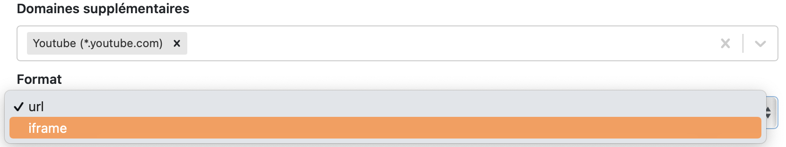

1. **Domaines supplémentaires**: choisir dans cette liste les domaines autorisés pour ce champ. *Par exemple: si le champ est uniquement pour des vidéos provenant de youtube, sélectionner Youtube. Mais si le champ est pour des vidéos provenant de youtube et/ou viméo, sélectionner Youtube et Viméo.*

2. **Format voulu:** il est possible d'intégrer le média de 2 façons différentes. 
	- *Par iframe*: cette option est pour partager un média uniquement. Les autres éléments présents sur la page ne sont pas pris en compte. Dans le cas de **Youtube**, iframe permet de partager uniquement la vidéo sans la barre de recherche youtube, le titre, les commentaires et tous les autres éléments autour. Cette option permet généralement un intégration plus propre. Un *iframe* est un simple bout de texte. 
		- Pour intégrer un média à une fiche avec iframe en mode édition (Data): récupérer la *balise iframe* depuis la page internet où se trouve le média en cliquant sur le bouton ou l'option **Partager (ou Share)** > **Embed**. Le texte en question commence par `<iframe` et se termine par `</iframe>`. Le et le coller dans le champ d'intégration de la fiche:
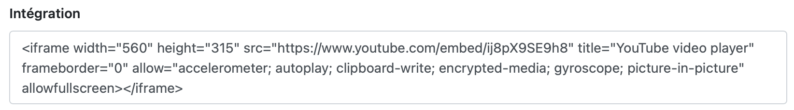
Résultat lors de la consultation de la fiche:
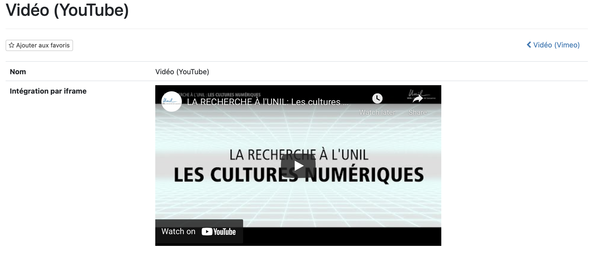
Pour ajouter plus d'un média, il est possible d'insérer plusieurs balises iframe l'une après l'autre:
  

> *Note: Pour des raisons de sécurité, le champ intégration supprime toutes autres balises et garde uniquement la balise iframe.*  

***Par URL***: cette option permet de partager une page d'un site internet avec la mise en page, les titres et autre éléments. Ceci est surtout pratique quand un site de propose pas d'option de partage par iframe. La largeur et la hauteur sont personnalisables - par défaut 900px et 400px.   
> Attention: il n'est pas toujours possible d'intégrer des pages de cette manière car il faut que le site en question accepte d'être intégré par URL. Cette décision est indépendante de Catima. Par exemple, Youtube et Viméo ne permettent pas de le faire.

Lors de la création d'un **champ d'intégration (embed)**, il est vivement conseillé de créer un titre explicite spécifiant le type d'intégration tel que *Intégration par iframe* et *Intégration par url* ou d'ajouter un texte d'aide à la saisie afin que les personnes ajoutant du contenu au catalogue sachent quel contenu ajouter.

#### Champ fichier

Ce champ permet d'ajouter des fichiers, avec d'éventuelles restrictions d'extension (par exemple uniquement .pdf ou .doc)

#### Champ géographique

Ce champ permet d'entrer une localisation géographique soit en entrant manuellement les valeurs de latitude et longitude soit en pointant la localisation sur une carte.

#### Champ image

Ce champ permet d'ajouter des fichiers images, avec d'éventuelles restrictions d'extension (par exemple uniquement .jpg ou .png). 

Il est également possible d'intégrer un champ de légende de l'image :

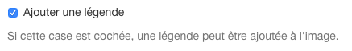

Cela permet à l'éditeur d'ajouter un texte de légende accompagnant l'image.

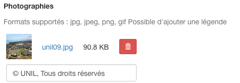

#### Champ nombre entier

Ce champ permet d'entrer des nombres entiers.

> L'option **"Numéro de série automatique"** permet l'attribution automatique d'une valeur numérique pour le champ "nombre entier" en question. Cela permet par exemple de créer des identifiants numériques automatiquement. La numérotation automatique concerne les _nouvelles_ fiches et commence par la plus haute valeur numérique existante pour ce champ et lui additionne "1". Si aucune valeur numérique n'existe à l'activation de cette option, alors la numérotation débute par le nombre "1".

#### Champ référence

Ce champ permet de créer une référence à un autre type de fiche.  

**Exemple:**  
Pour lier les *Bâtiments* aux *Universités*, créer un champ référence dans la fiche bâtiments. Lors de la saisie des données d'un bâtiment, il faudra donc choisir une université à laquelle il est lié. 

Lors de la consultation des fiches, l'université référencée apparaît de la même manière que les autres champs dans la fiche du bâtiment. 

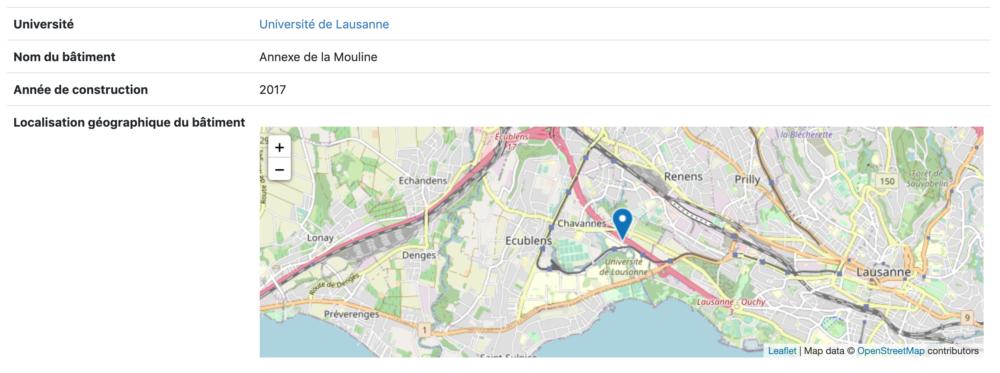

Les fiches *Bâtiments* qui font référence à une univeristé sont listé en bas de la fiche Université en question. Ci-dessous la fiche de l'université de Lausanne avec liste des fiches *Bâtiments* qui lui font référence:

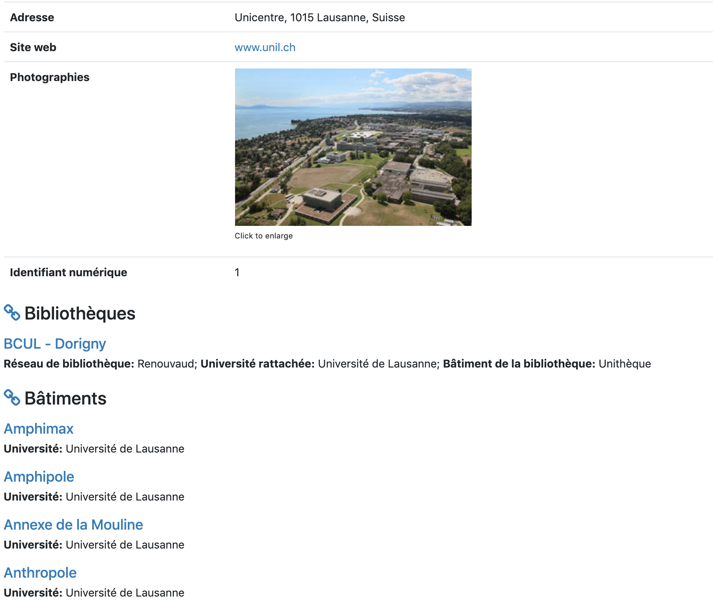

> Si plusieurs types de fiches font référence à une autre fiche -comme ici *Bâtiments* et *Bibliothèques* ont les deux un champ référence à la fiche *Universités*, les fiches qui lui font référence sont listées par type de fiche. 

#### Champ de texte

Ce champ permet d'entrer du texte, qu'il soit court (p.ex un nom ou un titre) ou long (p.ex texte descriptif)

> L'option **"Contient du texte formaté"** propose un éditeur de texte prenant en charge des options de mise en forme (gras, italique, listes, notes de bas de page) :

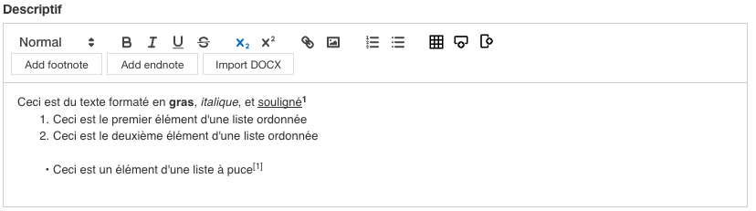

Qui s'affichent ainsi dans le site du catalogue : 

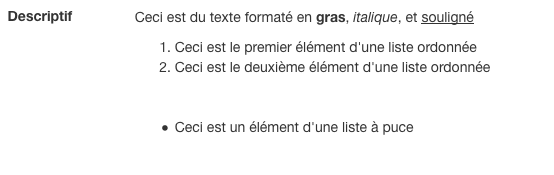

> **NB** : Les **champs primaires** ne peuvent pas être formatés (option "Texte formaté" grisée)

> **AVERSTISSEMENT** : une fois du texte formaté ajouté, il est **vivement déconseillé** de décocher la case **"Contient du texte formaté"**. En effet le formatage du texte ajoute du code informatique, et la désactivation de cette option affichera ce texte peu lisible à l'utilisateur. Recocher la case permet de rétablir l'affichage du texte formaté.

#### Champ URL

Ce champ permet d'entrer des adresses URL.

### Création d'un champ 

Bien que chaque champ impose son format de données spécifiques (nombres, dates, images, etc...), une partie des informations à remplir est commune : 

| | Definition | Exemple | Remarques |
| ---------- | ---------- |---------- | ---------- |
| Nom | Nom donné au nouveau champ | *Année de naissance de l'acteur*  | En cas de support de plusieurs langues, indiquer également les traductions du nom |
| Nom(pluriel) | La forme plurielle du nom  | *Années de naissance des acteurs* | En cas de support de plusieurs langues, indiquer également les traductions des formes plurielles |
| Slug | Forme simplifiée du nom | *birthdates_actors* | Doit être unique, n'être composé que de lettres (non accentuées), nombres et traits d'unions. Ils sont souvent en anglais. |

#### Options d'affichage des champs dans la liste des fiches

| | Definition | Remarques |
| ---------- | ---------- |---------- |
| **Utiliser comme champ primaire**             | Le champ designé comme primaire est celui qui permet d'identifier de manière unique les données. | Par défaut le champ primaire est un champ caché et correspond à un nombre (qui augmente à chaque ajout de données). Cette option ne peut être activée que pour un champ à la fois (la dernière activation est celle qui est appliquée). Activer cette option bloque l'accès à l'option "texte formaté". |
| **Inclure le champ dans la liste des fiches en mode édition (Data** | Activer/désactiver l'affichage de ce champ dans le tableau des données (section "Data") pour aérer l'affichage | Particulièrement utile pour les champs contenant de grands textes |
| **Inclure le champ dans la liste des fiches en mode consultation** | Activer/désactiver l'affichage du champ lors de la consultation des données sous forme de liste par l'utilisateur final | Si l'affichage des fiches se fait sous forme de *Grid* cette option ne sera pas prise en compte. |
| **Restreindre le champ au personnel du catalogue** | Cache ce champ pour les users et members.| Uniquement visible pour les éditeurs, super-éditeurs, reviewers et adminisatrateurs. |                                                                               

## Ajout et édition de contenu conditionnel ou sous-fiche

Un type de fiche peut avoir des caractéristiques communes à toutes les données (p.ex : tous les films ont un réalisateur) mais peut également avoir des caractéristiques "conditionnelles" (p.ex : la 'Période traitée' n'est pertinente que pour les documentaires historiques et pas pour les films d'action). Dans ce dernier cas, il est possible de créer une **sous-fiche** qui s'affiche uniquement lorsqu'un certain **choix** est sélectionné (p.ex : le choix de 'Période traitée' apparaît uniquement si le choix documentaire historique est sélectionné et reste invisible si le choix film d'action est sélectionné).

Cela permet de ne pas avoir de champs superflus lors de la saisie de données. 

Pour permettre l'enregistrement de données de manière conditionnelle, il est nécessaire de:
  1. D'abord créer la **sous-fiche**
  2. Puis créer l'**ensemble de choix** dans la fiche principale.  

> Il n'est pas possible de créer une sous-fiche à partir d'une autre condition qu'un ensemble de choix dans la fiche principale. 

### 1. Création d'une sous-fiche 

> La notion de sous-fiche étant liée à celle de type de fiche, se référer si besoin à la section "Type de fiche".

Pour ajouter une **Sous-fiche** , dans la barre de gauche, en bas de la rubrique "*Sous-fiches*", cliquer sur "**+ Nouvelle sous-fiche**". 

Une fois choisi un nom pour la sous-fiche, il est possible d'enregistrer et retourner au menu *Setup* avec "*Créer sous-fiche'*" ou d'enregistrer et ajouter une nouvelle sous-fiche avec "*Create and add another*".
 

### Édition d'une sous-fiche

Une fois la/les sous-fiches créée-s, il s'agit d'y ajouter les champs souhaités. 

La procédure est similaire à celle de l'édition d'une fiche et débute par un clic sur la liste déroulante "*+ Ajouter…*" qui révèle les différents choix de champs possibles :

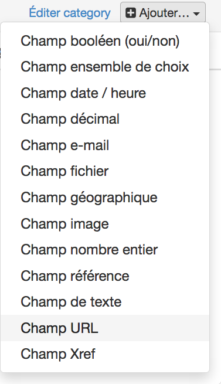

> Il est possible de créer plusieurs sous-fiches avec différentes conditions. 

### 2. Ajout d'un ensemble de choix  

Un ensemble de choix est une liste d'éléments prédéfinis permettant de remplir un champ.

> Exemple : un ensemble de choix peut consister en une liste de pays, de genre cinématographique, de professions ou de mots-clés par exemple.

Effectuer un choix permet ainsi l'affichage d'une sous-fiche dédiée. Un choix situé à n'importe quel niveau hiérarchique peut être lié à une sous-fiche.

La liste des "Ensembles de choix" est accessible en cliquant sur "Ensembles de choix" dans la barre de gauche en mode *Setup*. Une liste des ensembles de choix existants est affichée :

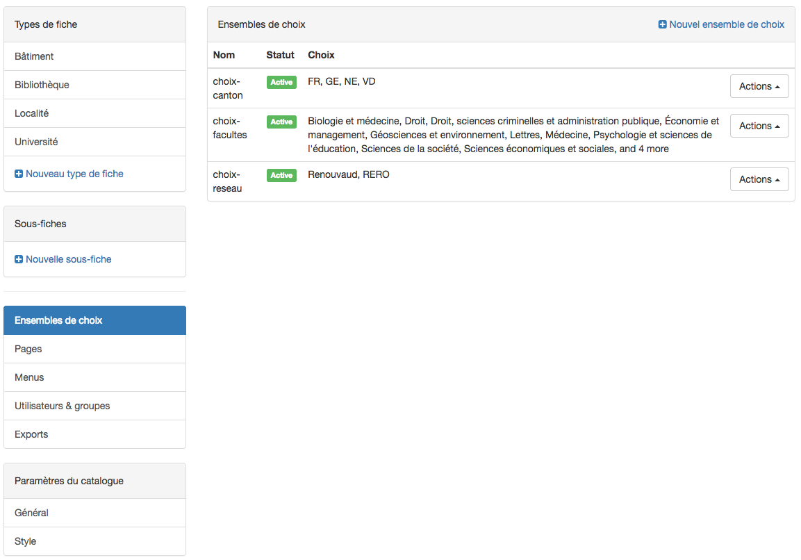

Il est alors possible de sélectionner un ensemble de choix existant ou d'en créer un nouveau. 

Lors de la création ou de la modification d'un ensemble de choix, il est possible de lier une sous-fiche en éditant un choix, puis en sélectionant la sous-fiche choisie sous "Sous-fiche (optionnel)".

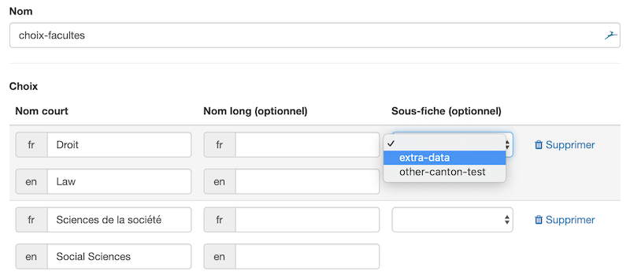

Dans cet exemple, la **sous-fiche** *extra-data* s'affichera et permettra la saisie de données uniquement lorsque le choix *Droit* sera selectionné.

> Si la sous-fiche de s'affiche pas comme voulu: en mode *Setup*, sélectionner le type de fiche et ajouter un champ avec l'ensemble de choix avec lequel la sous-fiche est reliée. 

## Affichage de contenus personnalisés et styles d'affichages 

Par défaut, CATIMA génère un affichage par type de fiche en créant une page dédiée qui n'est pas modifiable.  

Ainsi pour changer le style d'affichage des contenus (grille d'images, grille de texte ou liste) ou pour changer les champs affichés, la création d'une nouvelle page est nécessaire. 

> NB : le nom utilisé pour l'affichage des fiches (nom des fiches affiché) peut-être changé sans la création d'une nouvelle page. Pour cela il s'agit d'en passer par "l'affichage des fiches" dans la section de configuration du type de fiches (voir "Affichage des fiches")

Les pages peuvent contenir du texte mis en forme, du contenu (champs)issu des types de fiches, une carte géographique mais également (pour les utilisateurs avancés) du code HTML et Markdown.

### Ajout d'une page

Pour ajouter une page, sélectionner "Pages" dans la barre de gauche. La liste des pages existantes apparaît :

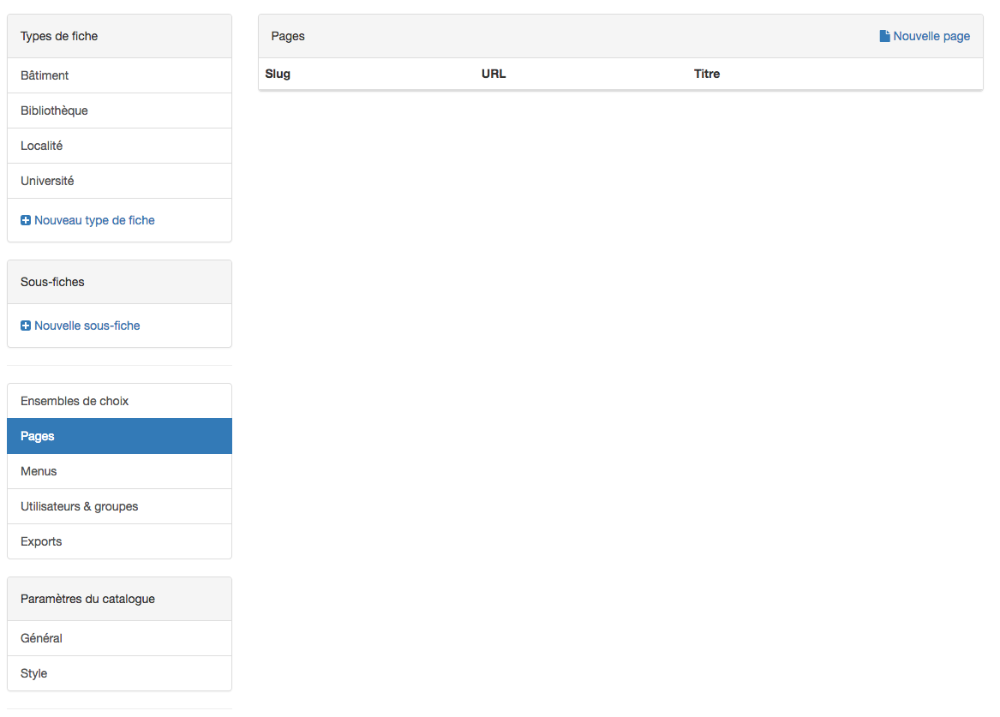

Cliquer sur "Nouvelle page". La page de configuration suivante apparait :

 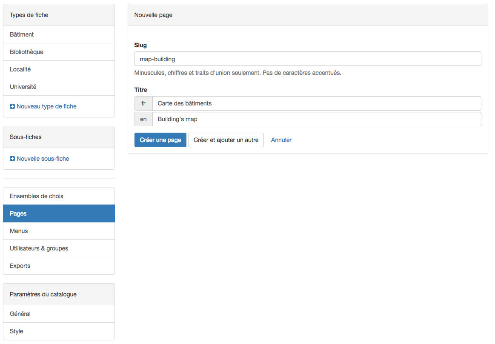 

Choisir le(s) titre(s) de la page dans les différentes langues du catalogue ainsi qu'une forme simplifiée du nom appelée "slug" qui apparaitra dans l'adresse web (URL) du site généré par CATIMA. Celui-ci doit être unique et n'être composé que de lettres (non accentuées), nombres et de traits d'unions. Les slugs sont souvent en anglais.

> Exemple de slug : "accueil", "home", "biblio"

Une fois les champs remplis , il est possible d'enregistrer et retourner au menu *Setup* avec "Créer une page" ou d'enregistrer et ajouter de nouvelles données avec "*Créer et ajouter une autre*".

### Édition d'une page 

Une fois la page créée, il s'agit d'y ajouter du contenu. Sélectionner "*Pages*" dans la barre de gauche. La liste récapitulative de toutes les pages s’affiche. Cliquer ensuite sur le bouton "Éditer"  correspondant à la page à paramétrer. La page d'édition suivante apparaît :

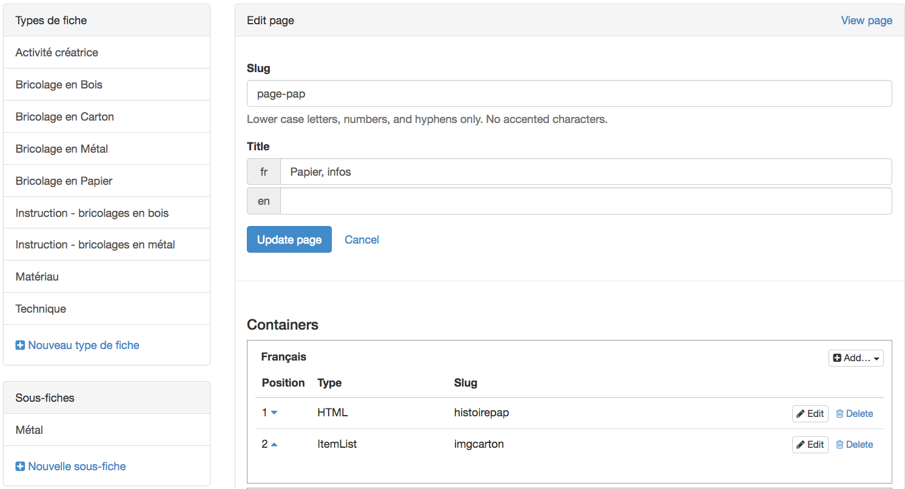

Les champs remplis lors de l'ajout de la page (slug et titres) sont facilement modifiables en leur attribuant les nouvelles valeurs souhaitées puis en cliquant sur "Update page". 

L'édition du contenu de la page se fait dans la section "**Containers**". 

Plusieurs types de contenus sont possibles :

-	**Map** : Permet de générer une carte géographique affichant les données de localisation pour un type de fiche spécifique.
-	**ItemList** : Ce type de contenu permet d’afficher une liste des contenus d’un type de fiches, notamment en changeant le style d'affichage (aperçu d'images, grille, liste ou line) *Maximum un par page*
-	**HTML** : Afficher un éditeur visuel afin d'écrire du texte mis en forme, des liens (URL) et d'ajouter des images ou des vidéos sans connaissance préalable. Un éditeur de code permet également aux utlisateurs avancés d'entrer directement du code HTML. C'est ce container qui permet l'intégration de médias.
-	**Markdown** : Ce langage permet l'affichage de textes, tableaux, et images avec une syntaxe simplifiée. 
-	**Contact** : Ce container permet d'ajouter un formulaire de contact dans une page personnalisée.
-	**Search** : Comme le conteneur ItemList, le Search permet d'afficher une liste de fiches prédéterminées selon une recherche sauvegardée. *Maximum un par page

Pour ajouter du contenu, cliquer sur "+Ajouter" puis choisir le type de contenu souhaité:

#### Édition d'un conteneur Item List

Ce type de *conteneur*, permet d'afficher (sur la page personnalisée) toutes les données enregistrées dans un type de fiche donné ainsi que de changer le style d'affichage des fiches (aperçu d'images, grille, liste ou line).

> **Attention**: il n'est pas possible d'avoir plus d'un conteneur *Item List* par page.

 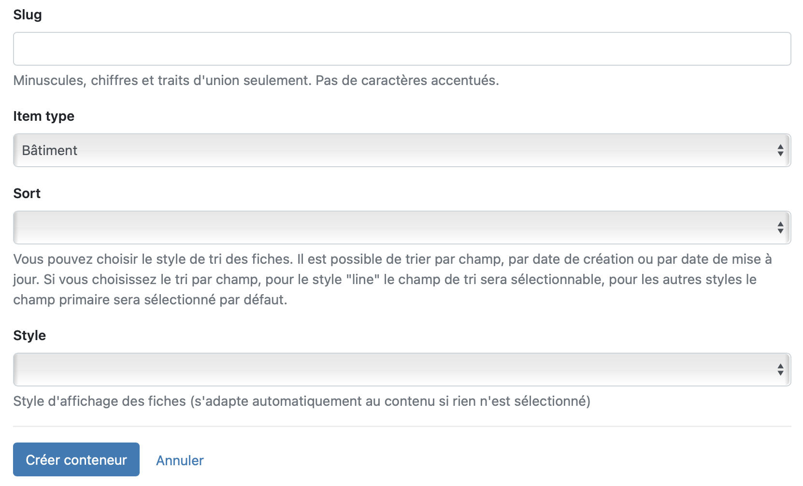

Choisir un "slug" (nom court à donner au conteneur). Celui-ci apparaitra dans l'adresse web (URL) du site généré par CATIMA. Il doit être unique et n'être composé que de lettres (non accentuées), nombres et de traits d'unions. Les slugs sont souvent en anglais.

> **Exemple de slug**: "liste-oeuvres", "work-list", "img-gallery"

Choisir aussi un ordre d'affichage *ascendant* ou *descendant*, par champ, date de création ou date de modification. Dans le cas des affichages par images, grille ou liste, le champ sélectionné est le champ primaire. Pour l'affichage de type line, il est possible de sélectionner le champ voulu parmis la liste de champs disponibles.

> **Exemple en mode line**: nous avons un type de fiche *Livre* qui contient les champs *Titre* (champ primaire), *Auteur*, *Date de publication* et *Image*. Le tri des fiches se fera selon le *Titre* (champ primaire) en mode images, gille ou liste. En mode line, il est possible de choisir de faire le tri selon le *Titre*, l'*Auteur* ou la *Date de publication*. Comme il n'est pas possible de classifier des image d'une manière ascendante (ou descendante), ce champ n'est pas sélectionnable pour le tri.  

Le choix du style permet de changer l'affichage des fiches selon les styles suivants : 

#### Images (thumb):
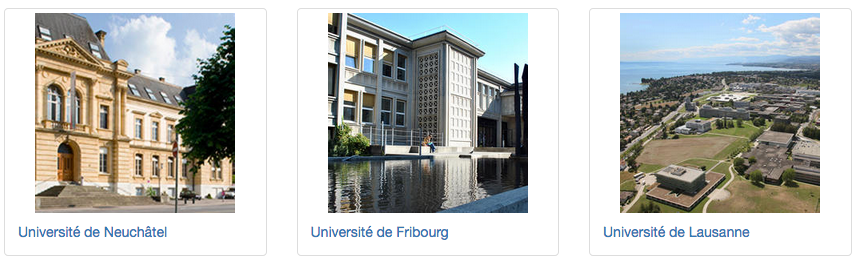

#### Grille (grid):
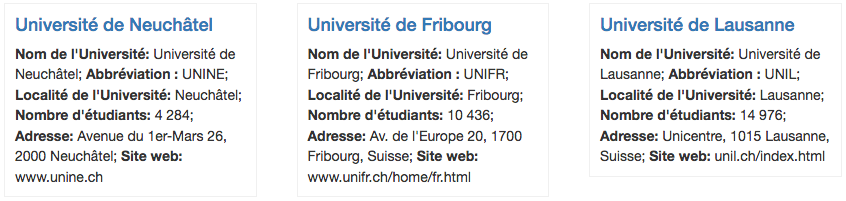

#### Liste:
 - Avec image:  
 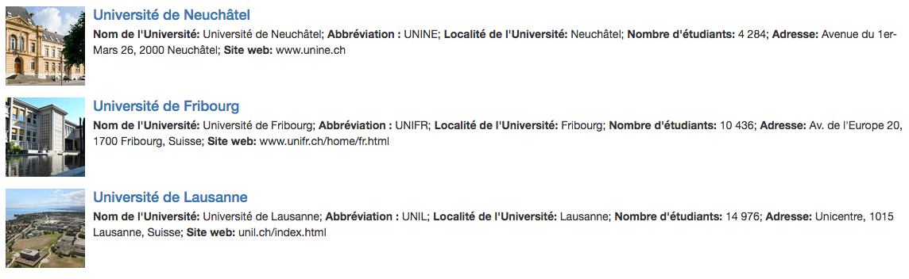
 - Sans image:  
 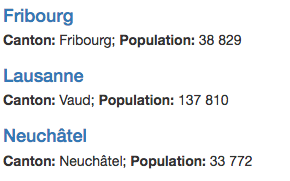
 
#### Line (ligne):
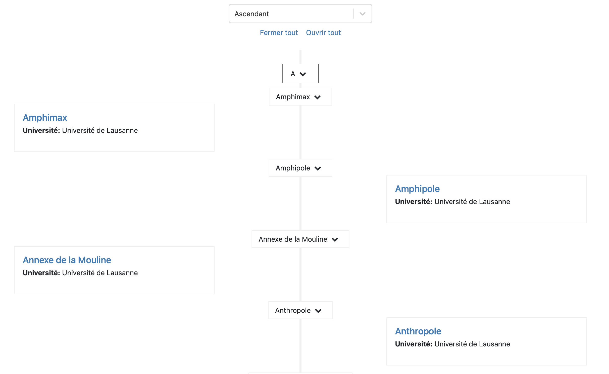

Le style *line* affiche les fiches le long d'une ligne verticale; il permet le tri par date ou ordre alphabétique. Le visiteur peut ouvrir ou fermer les fiches et les classer par ordre ascendant ou descendant. Dans l'image ci-dessous, on a choisi *Tout fermer* avant d'ouvrir une seule fiche.

#### Édition d'un conteneur de cartes géographique (Map Container)

Ce type de conteneur permet de générer automatiquement une carte géographique affichant les données géographiques pour un type de fiches donné, comme [ceci](https://catima.unil.ch/catmanual2/fr/map-building) : 

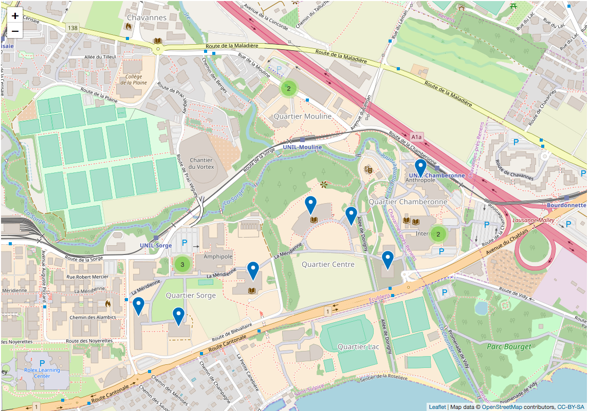

Pour créer ce conteneur, choisir "
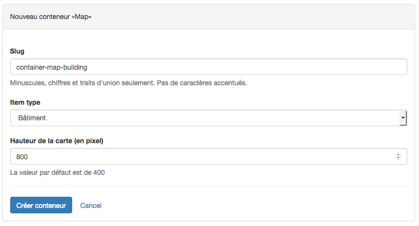

#### Édition d'un conteneur HTML

Ce type de conteneur permet d'ajouter du code utilisé habituellement dans les **pages web**. 

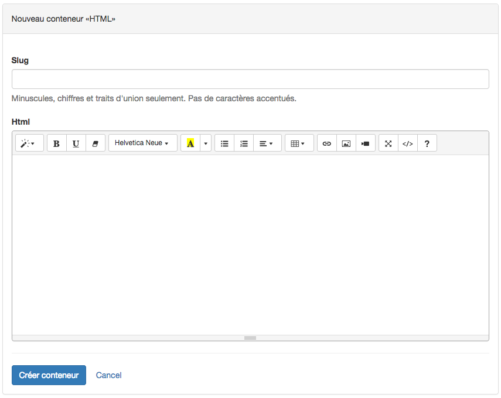

Choisir un "slug" (nom court à donner au conteneur). Celui-ci apparaitra dans l'adresse web (URL) du site généré par CATIMA. Il doit être unique et n'être composé que de lettres (non accentuées), nombres et de traits d'unions. Les slugs sont souvent en anglais.

> Exemple de slug : "accueil-html", "home-html", "biblio-html"

L'édition de l'HTML se déroule dans la zone "HTML" et peut se faire de deux manières :

**1. Édition manuelle via la barre d'outils  :**

* Baguette magique : choix des **titres** et **sous-titres**, blocs de citation ou en-têtes
* B et U : appliquer les styles **gras** ou **souligné** ;
* Gomme : **suppression des styles** appliqués
* Choix des **polices** ; 
* Choix de la **couleur du texte** ou celle du **fond** ;
* Insertions de listes à **puces** ou **numérotatées**, 
* Choix des styles d’**alignement** ;
* Insertion de  **tableau** (jusqu'à 10 colonnes x 10 lignes)
* Insertion de **liens**
* Insertion d'**image**
* Insertion de **vidéo**

 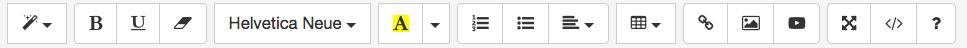

**2. Édition de code en activant l'affichage "Code View"**

* Les utilisateurs avancés ont la possibilité d'insérer, écrire ou modifier du code HTML via le mode "Code View".
 
    > Une fois le contenu HTML ajouté, retourner en mode édition de texte avant d'enregistrer, sans quoi le contenu entré via "Code view" ne sera pas enregistré !

#### Édition d’un conteneur Markdown

Ce type de conteneur permet d'ajouter du texte simple ou des tableaux et des images via une syntaxe simplifiée (Markdown).  

 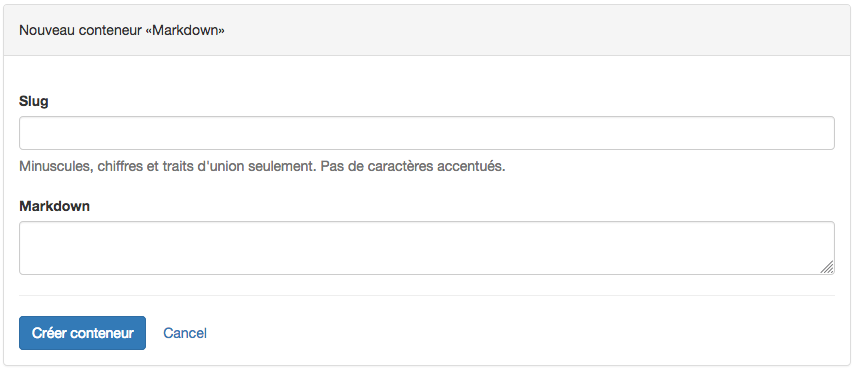

Choisir un "slug" (nom court à donner au conteneur). Il doit être unique et n'être composé que de lettres (non accentuées), nombres et de traits d'unions. Les slugs sont souvent en anglais.

> Exemple de slug : "liste-oeuvres", "work-list", "img-gallery"

Une fois le contenu Markdown ajouté, enregistrer et retourner au menu *Setup* avec "*Créer conteneur*".

#### Édition d'un conteneur Contact

Ce type de conteneur permet d'ajouter un formulaire de contact à destination des visiteurs du catalogue. 

 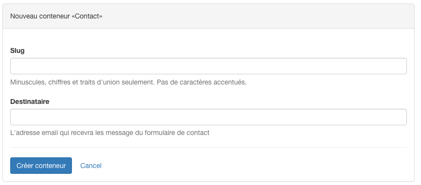

Choisir un "slug" (nom court à donner au conteneur). Il doit être unique et n'être composé que de lettres (non accentuées), nombres et de traits d'unions. Les slugs sont souvent en anglais.

> Exemple de slug : "container-contact", "formulaire-contact"

Puis indiquer l'adresse e-mail où seront transmis les messages écrits par les visiteurs du site.

Une fois le conteneur Contact ajouté, enregistrer et retourner au menu *Setup* avec "*Créer conteneur*".

### Edition d'un conteneur Search

 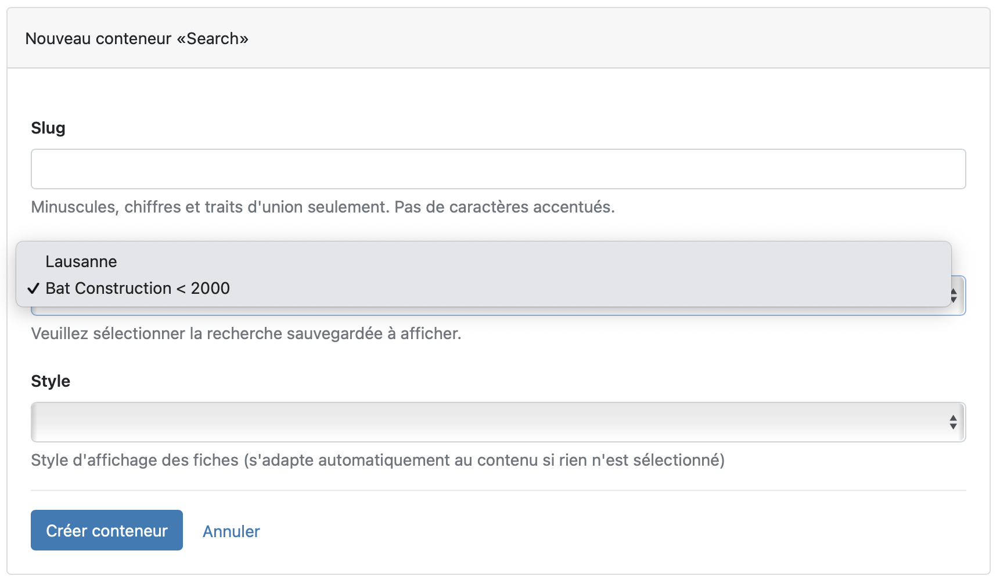
 
> **Attention**: il n'est pas possibled d'avoir plus d'un conteneur *Searcht* par page.

Ce conteneur affiche une liste de fiches selon un critère déterminé par une recherche préalablement sauvegardée. Cela peut être une recherche simple ou une recherche avancée. 

### Recherche simple 

 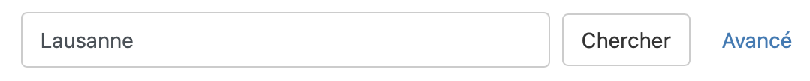
 
Depuis la page d'accueil, entrer un mot-clé dans la barre de recherche et cliquer sur "Chercher".

 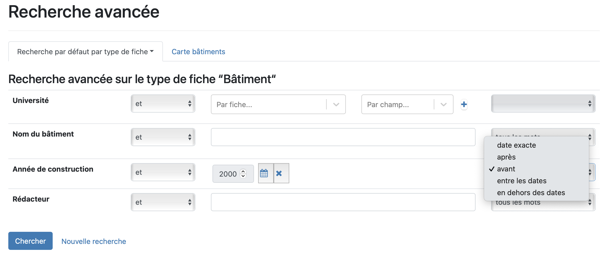
 
Les paramètres de recherche avancée permettent des recherches plus précises sur un type de fiche déterminé, sur certains champs uniquement ou sur un ensemble de champs. L'image ci-dessus montre la recherche des tous les bâtiments ayant été construits avant 2000. 

Dans les deux cas, il faut sauvegarder la recherche afin de pouvoir l'afficher dans une page: 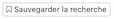

On trouve toutes les recherches sauvegardée dans le profil d'utilisateur. Cliquer sur l'adresse email en haut à droite (il faut avoir un compte Catima et être connecté), puis "Mes recherches." Par défaut, les recherches sont nommées selon la date et l'heure de la sauvegarder mais il est possible de les renommer afin de les retrouver plus facilement. 

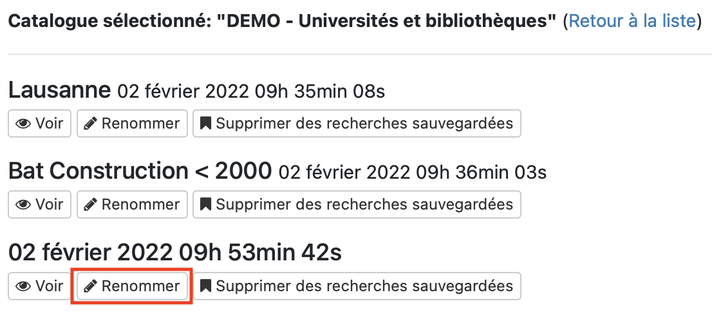

Lors de la création ou de l'édition d'un conteneur **Search** dans une page, la liste des recherches sauvegardées pour ce catalogue apparaît. 

Le choix du style permet de changer l'affichage des fiches. Se référer à [la section ItemList ci-dessus](#liste) pour voir les différents styles disponibles. 

### Intégration de média (embed) dans une page

Il est possible d'intégrer des médias tels que des vidéos, des capsules interactives ou des modèles 3D dans une page avec le conteneur HTML. Contrairement au [champ d'intégration (embed)](#champintegration) des fiches, l'intégration dans une page permet un affichage sur toute la page et une meilleure visualisation du contenu. 

Pour que l'intégration soit possible, il faut que le site sur lequel le média se trouve soit explicitement autorisé par Catima. Il doit faire partie de la **liste des domaines autorisés**.  

> Exemple: afin de pouvoir publier une vidéo youtube dans une fiche, il faut que le domaine **youtube** soit autorisé par Catima - ce qui est le cas.

##### Liste non-exhaustive des domaines autorisés:

- Youtube (*.youtube.com)
- Viméo (*.vimeo.com)

Pour connaître la liste exhaustive des domaines autorisés (qui peut évoluer en fonction des besoins), se référer aux personnes responsables. 

1. Créer ou éditer un conteneur HTML et entrer en mode "Code View".
 	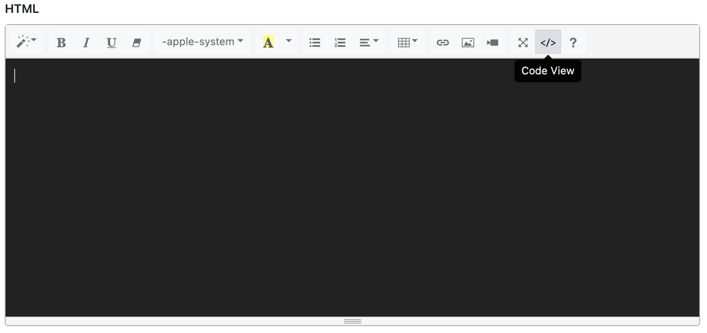
2. Récupérer la *balise iframe* depuis la page internet où se trouve le média en cliquant sur le bouton ou l'option **Partager (ou Share)** > **Embed**. Coller et copier le texte dans le conteneur HTML. Le texte en question commence par `<iframe` et se termine par `</iframe>`. 
   
3. Retourner en mode d'édition normal pour visualiser le résultat. Cette étape est nécessaire pour sauvegarder le travail. 
4. Sauvegarder avec *"Créer conteneur"* ou *"Enregistrer conteneur"*.

> Il est possible de personnaliser l'affichage du conteneur en ajoutant du code HTML en plus de la balise iframe.  

### Organisation des conteneurs

L'ordre des conteneurs ajoutés peut être modifié en tout temps en cliquant sur les flèches bleues **haut** ou **bas** à côté du numéro indiquant leur position (indiqués en rouge ci-dessous)

 

Une fois satisfait de l'organisation de vos conteneurs, **enregistrer** en cliquant sur "Update page" ou annuler avec "Cancel".

## Organisation de la barre de menus

Cette rubrique permet d'**organiser la présentation** de la barre de menus, permettant de naviguer dans le site. Par défaut, les onglets permettent d'accéder aux différents types de fiches, classés par ordre alphabétique. Créer un nouveau menu permet de changer le nom des menus dans la barre horizontale supérieure, mais aussi de créer un accès facile à des pages personnalisées (voir la section "Pages personnalisées")

> NB : L'ajout d'un nouveau menu remplace la barre de menu par défaut (portant le nom des types de fiches). Cela implique de devoir également créer manuellement tous les menus souhaités. 

Pour personnaliser l'organisation de cette barre, choisir "Menus" dans la barre latérale gauche. Les éventuels menus existants sont affichés dans une liste. 

 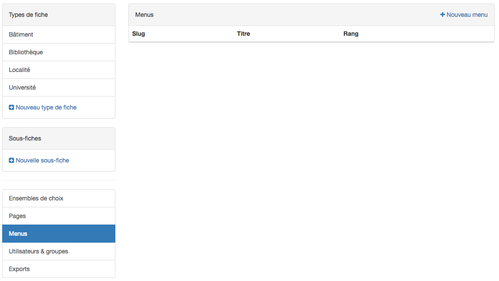

Pour ajouter un nouveau menu, cliquer sur "+ Nouveau menu". La page suivante affiche différents champs et permet de choisir parmi 4 types de menus différents :

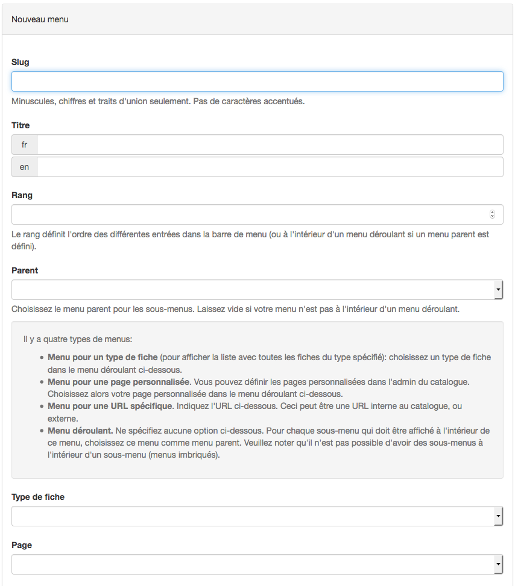
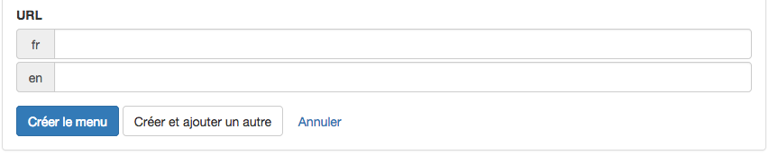

Pour tous les types de menus, remplir les informations suivantes : 
- **Slug** : nom court à donner au menu. Celui-ci apparaitra dans l'adresse web (URL) du site généré par CATIMA. Il doit être unique et n'être composé que de lettres (non accentuées), nombres et de traits d'unions. Les slugs sont souvent en anglais.
> Exemple de slug : "menu-oeuvres", "menu-biblio", "menu-img-gallery"
- **Titre** du menu : nom de l'onglet de la barre de menus.
- **Rang** : nombre entier permettant de définir l'ordre des menus (ou des éléments à l'intérieur un menu) à la place de l'ordre alphabétique. 
- **Parent** : lors de la création d'un sous-menu, choisir un menu parent (créé précédemment, voir ci-dessous)

Les champs suivants dépendent ensuite du type de menu choisi :

* **Menu pour un type de fiche**  : permet d'afficher la liste avec toutes les fiches du type spécifié
    * Choisir un type de fiche dans le menu déroulant "Item type"
 
* **Menu pour une page personnalisée** : permet d'accéder à une page personnalisée dans le site catima
    * Choisir la page personnalisée dans le menu déroulant "Page"

* **Menu pour une URL spécifique** : permet d'accéder à un lien spécifique (interne ou externe au catalogue)
    * Entrer l'URL (pour chaque langue si le catalogue est multilangue)

* **Menu déroulant** : permet d'avoir des sous-menus à l'intérieur de ce menu. 
    * Pour créer un menu "Parent" (un onglet dans la barre de menus permettant d'accéder à des sous menus) : 
        * Ne *rien* remplir dans les options 
    * Par la suite, lors de la création des sous-menus (type de fiche, page personnalisée ou URL) choisir ce menu comme menu parent 

> NB : Il n'est pas possible d'avoir des sous-menus à l'intérieur d'un sous-menu (menus imbriqués)

Une fois les champs remplis avec les données, il est possible d'enregistrer et retourner au menu *Setup* avec "*Créer le menu*" ou d'enregistrer et ajouter de nouvelles données avec "*Create and add another*".

# Gestion de la consultation et de l'édition des données du catalogue

Le site généré par CATIMA peut être visible publiquement, ou sa consultation restreinte à certaines personnes.

Pour configurer ce paramètre aller dans le mode "Setup", puis dans la section "Paramètres du catalogue" de la barre latérale de gauche, cliquer sur "Général". 

 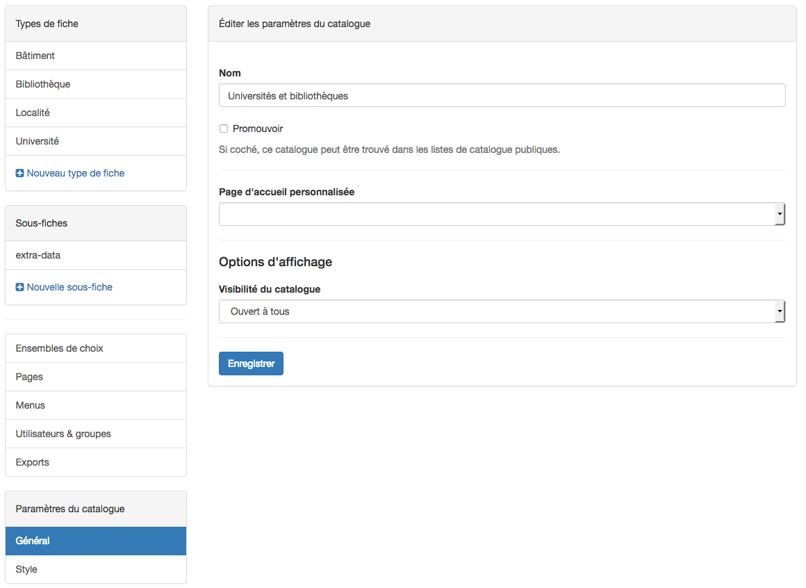

Dans la section "Options d'affichage", il est possible de changer la visibilité du catalogue avec les options suivantes : 

* **"Ouvert à tous"** : le catalogue est consultable publiquement, autant par des membres de CATIMA que par des personnes n'ayant pas de créé de compte
* **"Ouvert aux membres"** : le catalogue est consultable uniquement par les membres du catalogue. 
* **"Ouvert au personnel"** : le catalogue est consultable uniquement par le personnel du catalogue (éditeurs, super-éditeurs, reviewers et administrateurs). 
*Voir ci-dessous pour l'attribution du statuts à un utilisateur.*

## Les différents statuts

CATIMA propose différents statuts pouvant être attribué aux utilisateurs du catalogue; ces statuts définissent les actions possibles comme la consultation ou l'édition de fiches.  Les personnes sans compte CATIMA sont des visiteurs et doivent créer un compte pour pouvoir accéder aux autres statuts. 

> Les statuts sont spécifiques à un cataglogue: il est possible d'être membre d'un catalogue et éditeur d'une autre.  

Voici les différents rôles disponibles, ou chaque statut supérieur donne accès à toutes les fonctionnalités des statuts précédents, plus celles spécifiques à ce statut:  

- **User**: peut uniquement accéder aux catalogues publics et sauvegarder du contenu sur son profil.
- **Member**: peut avoir accès aux catalogues restreints au publics si invité.
- **Editor**: peut ajouter du contenu au catalogue, c'est-à-dire créer de nouvelles fiches, ainsi que modifier et supprimer les fiches qu'il a créées.
- **Super-editor**: peut modifier toutes les fiches ainsi qu'ajouter de nouveaux choix dans les ensembles de choix. 
- **Reviewer**: valide les fiches des *editors* et *super-editors* *(uniquement si la fonction validation est activée)*.
- **Administrator**: a accès à toutes les options du catalogue, attribue les différents statuts.

### Attribution de statuts 

L'attribution de statuts est fait en accédant à l'onglet "Utilisateurs et groupes" à partir de la page "Set up". Il est possible de changer le statuts inidivuellement ou en groupe. 

**Individuellement**  
Rechercher l'utilisateur-trice et cliquer sur le bouton Éditer" . Il est aussi possible d'inviter une nouvelle personne à participer au catalogue en cliquant sur "*+ Nouvel utilisateur*".

 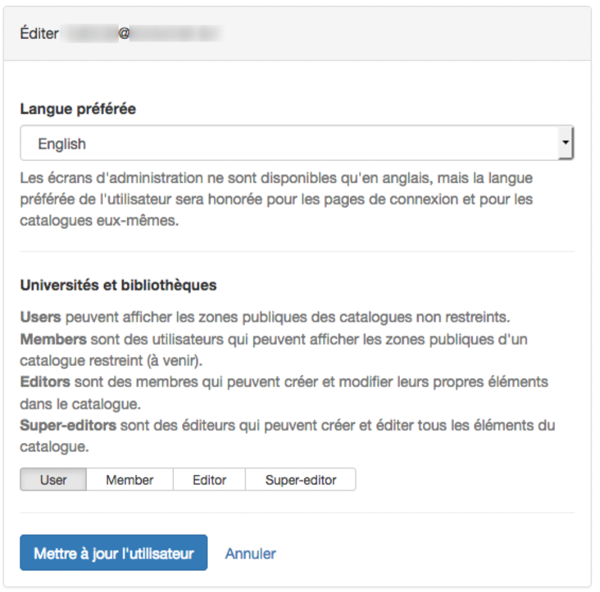

Choisir ensuite la langue préférée et le statut de la personne avant de mettre à jour. L'utilisateur sera notifié par email des changements. 

**En groupe**  
Les groupes peuvent servir à donner différents niveaux d'accès à un certain groupe d'utilisateurs ou à ajouter un grand nombre de personnes en même temps. Après avoir cliqué sur "*+ Nouveau groupe*":

 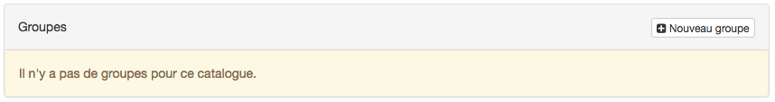

 Entrer ensuite un nom et une description pour le groupe. Il est possible de cocher la case "Public?", qui est spécialement utile si le but est d'ajouter beaucoup de personnes en même temps. Ceci générera un identifiant qu'il est possible de partager avec, par exemple, tous les étudiant-e-s du semestre d'Automne 2018, qui pourront ensuite rejoindre ce groupe. 

  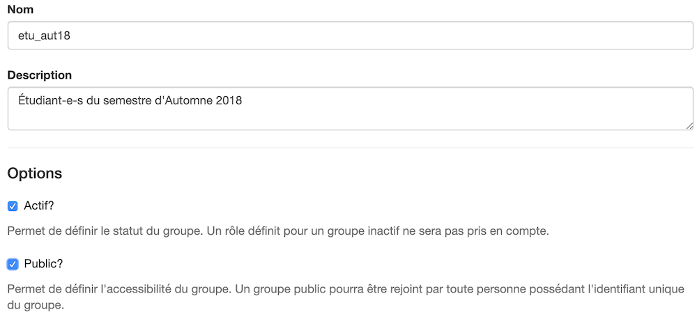

Pour que CATIMA génére cet identifiant, enregistrer les modifications en cliquant sur "Créer groupe", puis retourner dans le groupe en cliquand sur l'icône "Editer" pour pouvoir le lire et le partager. 

  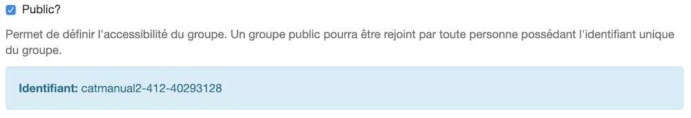

> Pour accéder à un groupe via un identifiant secret, l'utilisateur se rend dans "Mes groupes" > colle l'identifiant du groupe dans le champ prévu à cet effet et clique sur "Rejoindre le groupe".

Il est aussi possible : 
* d'ajouter d'autres personnes au groupe (icône ) en entrant une ou plusieurs adresses email. Dans le cas d'ajout en masse d'utilisateurs avec cette méthode, attention à ce que les adresses email soient correctement formatées: une adresse pas ligne et pas de caractère spécial. Il est conseillé de faire les invitations par petits lots plutôt que de faire tout d'un coup. 
* d'attribuer un même rôle à tous les membres du groupe(ici "Membre") : 
 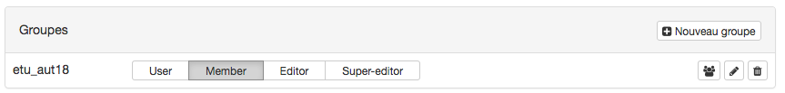

 > NB : Lorsque un utilisateur a un rôle attribué individuellement *et* un rôle attribué via un groupe, c'est le rôle le plus élevé qui s'applique.

## Statistiques

Visualiser le nombre de fois que le catalogue a été vu à partir de la rubrique **Statistiques** depuis la page "Set Up". Le graphique montre deux choses: 

- le nombre de fois que le catalogue a été consulté - en bleu
- le nombre de fois que les pages "Data" et "Set Up" ont été visualisées - en rouge

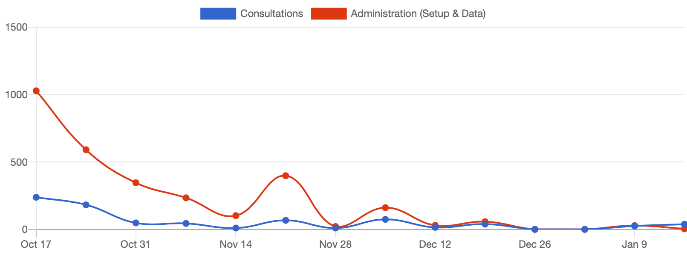

## API

Catima offre la possiblité de récupérer les informations en format JSON d'une manière dynamique avec une API. *Il faut que cette option soit activée par un administrateur système. Si elle ne l'est pas, prendre contact avec les responsables.*

### Qui a accès au données

Pour pouvoir utiliser les données avec l'API, il faut soit avoir un compte Catima et accès au catalogue dont on souhaite récupérer les données (méthode mot-de-passe), soit avoir une clé API de ce catalogue (méthode clé API). Les données accessibles avec la méthode d'authentification par mot-de-passe sont les mêmes que celles auxquelles l'utilisateur a accès alors que la méthode clé API permet un accès complet au catalogue. **Ne jamais partager une clé API publiquement.**.

Créer ou supprimer une clé API depuis la rubrique **API** en mode "Set Up". Plusieurs clés peuvent exister en même temps. 

L'ensemble des requêtes disponibles sont consultables [dans la documentation](https://catimalb.unil.ch/api-docs/index.html).

### Mode data only

Avec cette option activée, Catima est utilisé uniquement pour stocker les données et ne générera pas de site pour voir les fiches et naviguer entre elles.

**En mode data only:**

- les fiches ne sont pas accessibles via un navigateur par des visiteurs (pas de site)
- pas d'options de visualisation (menu, pages, statistiques)
- l'accès au catalogue par statut (editeur, reviewer, administrateur) est toujours possible

Ceci est utile si le catalogue est utilisé uniquement comme base de données et ne nécessite pas de site pour leur visualisation. 

*Il faut que cette option soit activée par un administrateur système. En cas d'intérêt, prendre contact avec les responsables.*

# Exemple de réalisation d'un catalogue

Afin d'illustrer la réalisation d'un catalogue du début à la fin, voici un exemple reprenant la plupart des étapes décrites jusqu'à présent. Cet exemple consiste en un catalogue recensant les universités romandes et de leurs bibliothèques afin de les représenter sur une carte géographique.

## Conceptualisation 

Une manière de débuter la conceptualisation est de représenter des données réelles ou d'exemple sous la forme d'un tableau de données. Cette étape de création fera émerger les éléments marquants du catalogue.

|  | Université de Fribourg | Université de Genève | Université de Lausanne | Université de Neuchâtel |
|--------------------|--------------------------------------------------------------------------------------------------------------|------------------------------------------------------------------------------------------------------------------------------------------------|--------------------------------------------------------------------------------------------------------------------------------------------------------------------------------------------------------------------------------|--------------------------------------------------------------------------------------------------------------------------------------------------------------------------------------------------------------------------------------------------------------------------------------------------------------------------------------------------------------------------------------------------------------------------------------------------------------------------------------------------------------------------------------------------------------------------------------------------------------------------------------------------------------------|
| Abbréviation | UNIFR | UNIGE | UNIL | UNINE |
| Localité | Fribourg | Genève | Lausanne | Neuchâtel |
| Bâtiments | Uni Beauregard, Uni Miséricorde, Uni Pérolles, Uni Régina Mundi |Battelle, Campus Biotech, CMU, Les Philosophes, Sciences, Uni Bastion, Uni Carl Vogt, Uni Dufour, Uni Mail, Uni Pignon |Amphimax, Amphipôle, Anthropole, Batochime, Biophore, Cubotron, Génopode, Internef, Unicentre, Unithèque|Rue de Saint-Nicolas 4, Place Numa-Droz 3, Chaussée de la Boine 20 , Fbg du Lac 5a, Av. DuPeyrou 1, etc.. |
| Facultés |Droit, Lettres et sciences humaines, Sciences et médecine, Sciences économiques et sociales, Théologie |Droit, Économie et management, Lettres, Médecine, Psychologie et sciences de l'éducation, Sciences, Sciences de la société, Théologie |Biologie et médecine, Droit, sciences criminelles et administration publique, Géosciences et environnement, Hautes études commerciales, Lettres, Sciences sociales et politiques, Théologie et sciences des religions  |Droit, Lettres et sciences humaines, Sciences,Sciences économiques |
| Nombre d'étudiants | 10414 |  16935 | 14976 | 4284 |
| Bibliothèque | Bibliothèque cantonale et universitaire (Fribourg) | Bibliothèque de l'Université de Genève | Bibliothèque cantonale et universitaire (Lausanne) | Bibliothèques UniNE |
| Adresse | Avenue de l'Europe 20, 1700 Fribourg | 24 rue du Général-Dufour,   1211 Genève 4 | Unicentre, 1015 Lausanne | Avenue du 1er-Mars 26, 2000 Neuchâtel |
| Site web | www.unifr.ch | www.unige.ch | www.unil.ch | www.unine.ch |

Dans cet exemple, la réalisation d'un tableau permet de relever les concepts importants de ce catalogue. Les concepts d'Université et de Bibliothèque sont centraux dans ce catalogue. Les grandes lignes du catalogue sont ainsi tracées conformément à son but initial ("Créer une base de données des Universités romandes et de leurs bibliothèques afin de les représenter sur une carte géographique"). Mais pour décrire une université, certains autres concepts méritent également d'être décrits comme la localité où se situe l'université ou ses bâtiments.

|Localité
|---
|Nom de la localité
|Canton
|Population
---

|Université
|---
|Nom de l'Université
|Abbréviation
|Localité ==> **concept "Localité"**
|Facultés
|Nombre d'étudiants
|Photographies
|Adresse
|Site web
----

|Bâtiment
|---
|Nom du bâtiment
|Localisation géographique
|Université ==> **concept "Université"**
---

|Bibliothèque
|---
|Nom de la bibliothèque
|Abbréviation
|Réseau
|Bâtiment ==> **concept "Bâtiment"**
|Université  ==> **concept "Université"**
---

### Types de fiches et liens

Les quatre concepts précédements relevés, "Université", "Bibliothèque", "Localité", "Bâtiment",  correspondent aux types de fiches qu'il faudra créer dans CATIMA.

**Liens conceptuels entre les types de fiches :**

* Une **localité** a une et une seule **université**
* Une **université** a une, ou plusieurs **bibliothèque(s)**
* Une **université** a un, ou plusieurs **bâtiment(s)**

Cette structure permet d'afficher toutes les bibliothèques, ainsi que tous les bâtiments d'une université.

## Ajout des types de fiches et création de champs

> Pour cette étape, se baser sur la section "Ajout d'un type de fiche". 

> NB : Cet exemple propose un catalogue bilingue français/anglais. Pour un catalogue mono- ou plurilingue, remplir les champs correspondants aux langues du-dit catalogue.

Le concept de "Localité" étant le concept le plus large (un bâtiment se situe dans une université, qui est dans une localité), il englobe les concepts plus précis que lui, à savoir "Université", qui lui-même englobe les "Bâtiments" et les "Bibliothèques". C'est pourquoi il est judicieux de créer d'abord le type de fiches de l'entité la plus large, ici "Localité". Ainsi lors de l'ajout d'une nouvelle université (puis de nouveaux bâtiments et bibliothèques) il existera toujours l'entité plus globale à laquelle faire référence.

Il s'agit ici de donner un nom (et d'éventuelles traductions du nom) au type de fiche, des formes au pluriel, ainsi qu'une version courte du nom appelée "slug" (NB : la langue anglaise se prête souvent bien à cet usage) puis de confirmer avec le bouton "créer type de fiche". 

 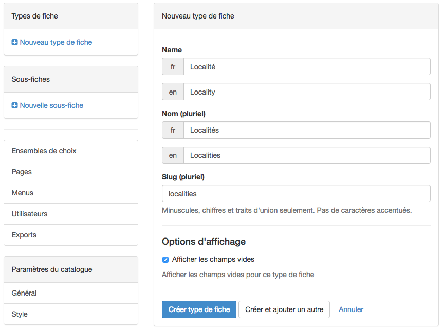

 Le type de fiche "Localité" ainsi créé est par défaut vide : 

  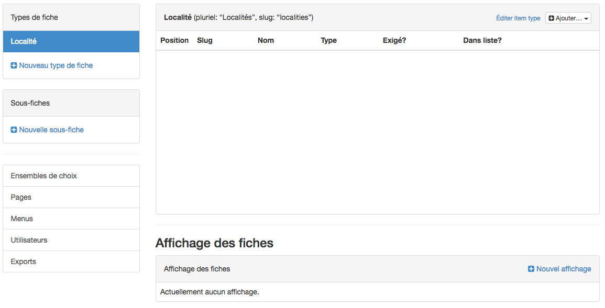

La prochaine étape est donc d'ajouter des champs descriptifs, qui ont été déterminés dans l'étape de conceptualisation. Pour la "Localité", il s'agira ainsi de créer les champs "Nom de la localité", "Canton" et "Population".

Pour cela, cliquer sur le bouton "+Ajouter", qui affichera une liste de champs possibles à ajouter. Le champ "Nom de la localité" par exemple sera un champ "de texte" et "Population" sera un champ "nombre entier". Pour le champ "Canton", ceux-ci étant en nombre limités (4), un champ "ensemble de choix" semble indiqué, mais un champ de texte aurait très bien convenu également.

Pour le champ "Nom de la localité", remplir le nom du champ (et éventuelles traductions), les formes au pluriel et le slug. Il est également possible d'ajouter un texte d'aide à la saisie, et de spécifier des options d'affichage comme définir que le champ en question comme champ primaire (voir "champ primaire"). Noter également les options de saisie de données, qui permettent selon le type de champ, d'entrer une ou plusieurs données (Single vs Multiple values) et de s'assurer que le champ sera rempli par l'utilisateur (Required). Confirmer l'ajout d'un champ avec le bouton "Créer le champ".

  
  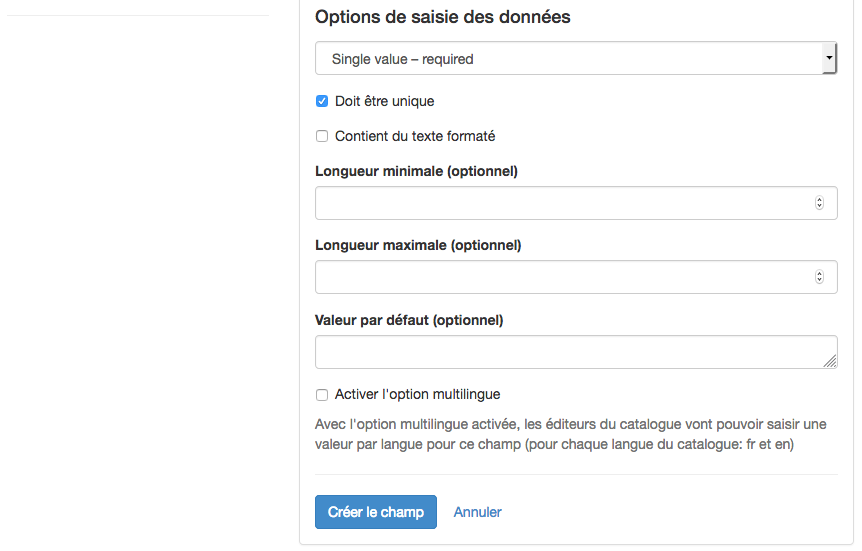

Cette étape, à répéter pour chaque champ du type de fiche, est globalement similaire pour tous les champs, voir "Types de champs" pour les spécifités de chaque champ.

Une fois tous les champs d'un type de fiche créés, créer un nouveau type de fiche par ordre de complexité croissante, jusqu'à avoir créé tous les types de fiches avec tous leurs champs. 

### Références à d'autres champs 

Lors de la conceptualisation, les concepts les plus "précis" comme par exemple "Bâtiment", font référence aux concepts dans lesquels ils sont compris, par exemple ici "Université". On attribue ainsi à chaque bâtiment une caractéristique d'appartenance à une université.

Dans CATIMA sela se traduit par la création d'un champ "Référence" : 

> Dans notre exemple, il s'agira dans "Bâtiment" de faire une référence aux concepts d' "Université". 

Pour cela, sélectionner "Bâtiment" parmi les types de fiches (accessibles dans la barre latérale gauche) puis créer un nouveau champ "Référence". 

  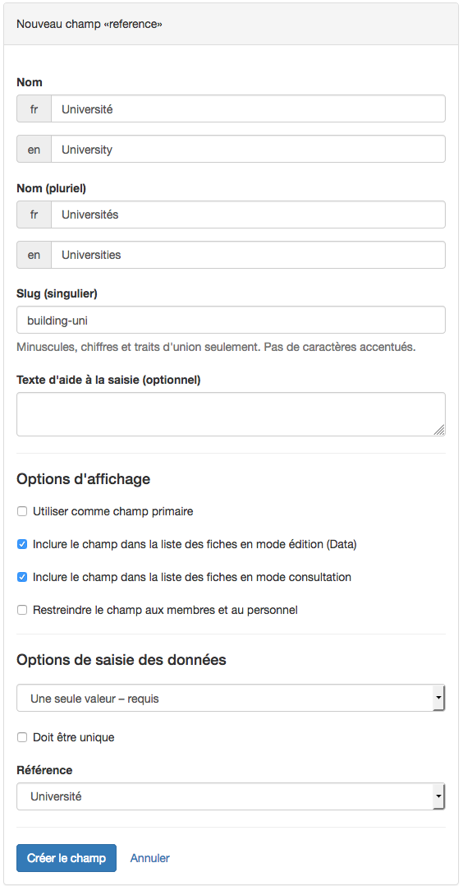

Pour l'éditeur de données, cela se concrétisera dans l'ajout d'un nouveau bâtiment par la possiblité/obligation de choisir parmi les universités pré-existantes.
