# Exemple de catalogue comportant un champ datation

- [Exemple de catalogue comportant un champ datation](#exemple-de-catalogue-comportant-un-champ-datation)
  - [Contexte d'utilisation du champ datation](#contexte-dutilisation-du-champ-datation)
  - [Configuration du champ datation](#configuration-du-champ-datation)
  - [Données du catalogue](#données-du-catalogue)
  - [Exemples de recherches](#exemples-de-recherches)
    - [Recherche simple](#recherche-simple)
    - [Recherche avancée](#recherche-avancée)
    - [Opérateurs de recherche: ET, OU, SAUF](#opérateurs-de-recherche-et-ou-sauf)
    - [Recherche par ensemble de choix](#recherche-par-ensemble-de-choix)
    - [Option *Exclure*](#option-exclure)
  - [Les périodes "parents" et "enfants"](#les-périodes-parents-et-enfants)
    - [Incidences sur les recherches](#incidences-sur-les-recherches)
  - [Croiser les champs de recherche](#croiser-les-champs-de-recherche)

## Contexte d'utilisation du champ datation

Une équipe de chercheurs effectue un inventaire d’objets retrouvés dans un château. Certains objets sont difficiles à dater de façon précise. Cependant, divers indices temporels peuvent être associés aux objets afin d’en estimer approximativement la date de création. Un champ de datation complexe est créé dans Catima avec les options de saisie manuelle et par ensemble de choix.

## Configuration du champ datation

L'ensemble de choix de type datation appelé "Datation d'objets" est créé préalablement au champ datation. Il est configuré de la manière suivante:

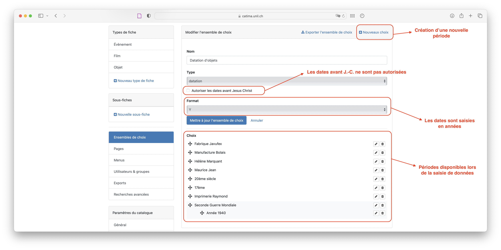

Le champs datation est créé et configuré de la manière suivante:

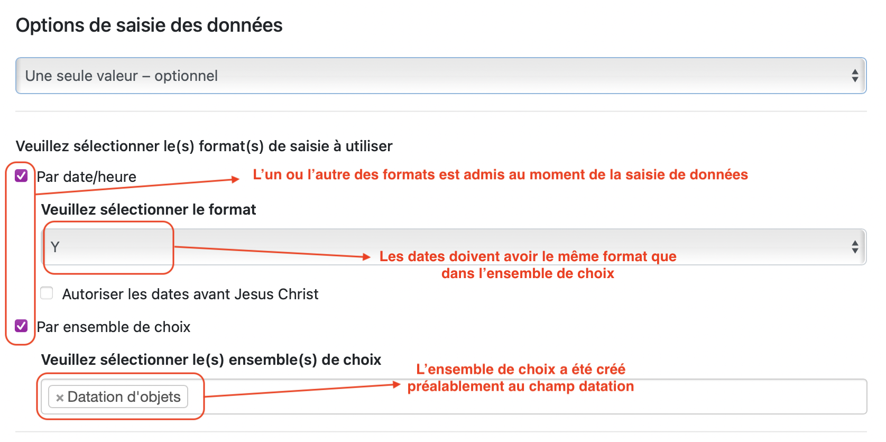

Lorsque les éditeurs saisissent les données, ils ont les possibilités suivantes:

- Saisir une datation **manuelle** avec une date de début et/ou une de date fin.
- Saisir une datation **par ensemble de choix**. Il s'agit d'une liste de périodes configurées par les administrateurs et les super-éditeurs du catalogue Catima.
- Ne saisir aucune datation.

## Données du catalogue

Ce catalogue est constitué de 13 objets qui sont les suivants:

| Titre de l'objet  | Information de datation                                                                                                                            | Datation choisie                                                                                                    | Vignette                                            |
|-------------------|----------------------------------------------------------------------------------------------------------------------------------------------------|---------------------------------------------------------------------------------------------------------------------|-----------------------------------------------------|
| Un livre          | La date d'impression "1922" est retrouvée sur la première page.                                                                                    | **Manuelle** entre 1922 et 1922                                                                                     |   |
| Une nappe         | On estime qu'elle est datée du début du 19ème siècle.                                                                                              | **Manuelle** entre 1815 et 1850                                                                                     |   |
| Un service à thé  | Le nom de la fabrique est indiqué sur les tasses. Il s'agit d'une fabrique en activité depuis 1902.                                                | **Par ensemble de choix** Fabrique Javufex: à partir de 1902                                                        |  |
| Un tableau        | Il ne porte pas de signature. Deux chercheurs ne sont pas d'accord:  l'un affirme qu'il est d'un peintre et l'autre d'une de ses élèves.           | **Par ensemble de choix et avec deux choix** Maurice Jean: entre 1897 et 1913 + Hélène Marquant: entre 1904 et 1929 |   |
| Une table         | D'après la manière dont elle a été construite  on estime qu'elle date d'avant la révolution industrielle.                                          | **Manuelle** Avant 1750                                                                                             |   |
| Un tapis          | On y trouve le nom d'une manufacture qui cessa son activité en 1782. On ne connait pas le date de début de son activité.                           | **Par ensemble de choix** Manufacture Bolais: avant 1782                                                            |  |
| Un vase           | Il est orné de motifs typiques du 17ème siècle mais son état de conservation laisse à penser qu'il pourrait être une copie datant du 20ème siècle. | **Par ensemble de choix et avec deux choix** 17ème: entre 1601 et 1700 + 20ème: entre 1901 et 2000                  |   |
| Une assiette      | Elle ne porte aucune indication qui pourrait aider à la dater.                                                                                     | **Aucune**                                                                                                          |   |
| Un carnet vide    | Au dos du carnet on retrouve l'année "1887" gravée mais on ne sait pas quand cela a été fait.                                                      | **Aucune**                                                                                                          | 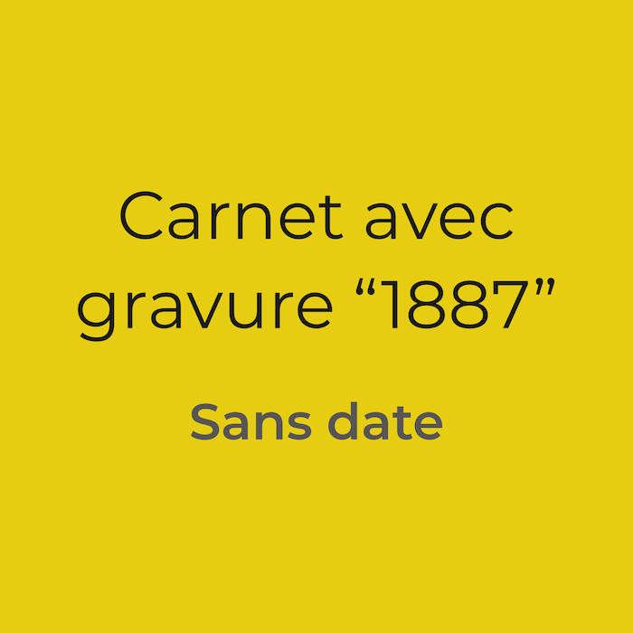  |
| Un cinématographe | C'est un cinématographe de la marque Lumière qui fut inventé en 1895.                                                                              | **Manuelle** après 1895                                                                                             |   |
| Un jeu de carte   | On sait qu'il a été fabriqué par l'imprimerie Raymond qui fut en activité de 1864 à 1913.                                                          | **Par ensemble de choix** Imprimerie Raymond entre 1864 et 1913                                                     |   |
| Une lampe         | On estime qu'elle est datée de la Seconde Guerre Mondiale.                                                                                         | **Par ensemble de choix** Seconde Guerre Mondiale: entre 1939 et 1945                                               |  |
| Une lettre        | Elle n'est pas datée mais au vu de son contenu on pense qu'elle est datée de l'année 1940.                                                         | **Par ensemble de choix** Enfant de *Seconde Guerre Mondiale*:  Année 1940: entre 1940 et 1940                      |  |

## Exemples de recherches

Pour faciliter la lecture de ces exemples les photos des objets ont été remplacées par des vignettes colorées et codées selon le type de datation attribuée à l'objet

- Jaune et sans bordure: **sans datation**
- Rouge et avec bordure dans les coins: **datation manuelle**
- Bleu et avec bordure sans coins: **datation par ensemble choix**

### Recherche simple

Une recherche simple dans la barre de recherche ne permet pas de rechercher des périodes car elle s'effectue uniquement sur le texte.

**On recherche tous les objets datés entre 1939 et 1945**
 

 > La recherche simple ne calcule pas de période

 **On recherche les objets datés de 1887**
 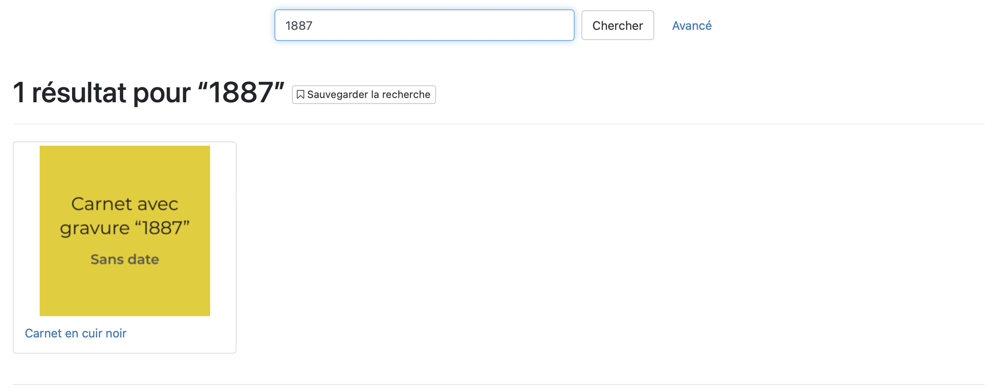

> La fiche ressort malgré son absence de datation car la date 1887 figure dans un de ses champs de texte.

**On recherche les objets datés de 1815**
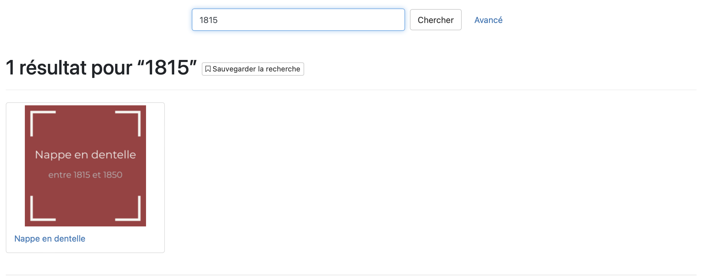

> La recherche sur le texte prend en compte le champs datation mais ne permet d'effectuer que des recherches textuelles pures sans aucun traitement.

### Recherche avancée

La recherche avancée sur le champ datation permet plusieurs possibilités. Voici une liste non-exhaustive d'exemples.

**On recherche les objets datés exactement de 1922**

**Résultat**

> Le livre est le seul objet qui est daté exactement de 1922.

 **On recherche tous les objets qui datent d'après 1922**
 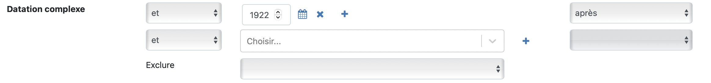

 **Résultats**
 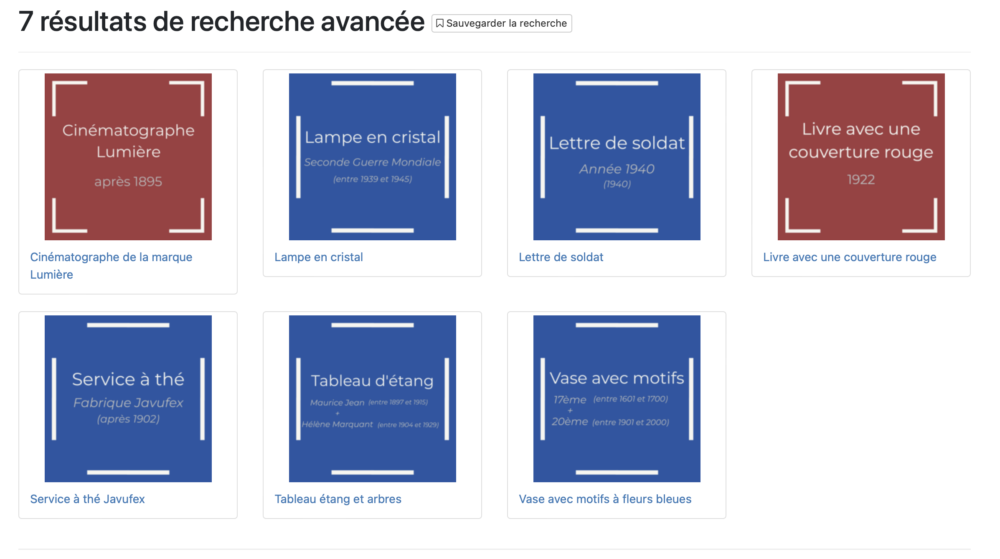

 > Tous les objets ont au moins une date qui est comprise entre 1922 et aujourd'hui. Le livre ressort car l'année 1922 est incluse.

 **On recherche tous les objets qui datent d'avant 1800**
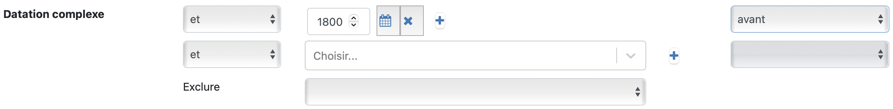

**Résultats**

> Le vase ressort car il porte deux choix, 17ème et 20ème. La période 17ème comprends des dates qui sont antérieures à 1800.

### Opérateurs de recherche: ET, OU, SAUF

Les opérateurs de recherche permettent d'élargir ou de préciser les recherches de manières plus ou moins complexe. Dans le champ datation, plusieurs critères de recherche peuvent être combinés entre eux. Cette ensemble de critère peut ensuite être associé à des critères issus d'autres champs en utilisant le premier opérateur du champ.

**On recherche les objets qui datent d'après 1930 ET d'avant 1970**
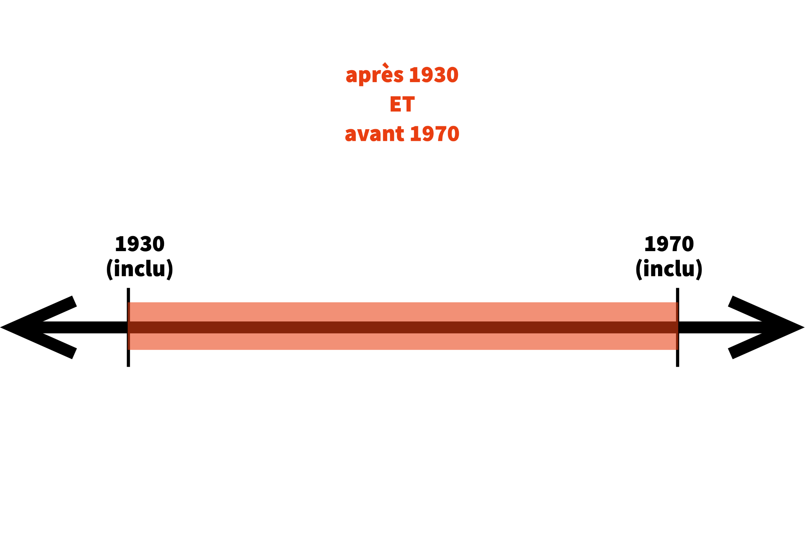

**Résultats**
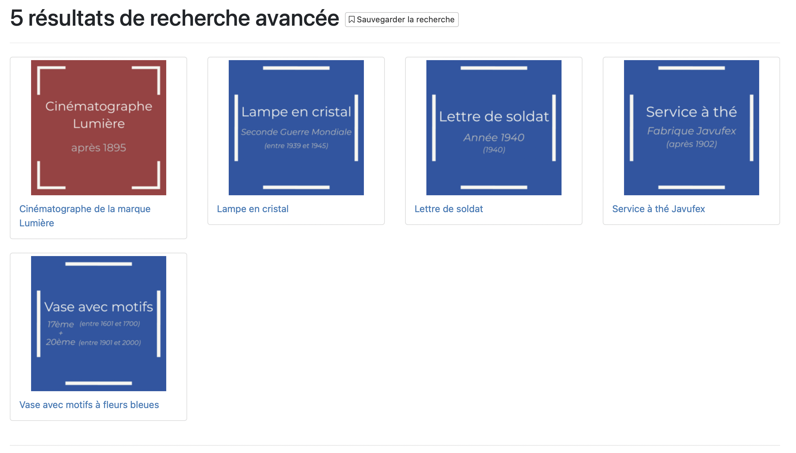

> - Le cinématographe inclut toutes les dates après 1895
> - La lampe contient des dates postérieure à 1930 et des dates antérieure à 1970
> - La lettre est datée de 1940 qui se trouve entre 1930 et 1970
> - Le service à thé inclut toutes les dates après 1902
> - Le vase est daté du choix 20ème qui comprend tout ce qui se trouve entre 1901 et 2000

**On recherche les objets qui datent d'avant 1940 OU d'après 1960**
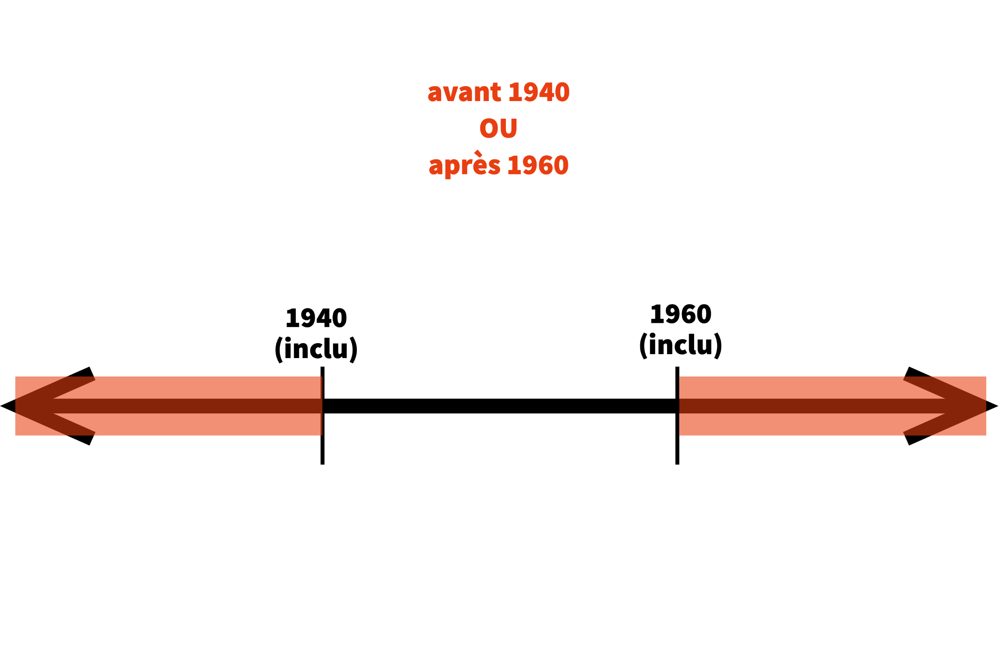

**Résultats**
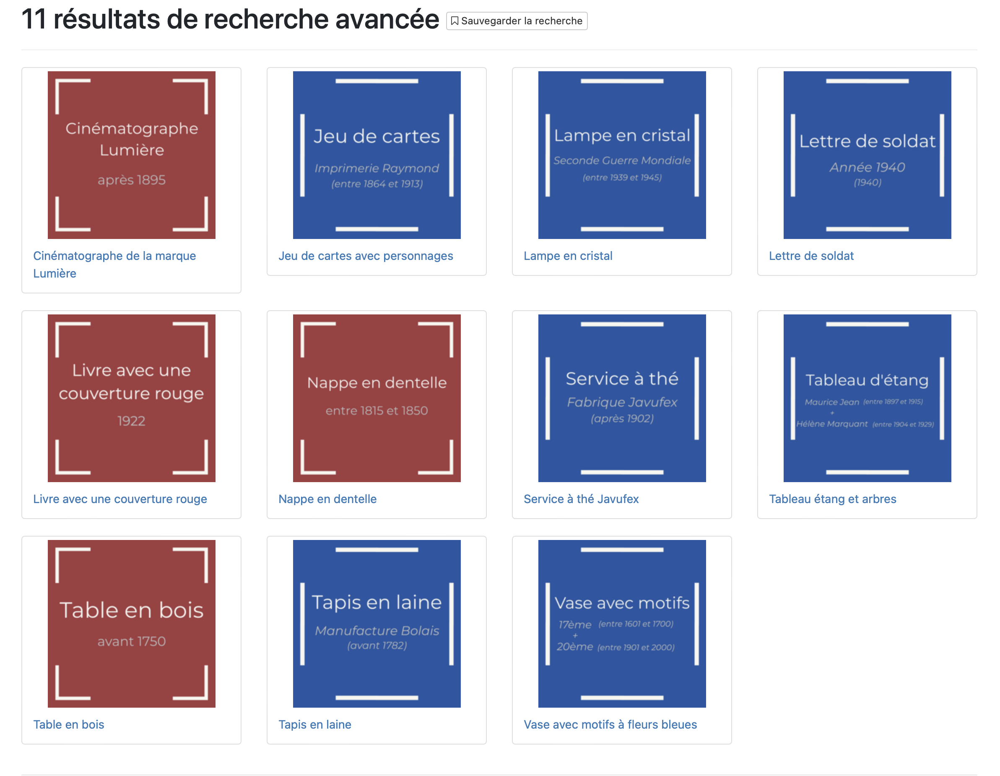

> - Le jeu de cartes, la lampe, le livre,  nappe, le service à thé, le tableau, la table et le tapis comprennent tous des dates antérieure à 1940
> - La lettre datée de l'année 1940 ressort car les années 1940 et 1960 sont incluses dans la recherche
> - Le cinématographe et le vase comprennent des dates postérieures à 1960 et des dates antérieures à 1940

**On recherche les objets qui datent d'avant 1940 SAUF ceux qui datent de l'année 1922**
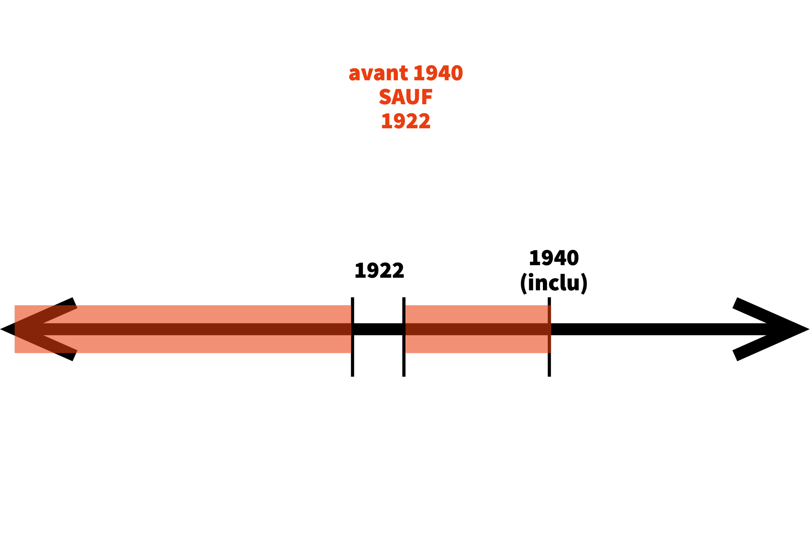

**Résultats**
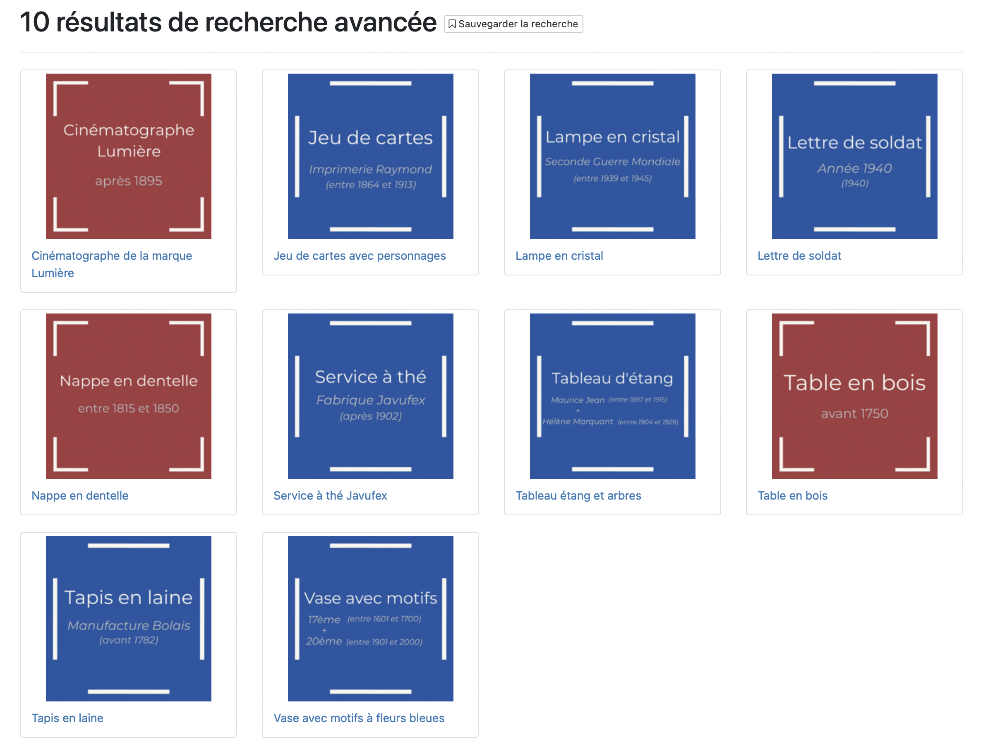

> - La lettre datée de 1940 ressort car l'année 1940 est incluse dans la recherche
> - Toutes les fiches comprennent au moins une date antérieure à 1940
> - Le livre ne ressort pas car les fiches datée exactement de 1922 sont écartées de la recherche

### Recherche par ensemble de choix

**On recherche tous les objets qui datent d'avant 1782 en utilisant le choix** ***Manufacture Bolais***
 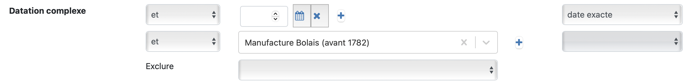
 **Résultats**
 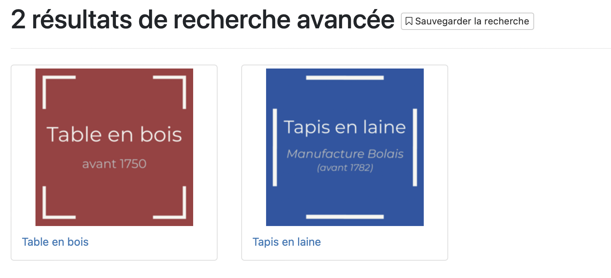

**Différence avec la recherche manuelle**  
On souhaite faire la même recherche manuellement: On recherche tous les objets qui datent d'avant 1782
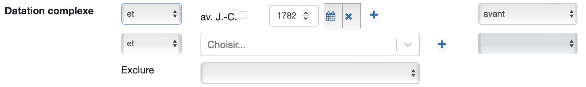

**Résultats**

**Pourquoi la recherche manuelle ressort une fiche de plus que la recherche par choix ?**  
Une recherche par choix retourne les fiches qui portent le choix sélectionné et les fiches datées manuellement qui ont au moins une date comprise dans la période. Elle ne recherche pas les autres fiches datées par choix qui ont une date comprise dans la période contrairement aux recherches manuelles qui se font sur toutes les fiches.

**Précision sur les choix qui portent une date précise**
Lorsque l'on effectue une recherche avec un portant une date précise (par exemple "Année 1940"), la recherche va uniquement retourner les fiches qui portent ce choix et les fiches datée manuellement de cette même date. La recherche n'incluera pas les fiches datée manuellement qui comportent plusieurs dates même si elles incluent la date recherchée.

### Option *Exclure*

**On recherche uniquement les fiches qui sont datées par un choix précis**  
L'option exclure permet d'exclure l'un ou l'autre des formats de saisie dans la recherche.

**Exemple**
On recherche les fiches datées entre 1900 et 1939

**Résultats**
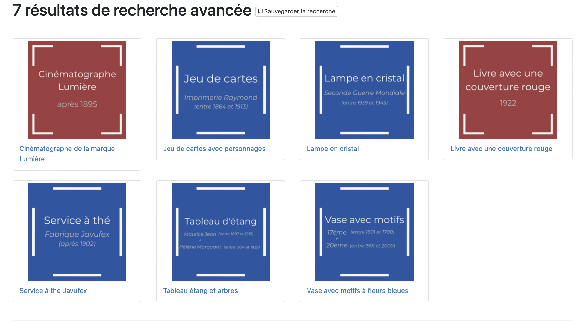

On souhaite par la suite exclure les fiches qui sont datées avec des choix (toutes les fiches bleues). On utilise l'option "Exclure" qui se trouve tout en bas des options de recherches.

**Résultat**

> Toutes les fiches qui portaient une datation par choix ont été exclues de la recherches

## Les périodes "parents" et "enfants"

Au moment de la création d'un choix de datation, il est possible de lui attribuer un parent parmis la liste des choix existants.

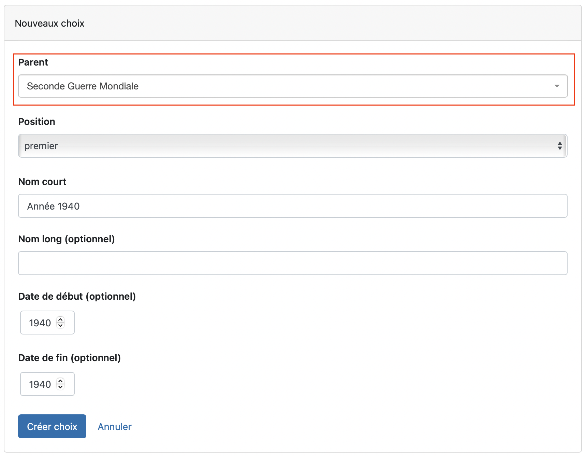

Dans notre inventaire, l'objet **Lampe en cristal** est daté du choix *Seconde Guerre Mondiale* et l'objet **Lettre de soldat** est daté du choix *Année 1940* qui se trouve être l'enfant de *Seconde Guerre Mondiale*.

### Incidences sur les recherches

**On recherche les objets qui sont datés de la Seconde Guerre Mondiale sans inclure les enfants**
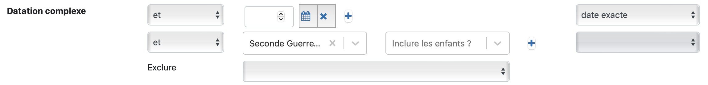
> L'encadré "Inclure les enfants ?" apparaît. Ne rien sélectionner correspond à cocher non.

**Résultats**
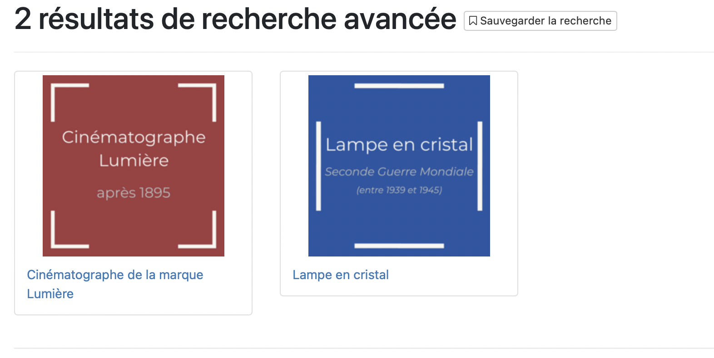

> - L'objet *Cinématographe Lumière* ressort car il s’agit d’une date manuelle qui correspond aux critères de la recherche
> - L'objet *Lampe en cristal* ressort, car il s’agit d’une date par ensemble de choix qui correspond à l’ensemble de choix recherché
> - L'objet *Lettre de soldat* ne ressort pas car les enfants d'un choix parents sont par défaut exclus de la recherche.
> - Les objets datés par un autre ensemble de choix que celui recherché ne sont pas inclus dans la recherche.

**On recherche les objets datés de la Seconde Guerre Mondiale en incluant les choix enfants de la période**
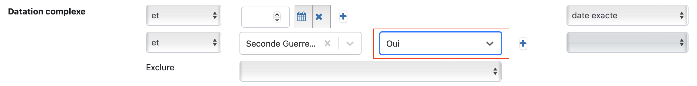

**Les résultats incluent la lettre de soldat**
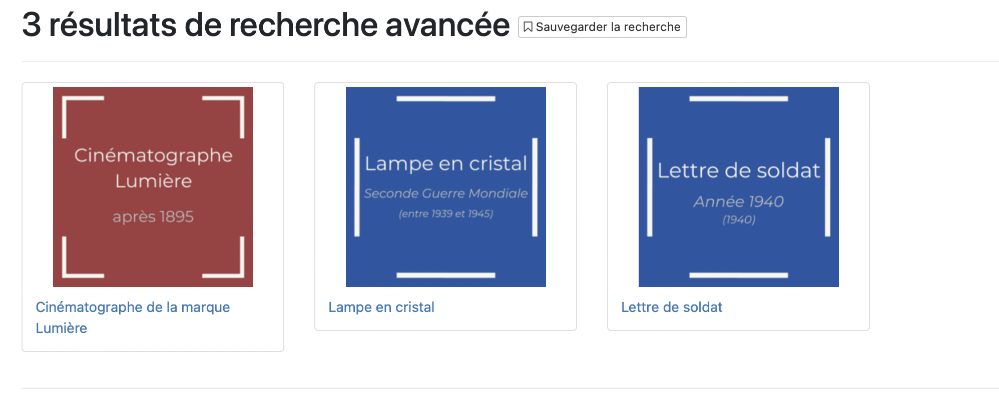

**On recherche manuellement tous les objets qui sont datés entre 1939 et 1945**
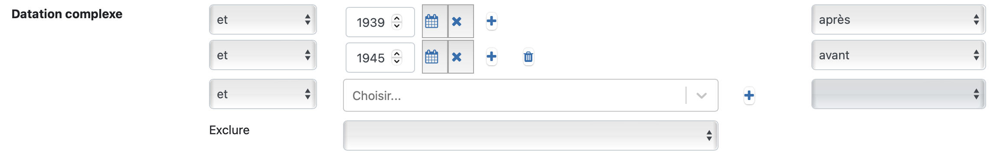

**Résultats**
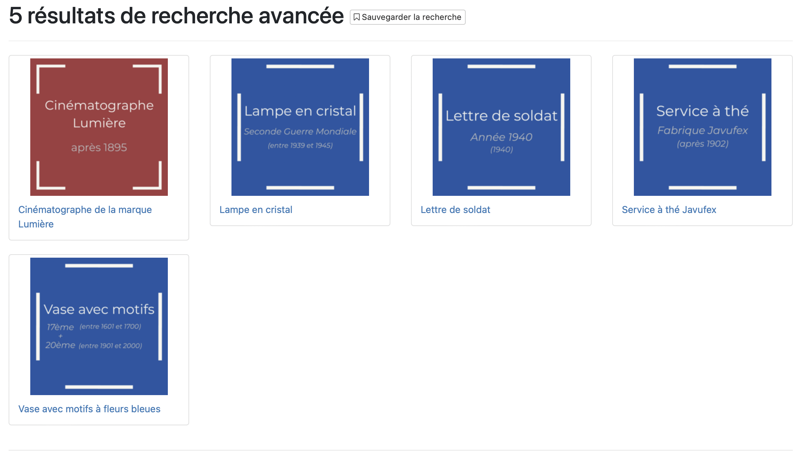

La recherche manuelle est toujours plus inclusive qu'une recherche par choix. Car elle s'intéresse à tous les objets qu'ils aient été datés par ensemble de choix ou manuellement. Ici tous les objets datés d'une période qui comprend au moins une date dans la période recherchée ressortent.

## Croiser les champs de recherche

La recherche avancée permet de croiser les champs de recherche.

**On recherche les objets datés après 1930 ET qui appartiennent à la catégorie** ***Objet de décoration***

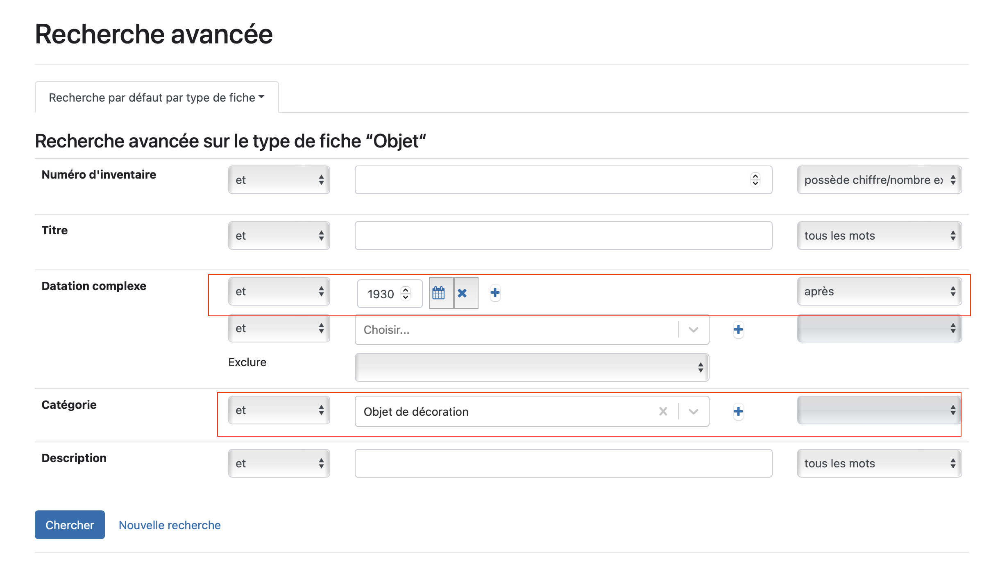

**Résultats**

***
