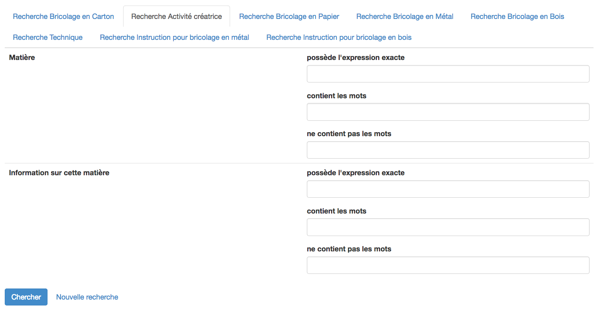
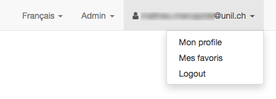

# Recherche

Les catalogues de CATIMA disposent d'une fonctionnalité de recherche permettant d'accéder au contenu du catalogue par le biais de mots-clés. Il est possible d'effectuer une recherche simple (recherche d'un mot, expression) ou une recherche avancée permettant de chercher du contenu au moyen de un plusieurs critères ("expression exacte", "contient les mots", "ne contient pas les mots").

Les recherches simple et avancées sont accessibles depuis la page d'accueil du catalogue, en cliquant sur le nom du catalogue tout à gauche de la barre de menus :

## Recherche simple

La recherche simple permet d'accéder à une liste de contenus contenant un mot ou une expression (chaîne de caractères). 

Dans la barre de texte, entrer le mot souhaité (p.ex "Rowling" ou "Suisse") et cliquer sur "*Chercher*" ("Search"). Une liste des résultats trouvés apparaît permettant d'accéder au contenu souhaité, ou de réitérer sa recherche.

## Recherche avancée

La recherche avancée permet de d'accéder à une liste de contenus en utilisant un ou plusieurs critères de recherche au sein d'un type de fiche. 

Pour accéder à la recherche avancée, cliquer sur "*Avancé*" ("Advanced"). Une page s'ouvre, présentant les différents types de fiches (le premier type de fiche s'ouvre par défaut) : 

Pour effectuer une recherche dans un type de fiche, sélectionner celui-ci parmi les onglets : les champs qui le composent s'affichent :  

Il est possible de chercher des mots ou expressions exactes dans les champs de textes ou de sélectionner un choix dans les champs 'ensembles de choix'.

Une fois les différents champs souhaités remplis, cliquer sur "*Chercher*" ("Search"). Une liste des résultats trouvés apparaît permettant d'accéder au contenu souhaité. Pour modifier la recherche, revenir en arrière à l'aide du bouton précédent (<-) de votre navigateur.

# Favoris

Les catalogues de CATIMA disposent d'une fonctionnalité permettant d'ajouter un contenu à une liste de favoris pour tous-tes les utilisateur-trice-s possédant un compte CATIA (voir [ici pour la création d'un compte](https://catima.unil.ch/fr/register)) et connecté-e-s.

## Ajout d'un contenu à la liste des favoris

Pour ajouter un contenu aux favoris, il s'agit d'accéder à la fiche souhaitée (par une navigation dans le site ou par par les résultats d'une recherche), puis de cliquer sur le bouton "Ajouter aux favoris" sous le nom de la fiche.

## Accès à la liste des favoris

La liste des favoris est accessible à 
tous-te utilisateur-trice inscrit-e et connecté à Catima, en cliquant successivement sur 

1. **Nom d'utilisateur** (tout à droite dans la barre de navigation)
2. **Mes favoris**

Les favoris sont présentés par groupe en fonction du catalogue dont proviennent les contenus : 

Une fois un groupe choisi, la liste des contenus favoris est présentée, permettant d'y accéder ou de supprimer le-s favoris souhaité-s.

