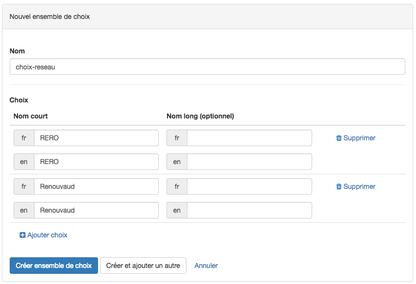

# Configuration d'un catalogue 
## Ajout d'un type de fiche 

Un catalogue permet de stocker des données (texte, images, dates, etc...) structurées sous la forme de types de fiches. Les types de fiches représentent des entités conceptuelles (p.ex le concept "livre") possédant des caractéristiques définies (p.ex "auteur", "année de publication").

Pour accéder à la section de configuration ("Setup"), cliquer sur "Admin" dans la barre horizontale supérieure, puis choisir "Catalog Setup" dans le menu déroulant. Une interface résumant les éventuels objets existants s'affiche.

Pour ajouter un objet, cliquer sur "+ Nouveau type de fiche" en bas de la rubrique "Types de fiche", dans la barre latérale gauche. 

Le formulaire suivant s’affiche :

Remplir le nom du type de fiche et sa forme plurielle. Si le support de plusieurs langues a été demandé pour le catalogue, il s'agira de remplir également ces éléments traduits dans les autres langues. Pour terminer, choisir une forme simplifiée du nom appelée "slug" qui apparaitra dans l'adresse web (URL) du site généré par CATIMA. Celui-ci doit être unique et n'être composé que de lettres (non accentuées), nombres et de traits d'unions. Les slugs sont souvent en anglais.

> Exemple : Pour un type de fiche "Acteurs de films", le slug peut être "movies-actors"

Une fois les champs remplis avec les données, il est possible d'enregistrer et retourner au menu *Data* avec "*Créer fiche de type*" ou d'enregistrer et ajouter un nouveau type de fiche avec "*Create and add another*".

> NB : Il est possible d'annuler à tout moment en cliquant sur "Annuler" (Cancel).

Une fois le type de fiche créé, ses éléments (nom, pluriel, slug) sont résumés sur la ligne grise. Il est possible de les modifier en cliquant sur le lien "Éditer item type".

### Édition d'un "type de fiche" 

Une fois le type de fiche créé, il s'agit d'y ajouter les champs souhaités. 

Pour ajouter un champ, cliquer sur la liste déroulant "*+ Ajouter…*" (*Add*) qui révèle les différents choix de champs possibles.

> Rappel : Les champs du type de fiche sont issus de l'étape de conceptualisation. Voir (conceptualisation) pour en savoir plus.

Bien que chaque champ impose son format de données spécifiques (nombres, dates, images, etc...), une grande partie des informations à remplir est commune : 

#### Choix du nom

|              | Définition                 | Exemple                           | Remarques                                                                                                                  |
|--------------|----------------------------|-----------------------------------|----------------------------------------------------------------------------------------------------------------------------|
| Nom          | Nom donné au nouveau champ | *Année de naissance de l'acteur*  | En cas de support de plusieurs langues, indiquer également les traductions du nom                                          |
| Nom(pluriel) | La forme plurielle du nom  | *Années de naissance des acteurs* | En cas de support de plusieurs langues, indiquer également les traductions des formes plurielles                           |
| Slug         | Forme simplifiée du nom    | *birthdates_actors*               | Doit être unique, n'être composé que de lettres (non accentuées), nombres et traits d'unions. Ils sont souvent en anglais. |

#### Options d'affichage des champs dans la liste des fiches

|                                               | Définition                                                                                                                           | Exemple | Remarques                                                                                                                                                                                                                              |
|-----------------------------------------------|--------------------------------------------------------------------------------------------------------------------------------------|---------|----------------------------------------------------------------------------------------------------------------------------------------------------------------------------------------------------------------------------------------|
| **Utiliser comme champ primaire**             | (Facultatif/Utilisateurs Avancés) Le champ designé comme primaire est celui qui permet d'identifier de manière unique les données.   | -       | Par défaut le champ primaire est un champ caché et correspond à un nombre (qui augmente à chaque ajout de données). Cette option ne peut être activée que pour un champ à la fois (la dernière activation est celle qui est appliquée) |
| **Inclure le champ dans la liste des fiches** | Cette option permet d'activer/désactiver l'affichage de ce champ dans le tableau des données (section "Data") pour aérer l'affichage | -       | Particulièrement utile pour les champs contenant de grands textes                                                                                          
## Ajout de "Contenu conditionnel" 

Un type de fiche peut avoir des caractéristiques communes à toutes les enregistrements de données (p.ex : tous les films ont un réalisateur) mais peut également avoir des caractéristiques "conditionnelles" (p.ex : la 'Période traitée' n'est pertinente que pour les documentaires historiques et pas pour les films d'action). Cela permet lors de l'entrée de données de ne pas avoir de champs superflus à remplir.

Les caractéristiques conditionnelles sont rassemblées dans des **sous-fiches**, et apparaissent selon le **choix fait par l'éditeur du catalogue** (p.ex : choisir le genre du film fera apparaître les champs pertinents uniquement pour ce genre). 

Pour permettre l'enregistrement de données de manière conditionnelle, il est nécessaire de créer : 

1. Une sous-fiche
2. Un ensemble de choix

> La notion de sous-fiche étant liée à celle de type de fiche, se référer si besoin à la section ["Type de fiche"](#ajout-dun-type-de-fiche).

### Création d'une sous-fiche 

Pour ajouter une **Sous-fiche** , dans la barre de gauche, en bas de la rubrique "*Sous-fiches*", cliquer sur "**+ Nouvelle sous-fiche**". 

Une fois choisi un nom pour la sous-fiche, il est possible d'enregistrer et retourner au menu *Setup* avec "*Créer sous-fiche'*" ou d'enregistrer et ajouter une nouvelle sous-fiche avec "*Create and add another*".

> NB : Il est possible d'annuler à tout moment en cliquant sur "Annuler".
> 
### Édition d'une sous-fiche

Une fois les sous-fiches créées, il s'agit d'y ajouter les champs souhaités. 

Pour cela, choisir la sous-fiche : dans la barre de gauche, dans la section "Sous-fiches", sélectionner la sous-fiche souhaitée. 

Le reste de la procédure est similaire à celle de l'édition d'une fiche et débute par un clic sur la liste déroulante "*+ Ajouter…*" qui révèle les différents choix de champs possibles :

> La notion de sous-fiche étant liée à celle de type de fiche, pour la suite de la procédure se référer si besoin à la section ["Type de fiche"](#type-de-fiche).

### Ajout d'un "Ensemble de choix" 

Un ensemble de choix est une liste d'éléments prédéfinis permettant de remplir un champ.

> Exemple : un ensemble de choix peut consister en une liste de pays, de genre cinématographique, de professions ou de mots-clés par exemple.

Effectuer un choix permet ainsi l'affichage d'une sous-fiche dédiée. 

La liste des "Ensembles de choix" est accessible en cliquant sur "Ensembles de choix" dans la barre de gauche. Une liste des ensembles de choix existants est affichée :

Cliquer sur "+Nouvel ensemble de choix" qui s’affiche en bleu, à droite dans la ligne grise. 

La page de paramétrages suivante apparait :

Choisir un **nom** pour l'ensemble de choix, puis entrer la liste de choix possibles (nom court et éventuellement nom long) avec "+Ajouter choix". 

Une fois les champs remplis avec les données, il est possible d'enregistrer et retourner au menu *Setup* avec "*Créer ensemble de choix'*" ou d'enregistrer et ajouter un nouvel ensemble de choix avec "*Create and add another*".

> NB : Il est possible d'annuler à tout moment en cliquant sur "Annuler" (Cancel).

## Affichages personnalisés

[Item View]

## Pages personnalisées : listes de types de fiches et contenus Web

Catima génère automatiquement une page par type de fiche. La rubrique "Page" permet d'ajouter des pages personnalisées comme une page d'accueil ou de bibliographie. Ces pages peuvent contenir du texte, des listes de types de fiches ou des blocs de code HTML ou Markdown.

### Ajout d'une page

Pour ajouter une page, sélectionner "Pages" dans la barre de gauche. La liste des pages existantes apparaît :

Cliquer sur "New page". La page de paramétrages suivante apparait :

  

Choisir le(s) titre(s) de la page dans les différentes langues du catalogue ainsi qu'une forme simplifiée du nom appelée "slug" qui apparaitra dans l'adresse web (URL) du site généré par CATIMA. Celui-ci doit être unique et n'être composé que de lettres (non accentuées), nombres et de traits d'unions. Les slugs sont souvent en anglais.

> Exemple de slug : "accueil", "home", "biblio"

Une fois les champs remplis , il est possible d'enregistrer et retourner au menu *Setup* avec "Créer page" (*Create page*) ou d'enregistrer et ajouter de nouvelles données avec "*Create and add another*".

> NB : Il est possible d'annuler à tout moment en cliquant sur "Annuler" (Cancel).

### Édition d'une page 

Une fois la page créée, il s'agit d'y ajouter du contenu. Sélectionner "*Pages*" dans la barre de gauche. La liste récapitulative de toutes les pages s’affiche. Cliquer ensuite sur le bouton "Actions" puis "*Éditer*" correspondant à la page à paramétrer. La page d'édition suivante apparaît :

Les champs remplis lors de l'ajout de la page (slug et titres) sont facilement modifiables en leur attribuant les nouvelles valeurs souhaitées puis en cliquant sur "Update page". 

L'édition du contenu de la page se fait dans la section "**Containers**". 

Trois types de contenus sont possibles :

-	**HTML** : Permet d'afficher un éditeur visuel afin d'écrire du texte mis en forme, des liens (URL) et d'ajouter des images ou des vidéos sans connaissance préalable. Un éditeur de code permet également aux utlisateurs avancés d'entrer directement du code HTML.
-	**ItemList** : Ce type de contenu permet d’afficher une liste des contenus d’un type de fiches.
-	**Markdown** : Ce langage permet l'affichage de textes, tableaux, et images avec une syntaxe simplifiée. 

Pour ajouter du contenu, cliquer sur "+Add" puis choisir le type de contenu souhaité. 
 
### Édition d'un conteneur HTML

Ce type de conteneur permet d'ajouter du code utilisé habituellement dans les **pages web**. 

Choisir un "slug" (nom court à donner au conteneur). Celui-ci apparaitra dans l'adresse web (URL) du site généré par CATIMA. Il doit être unique et n'être composé que de lettres (non accentuées), nombres et de traits d'unions. Les slugs sont souvent en anglais.

> Exemple de slug : "accueil-html", "home-html", "biblio-html"

L'édition de l'HTML se déroule dans la zone "HTML" et peut se faire de deux manières :

**1. Édition manuelle via la barre d'outils  :**

* Baguette magique : choix des **titres** et **sous-titres**, blocs de citation ou en-têtes
* B et U : appliquer les styles **gras** ou **souligné** ;
* Gomme : **suppression des styles** appliqués
* Choix des **polices** ; 
* Choix de la **couleur du texte** ou celle du **fond** ;
* Insertions de listes à **puces** ou **numérotatées**, 
* Choix des styles d’**alignement** ;
* Insertion de  **tableau** (jusqu'à 10 colonnes x 10 lignes)
* Insertion de **liens**
* Insertion d'**image**
* Insertion de **vidéo**

 

**2. Édition de code en activant l'affichage "Code View"**

* Les utilisateurs avancés ont la possibilité d'insérer, écrire ou modifier du code HTML via le mode "Code View".
 
> Quelque soit le mode choisi, il est possible d'afficher l'éditeur en mode **plein écran** via le bouton  
 
Une fois le contenu HTML ajouté, enregistrer et retourner au menu *Setup* avec "*Créer conteneur*".

> NB : Il est possible d'annuler à tout moment en cliquant sur "Annuler" (Cancel). Le contenu du champ d'édition sera perdu.

### Édition d'un conteneur Item List

Ce type de *conteneur*, permet d'afficher (sur la page personnalisée) toutes les données enregistrées dans un type de fiche donné.

 

Choisir un "slug" (nom court à donner au conteneur). Celui-ci apparaitra dans l'adresse web (URL) du site généré par CATIMA. Il doit être unique et n'être composé que de lettres (non accentuées), nombres et de traits d'unions. Les slugs sont souvent en anglais.

> Exemple de slug : "liste-oeuvres", "work-list", "img-gallery"

Une fois le slug et l'item choisis, enregistrer et retourner au menu *Setup* avec "*Créer conteneur*".

> NB : Il est possible d'annuler à tout moment en cliquant sur "Annuler" (Cancel). Le contenu du champ d'édition sera perdu.

### Édition d’un conteneur Markdown

Ce type de conteneur permet d'ajouter du texte simple ou des tableaux et des images viac une syntaxe simplifiée (Markdown).  

 

Choisir un "slug" (nom court à donner au conteneur). Celui-ci apparaitra dans l'adresse web (URL) du site généré par CATIMA. Il doit être unique et n'être composé que de lettres (non accentuées), nombres et de traits d'unions. Les slugs sont souvent en anglais.

> Exemple de slug : "liste-oeuvres", "work-list", "img-gallery"

Une fois le contenu Markdown ajouté, enregistrer et retourner au menu *Setup* avec "*Créer conteneur*".

> NB : Il est possible d'annuler à tout moment en cliquant sur "Annuler" (Cancel). Le contenu du champ d'édition sera perdu.

### Organisation des conteneurs

L'ordre des conteneurs ajoutés peut être modifié en tout temps en cliquant sur les flèches bleues **haut** ou **bas** à côté du numéro indiquant leur position (indiqués en rouge ci-dessous)

 

Une fois satisfait de l'organisation de vos conteneurs, **enregistrer** en cliquant sur "Update page" ou annuler avec "Cancel".

## Organisation du menu

Cette rubrique permet d'**organiser la présentation** de la barre de menus, permettant de naviguer dans le site. Par défaut, les onglets permettent d'accéder aux différents types de fiches, classés par ordre alphabétique. 

> NB : L'ajout d'un nouveau menu remplace la barre de menu par défaut. Cela implique de devoir également créer tous les autres menus souhaités. 

Pour personnaliser l'organisation de cette barre, choisir "Menus" dans la barre latérale gauche. Les éventuels menus existants sont affichés dans une liste. 

 

Pour ajouter un nouveau menu, cliquer sur "+ Nouveau menu" (*+ New menu item*). La page suivante affiche différents champs et permet de choisir parmi 4 types de menus différents :

Pour tous les types de menus, remplir les informations suivantes : 
- **Slug** : nom court à donner au menu. Celui-ci apparaitra dans l'adresse web (URL) du site généré par CATIMA. Il doit être unique et n'être composé que de lettres (non accentuées), nombres et de traits d'unions. Les slugs sont souvent en anglais.
> Exemple de slug : "menu-oeuvres", "menu-biblio", "menu-img-gallery"
- **Titre** du menu : nom de l'onglet de la barre de menus.
- **Rang** : nombre entier permettant de définir l'ordre des menus (ou des éléments à l'intérieur un menu) à la place de l'ordre alphabétique. 
- **Parent** : lors de la création d'un sous-menu, choisir un menu parent (créé précédemment, voir ci-dessous)

Les champs suivants dépendent ensuite du type de menu choisi :

* **Menu pour un type de fiche**  : permet d'afficher la liste avec toutes les fiches du type spécifié
    * Choisir un type de fiche dans le menu déroulant "Item type"
 
* **Menu pour une page personnalisée** : permet d'accéder à une page personnalisée dans le site catima
    * Choisir la page personnalisée dans le menu déroulant "Page"

* **Menu pour une URL spécifique** : permet d'accéder à un lien spécifique (interne ou externe au catalogue)
    * Entrer l'URL (pour chaque langue si le catalogue est multilangue)

* **Menu déroulant** : permet d'avoir des sous-menus à l'intérieur de ce menu. 
    * Pour créer un menu "Parent" (un onglet dans la barre de menus permettant d'accéder à des sous menus) : 
        * Ne *rien* remplir dans les options 
    * Par la suite, lors de la création des sous-menus (type de fiche, page personnalisée ou URL) choisir ce menu comme menu parent 

> NB : Il n'est pas possible d'avoir des sous-menus à l'intérieur d'un sous-menu (menus imbriqués)

Une fois les champs remplis avec les données, il est possible d'enregistrer et retourner au menu *Setup* avec "*Créer le menu*" ou d'enregistrer et ajouter de nouvelles données avec "*Create and add another*".

> NB : Il est possible d'annuler à tout moment en cliquant sur "Annuler" (Cancel).
