# Table des matières

- [Affichage, ajout et modification de données](#affichageajoutmod)
   - [Présentation](#presentation)
   - [Affichage des tableaux de données](#affichagetableaux)
   - [Rechercher un contenu](#rechercher-un-contenu)
   - [Ajout de données](#ajoutdonnees)
      - [Données d'intégration de média](#donneesintegration)
      - [Données de type datation](#donneesdatation)
      - [Données géographiques](#donneesgeo)
   - [Statuts des fiches](#statuts-des-fiches)
   - [Édition, duplication et suppression de fiches](#editionduplsup)
      - [Édition d'une fiche](#editionfiche)
      - [Duplication d'une fiche](#duplication-dune-fiche)
      - [Suppression d'une fiche](#suppression-dune-fiche)
   - [Gestion des suggestions](#suggestions)
- [Exemple d'ajout de données dans un catalogue](#exemplecat)
   - [Concept](#concept)
      - [Types de fiches et liens](#types-de-fiches-et-liens)
      - [Ajout d'une fiche](#ajout-dune-fiche)

# Affichage, ajout et modification de données 

Une personne avec le statut d'éditeur peut ajouter de nouvelles données dans un catalogue CATIMA. Elle peut modifier les fiches qu'elle a créé mais pas celles créées pas d'autres personnes. 

## Présentation

La section "Data" permet l'ajout et la modification de données du catalogue. Pour y accéder, cliquer sur "*Admin*" dans la barre de menus (en haut du navigateur) puis sur le type de fiche à ajouter/modifier. L'accueil de cette section consiste en un affichage des différentes fiches existantes dans la barre latérale gauche. 

## Affichage des tableaux de données

La barre latérale gauche permet d'accéder aux données par fiches. Une fois la fiche choisie, une liste des données existantes est présentée. 

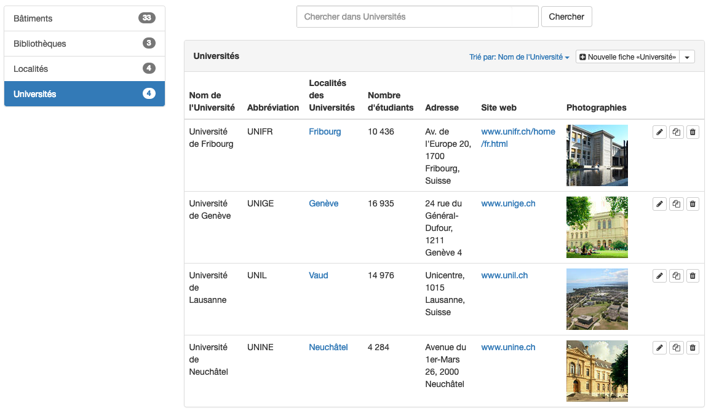

> NB : Certains champs ont pu être cachés dans la configuration du type de fiche. Ainsi seuls Les champs pour lesquels l'option "Inclure le champ dans la liste des fiches" a été activée dans ***Setup*** seront affichés dans cette liste.

## Rechercher un contenu
Il est possible d'afficher toutes les données du catalogue contenant une chaîne de caractères en effectuant une recherche dans la barre supérieure de saisie de texte. 

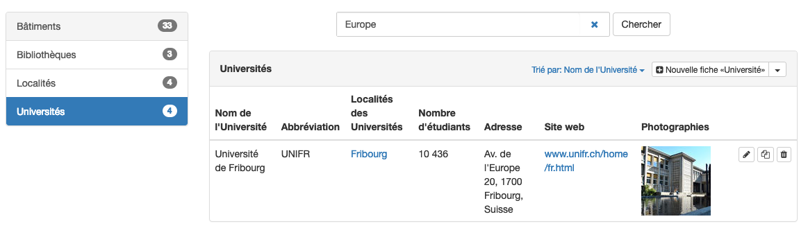

> La recherche se fait sur tous les champs de la fiche. 

## Ajout de données

Pour ajouter des données, sélectionner le type de fiche souhaité dans la barre latérale gauche. Les éventuelles données existantes s'affichent sous forme de tableau. Dans le cas contraire, une section vide apparaît en dessous du nom de la fiche.

Cliquer sur le bouton  **Nouvelle fiche "nom du type de fiche"**, fait s'ouvrir la page d'entrée manuelle des données, qui se présente sous la forme d'un formulaire.

En remplissant les sections des objets avec des données, seules des données respectants les formats autorisés (définis dans la configuration) peuvent être entrées (p.ex données numériques, e-mail ou dates).

Une fois les champs remplis avec les données, il est possible d'enregistrer et retourner au menu *Data* avec "*Créer fiche de type 'nom du type de fiche'*" ou d'enregistrer et ajouter de nouvelles données avec "*Create and add another*".

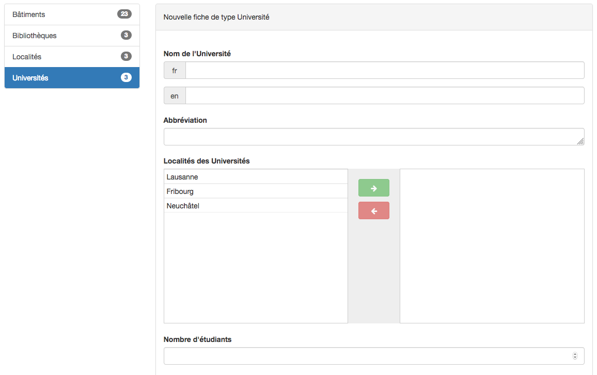  
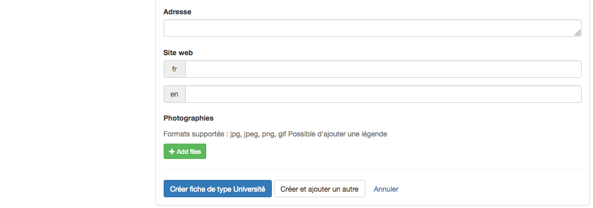  

Un enregistrement n'est possible que si toutes les sections obligatoires ont été remplies. Une fois les données enregistrées, celles-ci apparaissent dans la section *Data* sous la forme d'un tableau de données. 

### Données d'intégration de média

Les champs *intégration de média par iframe* et *intégration de média par url* demandent un format spécifique.

- **Intégration de média par iframe**: Récupérer la *balise iframe* depuis la page internet où se trouve le média en cliquant sur le bouton ou l'option **Partager (ou Share)** > **Embed**. Copier le texte et le coller dans le champ d'intégration de la fiche.
Pour ajouter plus d'un média, il est possible d'insérer plusieurs balises iframe l'une après l'autre.
  

- **Intégration de média par URL**: copier l'adresse complète de la page depuis la barre du navigateur.
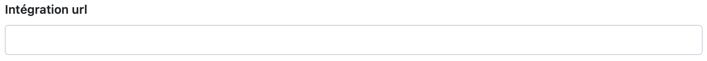  

### Données de type datation
> Le champ datation est un champ très complexe pour lequel a été réalisé [un manuel complet](assets/datation/exempledatation.pdf) ainsi qu'un [catalogue d'exemple](https://catima.unil.ch/datation-exple/fr) de l'utilisation du champ ainsi que de son comportement lors des recherches.

Le champ de datation est un champ qui permet **la datation plus ou moins souple** d'une fiche. Celui-ci se différencie du champ date/heure en offrant la possibilité de prendre en compte des périodes en plus de dates précises.
Des recherches par date peuvent ensuite être effectuées selon une période, prédéfinie ou définie par l'utilisateur lors de la saisie, ou selon une date précise.

Ce champ accepte deux types de formats pour l'entrée de dates lors de la création de nouvelles fiches:

- entrée manuelle par date/heure: pour chaque fiche ajoutée, saisir un début et une fin de période manuellement
- entrée par ensemble de choix: créer préalablement un ensemble de choix *de type datation* et le peupler de périodes pertinentes pour le projet. Sélectionner ensuite un choix au moment de créer la fiche.

> Les deux options peuvent être proposées pour un même type de fiche. Il est alors possible de choisir entre une période prédéfinie ou d'en créer une manuellement au moment de la saisie d'une nouvelle fiche. **Cependant, il n'est pas possible de saisir les deux formats dans une même fiche.**

#### Manuelle

Avec la datation manuelle, il y a plusieurs possibilités de saisie:

- Les champs *Date de début* et *Date de fin* sont remplis par deux dates différentes. Ils définissent une période allant d'une date à une autre, toutes les dates entre les deux étant aussi incluses.
- Les champs *Date de début* et *Date de fin* sont remplis avec les mêmes informations. Ils définissent une date fixe. Par exemple *Date de début*: 1990 et *Date de fin*: 1990.
- Uniquement le champ *Date de début* est rempli. Il définit une période après la date de début indiquée, date de début incluse.
- Uniquement le champ *Date de fin* est rempli. Il définit une période avant la date de fin indiquée, date de fin incluse.

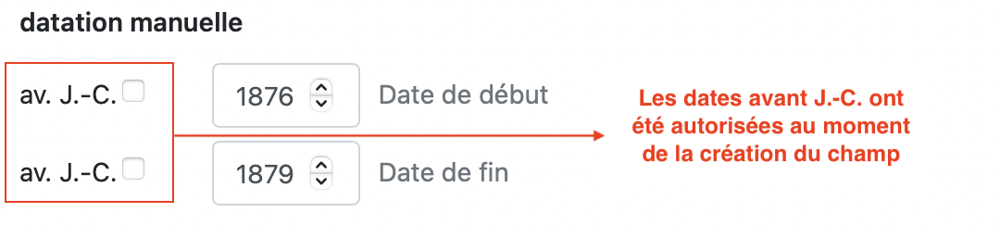

> Les dates de début et de fin sont **inclusives**. Une période définie avec la date de début **1990** et la date de fin **1999** comprend les années 1990, 1991, 1992, 1993, 1994, 1995, 1996, 1997, 1998 et 1999. Faire ensuite une recherche sur une ou plusieurs de ces années retournera les fiches datées de cette période.

#### Par ensemble de choix

Sélectionner un ou plusieurs choix dans la liste déroulante. La datation par ensemble de choix permet d'attribuer une ou plusieurs périodes différentes à une même fiche.

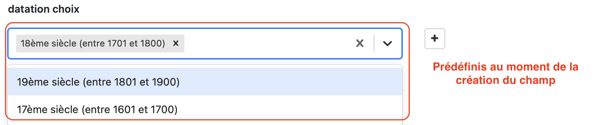

### Données géographiques
Le champ géographiques permet d'ajouter des points, des lignes et des polygones à une carte. 

- Pour ajouter une ligne, cliquer sur l'icône 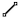 placer le point de départ de la ligne et ajouter des points pour créer un itinéraire. Il est possible de revenir en arrière en cliquant sur "Supprimer le dernier point". Finaliser la ligne en double cliquant sur le dernier point ou en cliquant sur "Terminer".
- Pour créer une polygone, cliquer sur l'icône 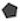 et placer le premier point. Placer les autres points pour créer une zone géographique. Il est possible de revenir en arrière en cliquant sur "Supprimer le dernier point". Finaliser la zone en rejoignant le point de départ, en double cliquant sur le dernier point ou en cliquant sur "Terminer".
- Pour ajouter un point, cliquer sur l'icône 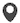 et placer le point sur la carte. Pour entrer des données de latitude et de longitude précises, sélectionner l'icône modifier et sélectionner le point. Les coordoonées géographiques s'affiche en bas de la carte et peuvent être modifiées manuellement. Cliquer sur sauvegarder pour enregistrer les modification.

#### Modifier ou supprimer des données géographiques
Cliquer sur l'icône d'édition pour déplacer les points formants une zone ou une ligne ou les points individuels ou cliquer sur l'icône corbeille et sélectionner les éléments à supprimer. Appliquer les changements en cliquant sur "Sauvegarder".

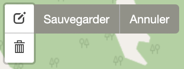

> ATTENTION ! Une fois les modifications sauvegardées dans le champ géographique, ne pas oublier de sauvegarder la fiche pour que les modifications soient enregistrées dans la base de données.

## Statuts des fiches

*Cette fonction est disponible uniquement si spécifiquement activée par l'administrateur.* 

Une fiche peut avoir différents statuts: brouillon, en attente de validation, validé ou rejeté. Ce statut est visible dans la liste des données de chaque type de fiche:
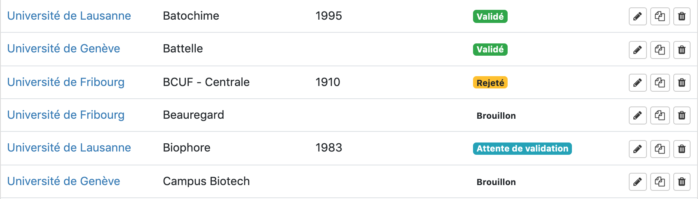

Par défault, une fiche a le statut de ***Brouillon***. Ceci indique aux reviewers qu'elle n'est pas encore prête à être publiée sur le site. Une fois les modifications terminée et la fiche prête à être publiée, il est possible de changer ce statut et d'indiquer que la fiche est prête pour la validation et publication. Cliquer sur "Editer"  et tout en bas de la page, cocher la case "Prêt pour la validation". Ceci changera le statut de la fiche ***Brouillon*** à ***Attente de validation***:
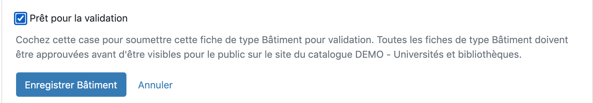

La fiche sera alors publiée dans le catalogue dès validation de celle-ci par un reviewer. Son statut passera alors à ***Validé***. S'il est encore nécessaire d'y apporter des changements, son statut sera ***Rejeté***. Il faudra alors éditer les données puis de nouveau cocher la case "Prêt pour la validation" lorsque la fiche sera prête.

## Édition, duplication et suppression de fiches

> Il n'est pas possible de modifier ou supprimer des fiches créées par d'autre éditeurs. 

### Édition d'une fiche

Pour choisir la fiche à éditer, sélectionner le type de fiche correspondant dans la barre latérale gauche. Pour modifier la fiche souhaitée, cliquer sur le bouton "Éditer"  pour la fiche souhaitée :

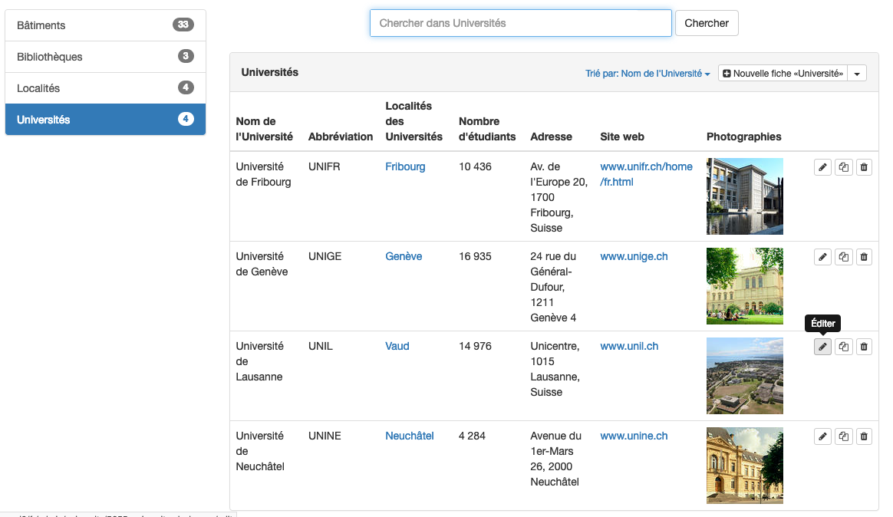  

Pour la modification de chaque champ, la procédure et les remarques sont semblables à l'ajout de données (voir [Ajout de données](#ajoutdonnees)).

### Duplication d'une fiche

Pour choisir la fiche à dupliquer, sélectionner le type de fiche correspondant dans la barre latérale gauche. Les données existantes s'affichent sous forme d'un tableau. Pour dupliquer une fiche, cliquer sur le bouton "Dupliquer" 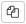 pour la fiche souhaitée : 

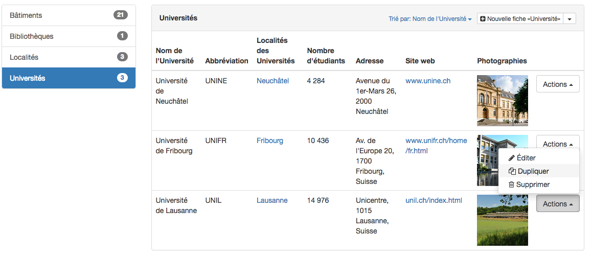  

Cela ouvre la même page que pour l'ajout de données, avec les données de la fiche dupliquée, qu'il est possible de modifier.

### Suppression d'une fiche

Pour choisir la fiche à supprimer définitivement, sélectionner le type de fiche correspondant dans la barre latérale gauche. Les données existantes s'affichent sous forme d'un tableau. Pour supprimer une fiche, cliquer sur le bouton "Supprimer"  pour la fiche souhaitée.

# Suggestions 

*Cette fonction est disponible uniquement si spécifiquement activée par l'administrateur.* 

Les suggestions sont faites par les visiteurs du catalogue et permettent d'envoyer des commentaires aux éditeurs et administrateurs. Elles apparaissent par une pastille à côté de la fiche pour laquelle la suggestion a été faite  indiquant le nombre de suggestions à traiter.

Cliquer sur  pour éditer la fiche et retrouver toutes les suggestions affichée sur la gauche. 

 

Les options disponibles sont les suivantes: 

**1**: voir la suggestion:  
**2**: valider la suggestion: l'icône deviendra vert et la suggestion reste visible  
**3**: supprimer la suggestion  
 

# Exemple d'ajout de données dans un catalogue

Afin d'illustrer l'ajout de données dans un catalogue, voici un exemple reprenant toutes les étapes décrites jusqu'à présent. Cet exemple consiste en un catalogue recensant les universités romandes et de leurs bibliothèques afin de les représenter sur une carte géographique.

## Concept

Les informations que le catalogue devra contenir à la fin sont les suivantes : 

|  | Université de Fribourg | Université de Genève | Université de Lausanne | Université de Neuchâtel |
|--------------------|--------------------------------------------------------------------------------------------------------------|------------------------------------------------------------------------------------------------------------------------------------------------|--------------------------------------------------------------------------------------------------------------------------------------------------------------------------------------------------------------------------------|--------------------------------------------------------------------------------------------------------------------------------------------------------------------------------------------------------------------------------------------------------------------------------------------------------------------------------------------------------------------------------------------------------------------------------------------------------------------------------------------------------------------------------------------------------------------------------------------------------------------------------------------------------------------|
| Abbréviation | UNIFR | UNIGE | UNIL | UNINE |
| Localité | Fribourg | Genève | Lausanne | Neuchâtel |
| Bâtiments | Uni Beauregard, Uni Miséricorde, Uni Pérolles, Uni Régina Mundi |Battelle, Campus Biotech, CMU, Les Philosophes, Sciences, Uni Bastion, Uni Carl Vogt, Uni Dufour, Uni Mail, Uni Pignon |Amphimax, Amphipôle, Anthropole, Batochime, Biophore, Cubotron, Génopode, Internef, Unicentre, Unithèque|Rue de Saint-Nicolas 4, Place Numa-Droz 3, Chaussée de la Boine 20 , Fbg du Lac 5a, Av. DuPeyrou 1, etc.. |
| Facultés |Droit, Lettres et sciences humaines, Sciences et médecine, Sciences économiques et sociales, Théologie |Droit, Économie et management, Lettres, Médecine, Psychologie et sciences de l'éducation, Sciences, Sciences de la société, Théologie |Biologie et médecine, Droit, sciences criminelles et administration publique, Géosciences et environnement, Hautes études commerciales, Lettres, Sciences sociales et politiques, Théologie et sciences des religions  |Droit, Lettres et sciences humaines, Sciences,Sciences économiques |
| Nombre d'étudiants | 10414 |  16935 | 14976 | 4284 |
| Bibliothèque | Bibliothèque cantonale et universitaire (Fribourg) | Bibliothèque de l'Université de Genève | Bibliothèque cantonale et universitaire (Lausanne) | Bibliothèques UniNE |
| Adresse | Avenue de l'Europe 20, 1700 Fribourg | 24 rue du Général-Dufour,   1211 Genève 4 | Unicentre, 1015 Lausanne | Avenue du 1er-Mars 26, 2000 Neuchâtel |
| Site web | www.unifr.ch | www.unige.ch | www.unil.ch | www.unine.ch |

Dans cet exemple, les concepts d'Université et de Bibliothèque sont centraux dans ce catalogue. 

Conceptuellement, voici les entités qui composent ce catalogue et les champs qu'il s'agira de remplir.

|Localité
|---
|Nom de la localité
|Canton
|Population
---

|Université
|---
|Nom de l'Université
|Abbréviation
|Localité ==> **concept "Localité"**
|Facultés
|Nombre d'étudiants
|Photographies
|Adresse
|Site web
----

|Bâtiment
|---
|Nom du bâtiment
|Localisation géographique
|Université ==> **concept "Université"**
---

|Bibliothèque
|---
|Nom de la bibliothèque
|Abbréviation
|Réseau
|Bâtiment ==> **concept "Bâtiment"**
|Université  ==> **concept "Université"**
---

### Types de fiches et liens

Les quatre concepts précédements relevés, "Université", "Bibliothèque", "Localité", "Bâtiment", correspondent aux types de fiches existants dans Catima.

**Liens conceptuels entre les types de fiches :**

* Une **localité** a une et une seule **université**
* Une **université** a une, ou plusieurs **bibliothèque(s)**
* Une **université** a un, ou plusieurs **bâtiment(s)**

### Ajout d'une fiche

Le concept de "Localité" étant le concept le plus large (un bâtiment se situe dans une université, qui est dans une localité), il englobe les concepts plus précis que lui, à savoir "Université", qui lui-même englobe les "Bâtiments" et les "Bibliothèques". C'est pourquoi il est judicieux d'ajouter d'abord des fiches aux entités les plus larges, ici "Localité". Ainsi lors de l'ajout d'une nouvelle université (puis de nouveaux bâtiments et bibliothèques) il existera toujours l'entité plus globale à laquelle faire référence. 

La structure du catalogue a été crée dans cet exemple par l'adminstrateur-trice du catalogue. La tâche ici est d'ajouter de nouvelles données en suivant la structure existante. 

Ainsi pour ajouter une nouvelle localité : dans la section "Data" de Catima, sélectionner "Localités" dans la colonne latérale gauche. 

Une liste des localités existante s'affiche : 

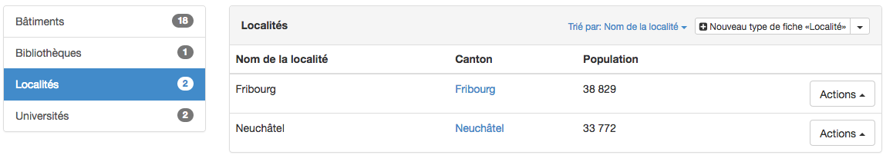  

Cliquer sur "+ Nouveau type de fiche 'Localité'" puis remplir tous les champs nécessaires : 

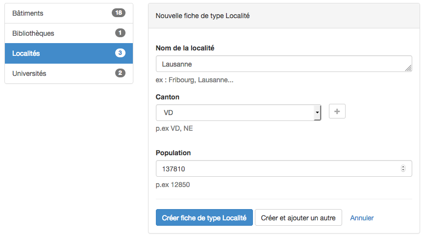  

Une fois la localité créée, il est possible de lui ajouter l'Université dans la localité de Lausanne :

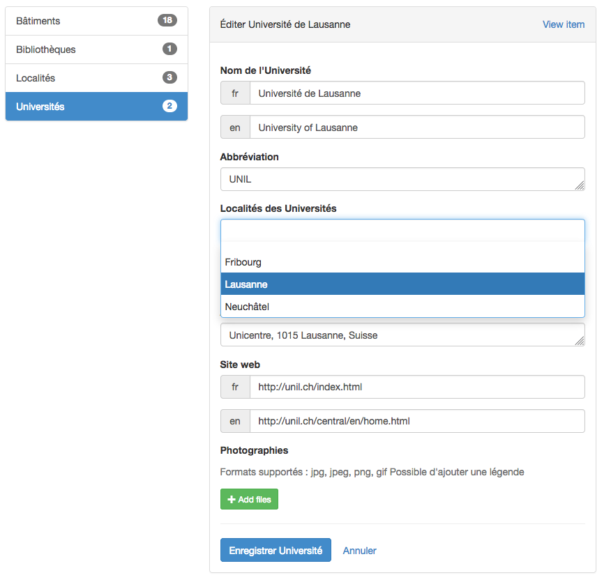  

Puis d'ajouter les données des autres types de fiches "Bâtiments" et "Bibliothèques" : 

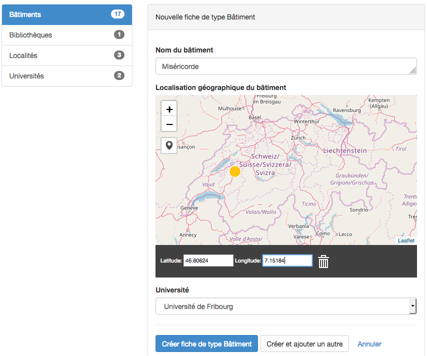  

