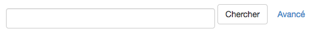
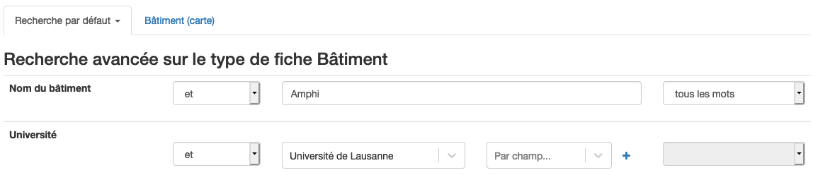
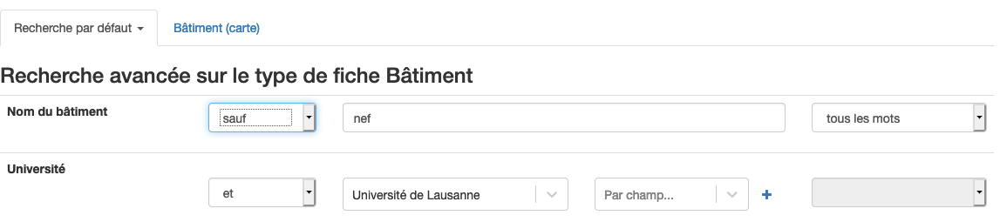
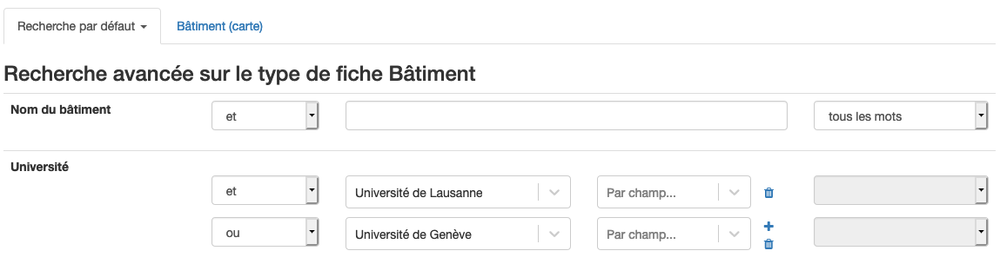
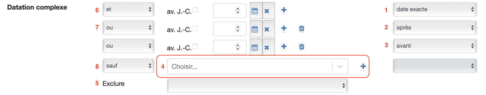

# Table des matières

- [Table des matières](#table-des-matières)
- [Recherche](#recherche)
  - [Recherche simple](#recherchesimple)
  - [Recherche avancée](#rechercheavancee)
    - [Opérateurs de recherche](#operateurs)
- [Recherche sur le champ datation](#recherchedatation)
    - [Recherche simple](#recherchedatationsimple)
    - [Recherche avancée](#recherchedatationavancee)

# Recherche

Les catalogues de CATIMA disposent d'une fonctionnalité de recherche permettant d'accéder au contenu du catalogue par le biais de mots-clés. Il est possible d'effectuer une recherche simple (recherche d'un mot, expression) ou une recherche avancée permettant de chercher du contenu au moyen de un plusieurs critères ("expression exacte", "contient les mots", "ne contient pas les mots").

Les recherches simple et avancées sont accessibles depuis la page d'accueil du catalogue, en cliquant sur le nom du catalogue tout à gauche de la barre de menus :

## Recherche simple

La recherche simple permet d'accéder à une liste de contenus contenant un mot ou une expression (chaîne de caractères). 

Dans la barre de texte, entrer le mot souhaité (p.ex "Rowling" ou "Suisse") et cliquer sur "*Chercher*" ("Search"). Une liste des résultats trouvés apparaît permettant d'accéder au contenu souhaité, ou de réitérer sa recherche.

## Recherche avancée 

La recherche avancée permet de d'accéder à une liste de contenus en utilisant un ou plusieurs critères de recherche **au sein d'un type de fiche**. 

La recherche avancée est accessible depuis la page d'accueil du catalogue (via un clic sur le nom du catalogue). Pour accéder à la recherche avancée, cliquer sur "*Avancé*" ("Advanced") qui se trouve à droite du bouton "Chercher". Une page s'ouvre, présentant l'interface de recherche avancée. Le premier type de fiche s'ouvre par défaut mais en cliquant sur "Recherche par défaut" les autres types de fiches peuvent être choisis pour faire l'objet d'une recherche.

Il est possible de chercher des mots ou expressions exactes dans les champs de textes ou de sélectionner des options proposées. 

Pour sélectionner plus d'une option parmi les choix proposés (par exemple "Université de Lausanne", ainsi que "Université de Genève"), cliquer sur le bouton "+". Cette action ajoute une ligne, qui permet d'entrer une nouvelle option.

Une fois les différents champs souhaités remplis, cliquer sur "*Chercher*" ("Search"). Une liste des résultats trouvés apparaît permettant d'accéder au contenu souhaité. Pour modifier la recherche, revenir en arrière à l'aide du bouton précédent (<-) de votre navigateur.

### Opérateurs de recherche

Une recherche avancée s'effectue en entrant un ou plusieurs critères de recherche puis : en les cumulant (par défaut, opérateur "**ET**"), en les excluant (opérateur "**SAUF**") ou en élargissant (opérateur "**OU**").

**Opérateur "ET" (par défaut):**

Ici les critères se **cumulent**, c'est-à-dire que les fiches doivent correspondre à tous les critères entrés pour être incluses dans les résultats. Il s'agit de l'opérateur proposé par défaut pour chaque critère, car il correspond aux situations de recherche les plus fréquentes. 

> **Exemple** : Pour obtenir la liste des bâtiments de **l'Université de Lausanne** contenant l'expression "**Amphi**" (à savoir "**Amphi**max" et "**Amphi**pole"), la recherche consiste à entrer "Amphi" comme "Nom du bâtiment" et choisir "Université de Lausanne" comme "Université".

**Opérateur "SAUF" :**

Lorsqu'un critère de recherche est accompagné de l'opérateur "**SAUF**", seuls les résultats ne **correspondant pas** à ce critère seront affichés.

> **Exemple** : Pour obtenir la liste des bâtiments de l'Université de Lausanne ne **contenant PAS** l'expression "***nef***" (pour exclure "Internef" et "Extranef"), la recherche consiste à entrer "nef" comme "Nom du bâtiment" avec l'opérateur "SAUF" et choisir "Université de Lausanne" comme "Université".

**Opérateur "OU" :**

En choisissant l'opérateur "OU", on souhaite obtenir une liste de résultats contenant toutes les fiches pour lequelles au moins un des critère est vrai. 

> **Exemple** : Pour obtenir la liste des bâtiments correspondant soit au critère "Université de Lausanne" soit "Université de Genève" comme "Université", entrer ces deux critères (en ajoutant une ligne *via* le bouton "+") et les accompagner de l'opérateur "OU".

## Recherche sur le champ datation
> Le champ datation est un champ très complexe pour lequel a été réalisé [un manuel complet](assets/datation/exempledatation.pdf) ainsi qu'un [catalogue d'exemple](https://catima.unil.ch/datation-exple/fr) de l'utilisation du champ ainsi que de son comportement lors des recherches.

**Différences entre les champs "Datation" et "Date"**
Le champ **Date** permet l'entrée d'une date précise sur une fiche. Cette date doit être unique. Cela peut être par exemple la date de naissance d'une personne, l'année de construction d'un bâtiment ou l'heure et la date d'une représentation.

Le champ de **Datation** accepte une date de début et une date de fin, permettant la création de périodes et la recherche sur toutes les dates contenues dans cette période.

### Recherche simple

Rechercher une date dans la barre de recherche retournera uniquement les fiches dans lesquelles les caractères recherchés figurent tels quels dans un des champs. Une recherche simple ne permet pas de calculer des périodes.
Ainsi, entrer deux dates dans la barre de recherche ne calculera pas une période mais retournera les fiches dans lesquelles figurent textuellement les deux dates.

### Recherche avancée

Une recherche avancée sur le champ datation permet de préciser des périodes de plusieurs façons différentes.

Les champs dates permettent de rechercher des dates manuellement. Les listes déroulantes à droite permettent de préciser si la recherche se fait sur une date exacte (1), après une date (2) ou avant une date (3).

La liste déroulante (4) permet d'effectuer des recherches par ensemble de choix.

Le critère ***Exclure*** (5) permet d'exclure l'un ou l'autre des types de datation. Exclure les fiches avec **datation manuelle** ne retournera que les fiches avec une **datation par ensemble de choix** et inversement.

Les critères peuvent être cumulés à l'aide des opérateurs de recherche "et", "ou" et "sauf" qui se trouvent sur la gauche.

L'opérateur qui se trouve avant la première ligne (6) se réfère aux autres champs de recherche. Tous les autres permettent de faire entrer en interaction plusieurs critères à l'intérieur du champ datation.
>  **Rappel:**
> 
> **ET** (6): tous les critères doivent être remplis
> 
> **OU** (7): l'un ou l'autre des critères doit être rempli
> 
> **SAUF** (8): le critère doit être exclu
