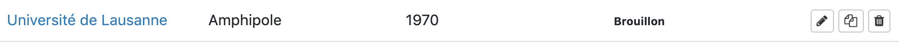
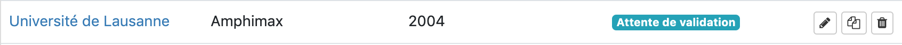
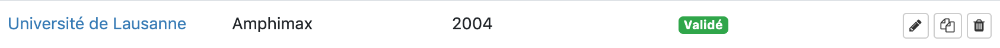
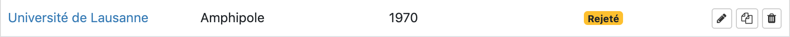
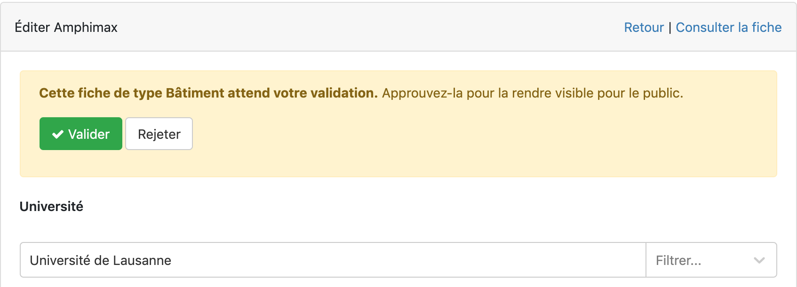

# Table des matières

- [Statuts des fiches](#statuts-des-fiches)
- [Processus de travail](#processus-de-travail)
- [Valider ou rejeter une fiche](#valider-ou-rejeter-une-fiche)

# Statuts des fiches

Une personne avec le statut de reviewer peut approuver ou rejeter des fiches créées par les (super-)éditeurs. 

Une fiche peut avoir différents statuts: brouillon, attente de validation, validé ou rejeté. Le statut présent d'une fiche est visible en cliquant sur le type de fiche depuis la page "Data":

# Processus de travail

Lors de la création et sauvegarde d'une fiche, celle-ci a le statut de ***Brouillon***. Cela indique que la fiche va encore subir des modifications ou n'est simplement pas prêtre à être publiée. 

Une fois les modifications terminée, le statut ***Attente de validation*** que la fiche est prête à être validée et publiée. 

Les reviewers ont maintenat la possibilité de valider ou rejeter la fiche. Le status ***Validé*** indique que la fiche en question est maintenant visible dans le catalogue. 

Si au contraire des modifications sont encore nécessaires, la fiche peut alors être ***Rejeté***, indiquant qu'elle est passée par la validation mais n'a pas été acceptée. Les (super-)éditeurs peuvent y apporter des changements et la soumettre de nouveau pour validation. 

# Valider ou rejeter une fiche

Pour valider ou rejeter une fiche, cliquer sur le bouton éditer  d'une fiche qui a le statut ***Attente de validation***. Il est possible de consulter le contenu de la fiche et de l'approuver ou rejeter via le box jaune qui s'ouvre en mode édition: 

Il faut ensuite cliquer sur *Enregistrer "Nom de la fiche"* tout en base de la page pour sauvegarder les changements. 

Attention: il n'est pas possible de revenir en arrière et changer le status d'une fiche qui a été validée pour la publication. Les modifications restent possibles mais le status restera ***Validé***.

> Uniquement les fiches avec le statut **Validé** sont publiées dans le catalogue.

