# Table des matières

- [Ajout de choix dans les ensembles de choix](#ajout-choix)
- [Ajout des choix de type datation](#ajoutchoixdatation)
- [Choix parents et choix enfants](#choixparents)

En plus de la création de nouvelles fiches, un super-éditeur peut modifier toutes les fiches existantes et ajouter des choix dans les ensembles de choix.

## Ajout de choix dans les ensembles de choix

Pour ajouter un nouveau choix, lors de l'ajout ou de la modification d'une fiche avec une option "Ensemble de choix", cliquer sur .

Une fenêtre d'ajout suivante s'ouvre:

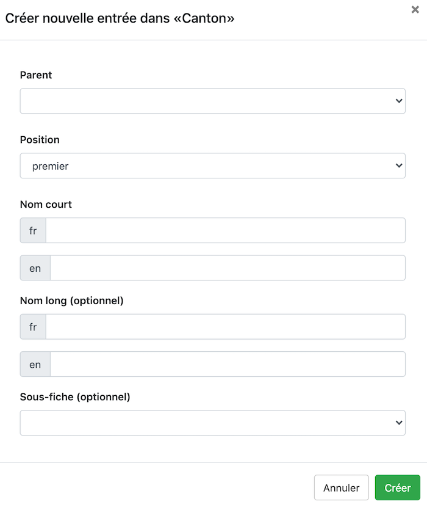

Remplir les informations demandées puis cliquer sur "Créer" pour ajouter le choix à l'ensemble de choix.  
> Le champ "Sous-fiche" permet l'affichage de contenu conditionel (la sous-fiche) lors de la sélection de ce choix. La sous-fiche doit être préalablement créée par une administrateur pour pouvoir être sélectionnée.

Il n'est pas possible pour un super-éditeur de supprimer des choix existants.

## Ajouter des choix dans les ensembles de choix de type datation

Cliquer sur *+ Nouveau choix* pour ajouter une nouvelle période ou date précise. Il y a plusieurs possibilités:

- les champs *Date de début* et *Date de fin* sont remplis par deux dates différentes. Ils définissent une période allant d'une date à une autre, toutes les dates entre les deux étant aussi incluses.
- uniquement le champ *Date de début* est rempli. Il définit une période après la date de début indiquée, date de début incluse.
- uniquement le champ *Date de fin* est rempli. Il définit une période avant la date de fin indiquée, date de fin incluse.
- Remplir les deux champs avec les mêmes informations permet de définir une date fixe. Par exemple *Date de début*: 1990 et *Date de fin*: 1990.

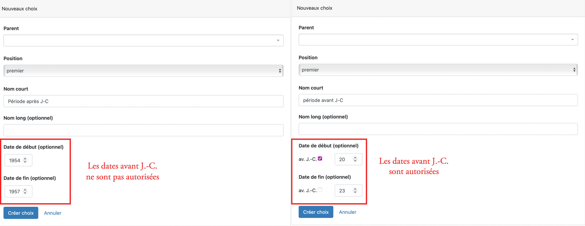

> Les dates de début et de fin sont **inclusives**. Une période définie avec la date de début **1990** et la date de fin **1999** comprend les années 1990, 1991, 1992, 1993, 1994, 1995, 1996, 1997, 1998 et 1999. Faire ensuite une recherche sur une ou plusieurs de ces années retournera les fiches datées de cette période.

## Choix parents et choix enfants

Lors de la création d'un choix, il est possible de lui associer un **parent**.
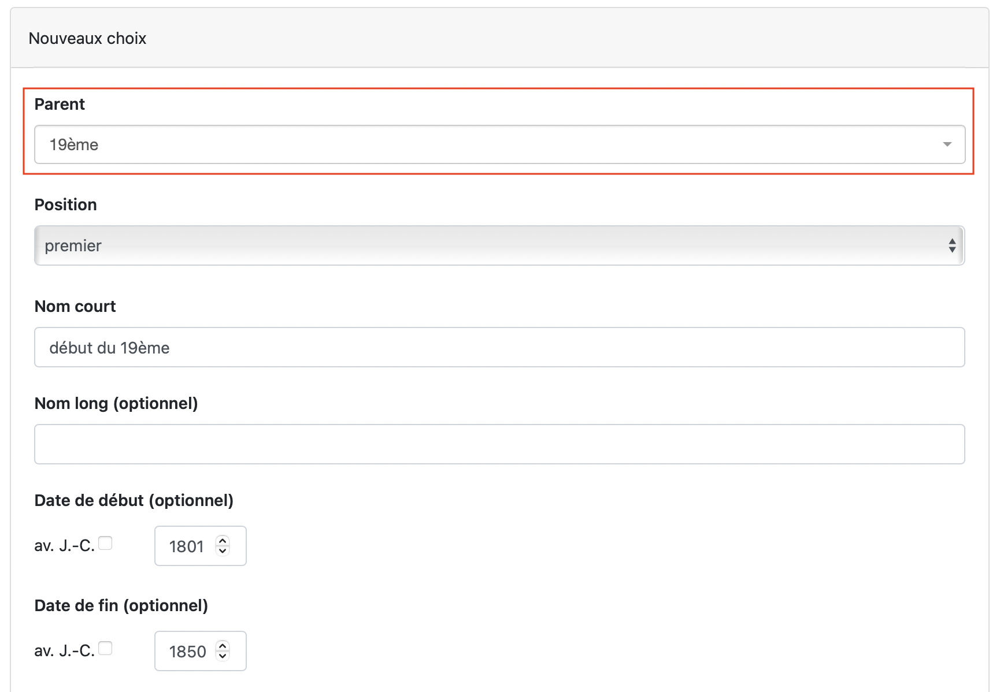

La hiérarchie des choix est visible dans le mode **Set up** de l'ensemble de choix. Pour modifier l’ordre, sélectionner l’élément en cliquant sur la croix et le déplacer à l’emplacement désiré de la hiérarchie. 

**ATTENTION** il n'est pas recommandé de créer plusieurs niveaux de hiérarchisation des choix car cela entraîne de la confusion lors de la recherche par choix parent. Lors d'une recherche par ensemble de choix, les enfants d'enfants ne sont pas inclus.

### Exemple

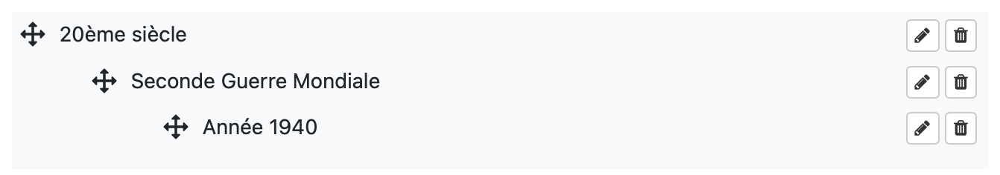

- Le choix 20ème siècle
  - Le choix Seconde Guerre Mondiale est l'enfant de 20ème siècle
  		- Le choix année 1940 est l'enfant de Seconde Guerre Mondiale

#### Incidence sur la recherche

On recherche les objets datés du 20ème siècle sans inclure les enfants

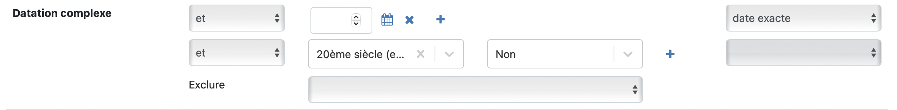

> Aucun enfant ne ressort dans la recherche

On recherche les objets datés du 20ème siècle en incluant les enfants

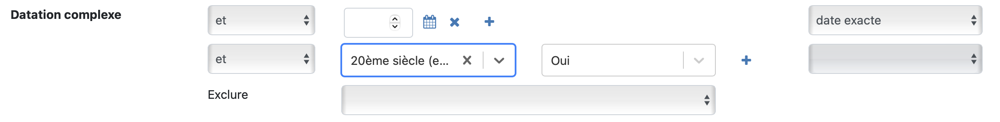

> Le premier niveau d'enfants ressort

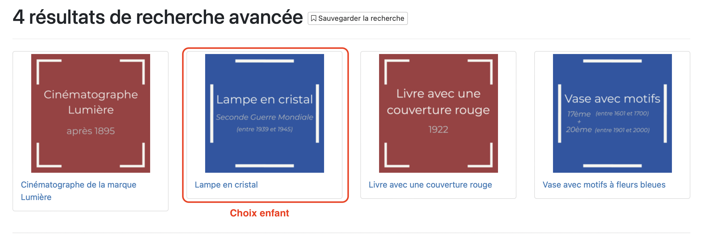

On recherche les objets datés de la Seconde Guerre Mondiale sans inclure les enfants

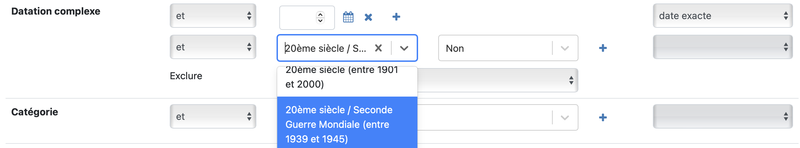

> Le choix parent ne ressort plus

On recherche les objets datés de la Seconde Guerre Mondiale en incluant les enfants

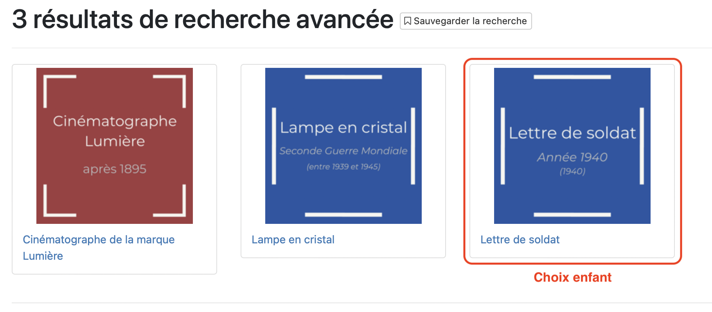

> Le choix enfant ressort mais pas le choix parent

On recherche les objets datés du 20ème siècle en incluant les enfants **OU** les objets datés de la Seconde Guerre Mondiale en incluant les enfants

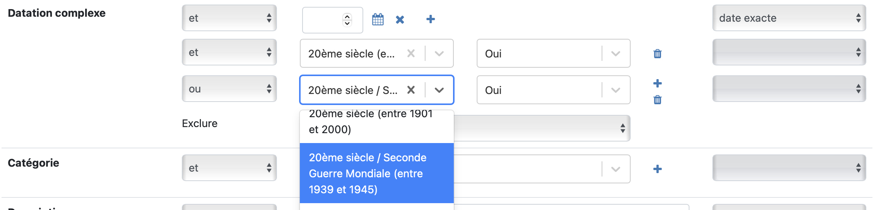

> Les 3 niveaux ressortent

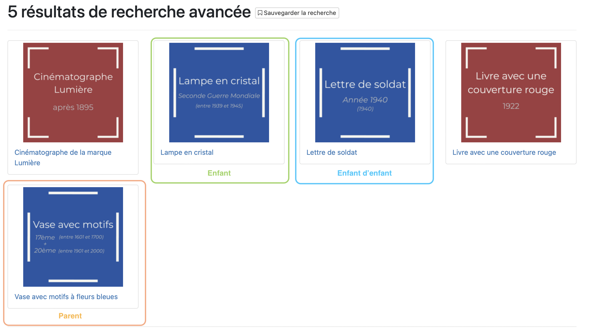

### En résumé

La hierarchie des choix dans les ensembles de choix standard ou de type datation a un impact important sur la recherche. Plus les choix sont bas dans la hiérarchie plus il sera difficile de les faire ressortir lors de la recherche par ensemble de choix.
