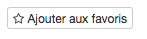
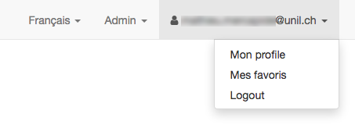
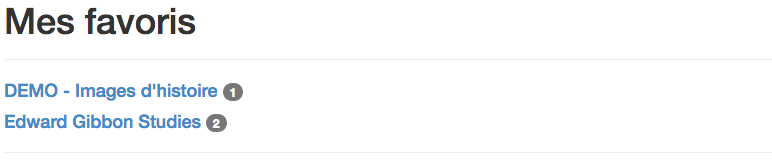
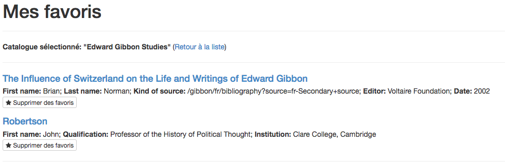
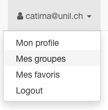
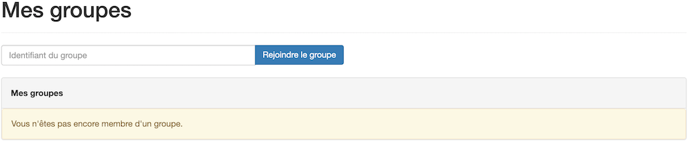

# Table des matières

<!-- TOC -->

- [Favoris](#favoris)
    - [Ajout de contenu](#ajout-de-contenu)
    - [Accès à la liste des favoris](#accès-à-la-liste-des-favoris)
- [Accès à des catalogues restreints](#accès-à-des-catalogues-restreints)

<!-- /TOC -->

# Favoris

Les catalogues de CATIMA disposent d'une fonctionnalité permettant d'ajouter un contenu à une liste de favoris pour tous-tes les utilisateur-trice-s possédant un compte CATIA (voir [ici pour la création d'un compte](https://catima.unil.ch/fr/register)) et connecté-e-s.

## Ajout de contenu
Pour ajouter un contenu aux favoris, il s'agit d'accéder à la fiche souhaitée (par une navigation dans le site ou par par les résultats d'une recherche), puis de cliquer sur le bouton "Ajouter aux favoris" sous le nom de la fiche.

## Accès à la liste des favoris

La liste des favoris est accessible à 
tous-te utilisateur-trice inscrit-e et connecté à Catima, en cliquant successivement sur 

1. **Nom d'utilisateur** (tout à droite dans la barre de navigation)
2. **Mes favoris**

Les favoris sont présentés par groupe en fonction du catalogue dont proviennent les contenus : 

Une fois un groupe choisi, la liste des contenus favoris est présentée, permettant d'y accéder ou de supprimer le-s favoris souhaité-s.

# Accès à des catalogues restreints

La consultation de certains catalogues est limitée à un (ou plusieurs) groupe(s) d'utilisateurs uniquement, déterminé par l'administrateur du catalogue. Pour accéder à un catalogue restreint, il est ainsi nécessaire d'être un utilisateur Catima et d'être connecté à son compte.

Il est possible d'y accéder soit grâce à un email enovoyé par l'administrateur du catalogue, soit grâce à un indentifiant secret.

**Pour rejoindre un groupe grâce à un identifiant secret:** une fois connecté à votre compte, cliquez sur l'adresse e-mail dans la barre horizontale supérieure, puis sur "Mes groupes". 

Une liste des groupes d'appartenance s'affiche, avec votre rôle dans chaque groupe (utilisateur, membre, [super-]éditeur ou administrateur) et un bouton permettant de quitter le groupe.

Entrez l'identifiant dans la case "Identifiant du groupe" pour accéder à un groupe secret.
